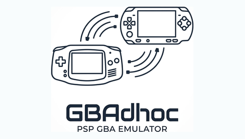
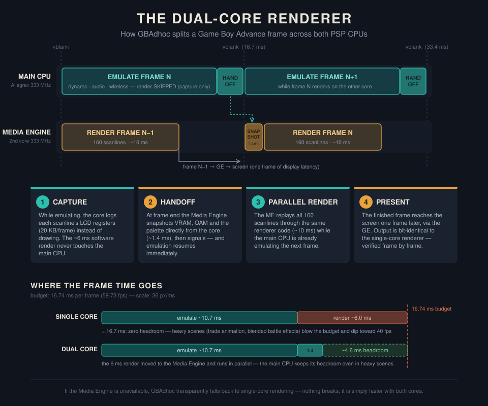
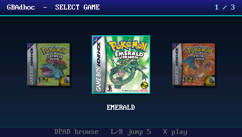
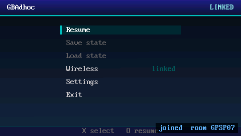
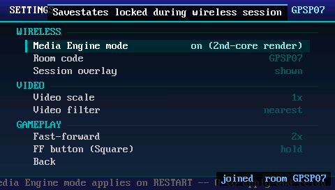
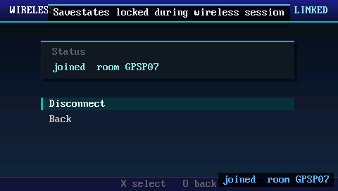
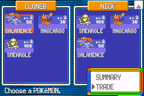
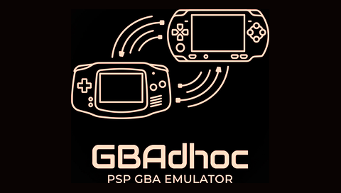

<p align="center">
  <br>
  <sub><b>GBAdhoc (Playable Build)</b></sub>
</p>

**Game Boy Advance emulation for PSP With AGB-015 (Wireless Adapter) Support**

Two PSPs, a copy of Pokémon Emerald on each.
Walk in, sit down, trade, battle, walk out with the attendant
stamping your trainer card. Exactly as if you'd plugged an AGB-015 Wireless
Adapter into a real Game Boy Advance; except the "GBAs" are PSPs, and the
radio is the PSP's WLAN.

GBAdhoc is a fork of [libretro gpSP] with a heavily modified native PSP frontend.
It does two things that are brand new to GBA emulation on PSP.

### It emulates the GBA Wireless Adapter over PSP ad-hoc

The AGB-015 wireless adapter is emulated entirely in software and bridged
directly to the PSP's sceNetAdhoc library. The emulator provides a
transparent hardware interface to the guest ROMs, enabling features that
were previously unsupported in handheld emulators, such as Pokémon
Emerald's Union Room, Trade Center, and wireless link battles.

This implementation is not a timing-agnostic approximation. The emulated
adapter strictly reproduces the physical hardware's packet delivery
behavior. Network packets are paced to the exact cadence expected by the
games' internal polling loops. Pokémon's link code silently discards input
polling when the receive queue overflows; matching the hardware delivery
pacing eliminates the desynchronization issues. GBAdhoc maintains wireless
sessions at full speed (59.73 fps) with a clean input path. Measured across
hundreds of automated hardware trades, the in-game receive queue never
saturates.

### It's the first true dual-core GBA emulator on PSP

GBAdhoc initializes the PSP's secondary processor (the Media Engine) to
offload the entire GBA video renderer. While the primary CPU emulates the
next system frame, the Media Engine rasterizes the previous frame. This
parallel execution handles roughly one-third of the frame's total
computational workload.

The performance yield is most apparent during heavy GPU loads (e.g., trade
animations and alpha-blended battle effects), maintaining stable framerates
where previous single-core iterations dropped below 40 fps. Furthermore,
during ad-hoc sessions, this parallelization frees up primary CPU cycles to
handle the WLAN stack without stalling emulation.

The renderer's output is bit-for-bit identical to the single-core fallback
path, verified via frame-by-frame reference testing. If the Media Engine is
unavailable, the emulator transparently falls back to main-CPU rendering
without loss of stability.

<p align="center">
  
</p>

**Media Engine mode ships ON by default.** The toggle is located in
Settings → "Media Engine mode" (requires restart).

---

## Screenshots

Captured from real hardware, the UI pages are GE dumps taken mid-session,
and the Trade Center frame was rendered by the Media Engine during one of
the automated hardware trades.

<table align="center">
  <tr>
    <td align="center" colspan="2">
      <br>
      <sub>The game gallery — box art streamed from the memory stick</sub>
    </td>
  </tr>
  <tr>
    <td align="center">
      <br>
      <sub>In-game menu, wireless session linked</sub>
    </td>
    <td align="center">
      <br>
      <sub>Settings — Media Engine mode, room code, session overlay</sub>
    </td>
  </tr>
  <tr>
    <td align="center">
      <br>
      <sub>Wireless page — joined room, one-button disconnect</sub>
    </td>
    <td align="center">
      <br>
      <sub>Emerald's Trade Center, mid-trade — rendered on the Media Engine</sub>
    </td>
  </tr>
</table>

---

## Quick start (playable build)

**You need:** a PSP on custom firmware (developed and tested on ARK-4,
PSP-1000s), your own GBA ROMs, and — for wireless — two PSPs.

1. Copy `builds/playable/` (the folder with `EBOOT.PBP` and
   `gbadhoc_me.prx`) to `ms0:/PSP/GAME/GBADHOC/` on each console.
2. Put ROMs in a `roms/` folder beside the EBOOT. (`gba_bios.bin` is
   optional — a built-in open-source BIOS is bundled.)
3. Launch, pick a game, play.

**Box art:** the gallery loads art you supply yourself. Make a `boxart/`
folder beside the EBOOT and drop in one image per game, named exactly like
the ROM but with a `.bmp` extension — `Golden Sun (USA, Europe).gba` →
`boxart/Golden Sun (USA, Europe).bmp`. Uncompressed 24- or 32-bit BMP, any
size (the gallery resamples to 112×112 when it loads). BMP rather than PNG
is deliberate — the app ships no PNG decoder, and every image editor can
export one. Games without art still get a styled placeholder card, so a
partly-filled folder looks intentional. The gallery sorts alphabetically,
so naming ROMs consistently keeps series together.

**To link two consoles:** WLAN switch on, then on both PSPs:
Start+Select → **Wireless** → one console **Host**, the other **Join**
(same room code, set in Settings). In-game, head to the Union Room or Trade
Center and play — the game handles the rest, because as far as it knows,
you're both holding GBAs with Wireless Adapters.

> **IMPORTANT:** Please make sure **BOTH** PSP's are configured in the
> network settings of the XMB to occupy the **SAME** Ad-Hoc channel.

**Settings tour:** dark and light **themes** (applies instantly), an **FPS
counter** that reads the true emulation speed — during fast-forward it shows
the real emulated rate, not the display cadence, and the number in brackets is
how many frames were actually drawn — plus **fast-forward**, an A/B
button-swap, and video scale/filter options.

**Smooth fast-forward.** The Fast-forward setting offers six values: `1.5x`,
`3x` and `uncapped`, each also available as **smooth**. Ordinary fast-forward
skips frames to buy speed, which is why it looks like a slideshow on every
handheld emulator. Smooth mode draws *every* frame instead — a lower top speed,
but fast motion rather than a strobe. It is affordable here specifically
because the Media Engine is doing the drawing on the second core.

Pokémon **Emerald** is the validated flagship — trades and clean session
exits are regression-tested on real hardware. Other RFU-aware games should
negotiate with the adapter; wireless behavior outside the Pokémon gen-3
family is untested.

Link **battles** are supported and complete end to end, but currently run
a bit slow. The client in particular has to wait about 200-300ms between actions.
This might just be a fundamental reality of the network stack, I'm curious if someone
more intelligent then me is able to optimize this further.

## Pokémon Unbound — very near full speed

**Around 50 fps, with no frameskip and completely uncompromised audio.**

Large CFRU-based ROM hacks — Unbound being the flagship — have never run well
on PSP. Unbound sat in the low 20s in battle, which is not a game you can play.
It now runs very near full speed, drawing **every single frame** and with
**completely uncompromised audio**. No frames skipped to inflate a counter, no
sample rate cut, no channels disabled.

The reason it was slow turned out to be one 372-byte routine. CFRU rewrites its
own code while running — a legitimate speed trick that works on real hardware —
and that forced the emulator to throw away and rebuild its translated code
about 1,450 times a second. Profiling the frame directly showed **dynarec
recompilation eating 58% of every frame**, while the emulation it was supposed
to be doing sat idle behind it.

The fix splits translation at exactly the addresses a game patches, so each
rebuild is a small fragment instead of an entire routine. Recompilation dropped
**from 58% of the frame to about 5%**.

Games that don't rewrite their own code never trigger any of this and are
bit-for-bit unaffected — verified by comparing full frame *and* audio hashes
against the previous build.

**Known limits:**

- Two-player sessions; wireless validated primarily on Emerald; custom
  firmware required (the Media Engine and ad-hoc stack need kernel access).
- On PSP-2000 and later the emulator claims the full 64 MB memory layout,
  so even 32 MB carts (Mother 3, large ROM hacks) run fully
  memory-resident. The original PSP-1000 has half the RAM: 32 MB carts
  work, but demand-page off the memory stick with occasional hitches
  (16 MB carts — the entire Pokémon gen-3 family — fit fully everywhere).

---

<p align="center">
  <br>
  <sub><b>GBAdhoc [HARNESS]</b></sub>
</p>

## The Test Harness (For Developers)

The reliability of the netcode implementation is validated using
`harness-kit/`, an autonomous, on-device test rig included in this
repository.

Network edge cases cannot be reliably validated within standard emulator
environments. Software like PPSSPP reproduces neither physical PSP WLAN
latency nor multi-device hardware clock drift, which are the primary
variables for ad-hoc desynchronization. To account for this, the test rig
orchestrates unattended execution on actual console hardware.

The harness is designed to support general automated hardware testing and
artifact generation (such as capturing all UI screenshots for this
repository.)

Below is an example of a practical use case (Mine)

```
two PSPs run a scripted trade → exit → expose their memory sticks over USB
→ the PC collects logs/saves/screenshots, restores golden saves, stages the
next build → the consoles relaunch themselves → repeat, all night
```

Every run ends with an oracle check.

### Running it

```
python harness-kit/hw_loop.py --host D: --join E: ^
  --stage <dir> --golden harness-kit/golden-saves ^
  --logs <dir> --verify --forever --keep-going --timeout 86400
```

- **`--stage`** is a folder mirrored onto both cards before each run: the
  EBOOT, `gbadhoc_me.prx`, autopilot `.inputs` scripts, and per-role configs
  (`host-.gpsp-harness.ini` / `join-.gpsp-harness.ini` — prefixes route a
  file to one console). **Editing files here between runs is how you change
  experiments — no restart needed.**
- **`--golden`** holds the baseline saves restored before every run (two
  different parties on purpose, so a completed trade is detectable).
- **`--verify`** turns on the save-decoding oracle. Always pass it.

The consoles run the harness EBOOT (black background — instantly
distinguishable from the playable build) with an autopilot that injects pad
input and asserts on GBA RAM — it navigates the real Union Room, sits in the
real chair, trades the real Pokémon. Fixture scripts for Emerald's Trade
Center are included, comment-annotated with every failure mode that shaped
them.

`harness-kit/HARNESS.md` is the full manual — staging semantics, the config
keys, and the autopilot grammar. `summarize_log.py` turns a 40 KB run log
into 30 lines worth reading.

---

## Building from source

Docker only — no local toolchain:

```bash
cd gpsp
docker run --rm -v "$PWD":/build -w /build pspdev/pspdev make platform=psp1
docker run --rm -v "$PWD":/build -w /build/psp pspdev/pspdev make harness
```

That produces the harness EBOOT and `me/gbadhoc_me.prx` (the Media Engine
kernel module — ships beside every EBOOT). For the playable build add
`EXTRA_DEFS=-DGPSP_PLAYABLE` (and run `make clean` first: 'make' does not
track define changes, and a mixed build silently strips the harness's
telemetry; this exact mistake has been made, twice, by the person writing this sentence).

Developer documentation lives in `docs/` — `ARCHITECTURE.md` maps how the
pieces fit together, and `AUTOPILOT.md` is the manual for the autopilot
script grammar the harness fixtures are written in.

---

## Attribution

The adapter emulation (`rfu.c`, `serial_proto.c`) — the hardest and most
valuable piece of this stack — is **David Guillen Fandos**'s
reverse-engineering work, inherited, not ours. gpSP is **Exophase**'s; the
MIPS dynarec that makes GBA-on-PSP possible at all is by **notaz** and the
**libretro/gpsp** contributors. The Media Engine boot method descends from
**mrbrown**'s melib via **DaedalusX64**. Wireless Adapter protocol
documentation by **Rodrigo Alfonso (afska)** and **kuiper.dev**. Game-side
link behavior was understood through the **pret** `pokeemerald`
decompilation. GPL-2.0; upstream copyright headers intact.

[libretro gpSP]: https://github.com/libretro/gpsp
