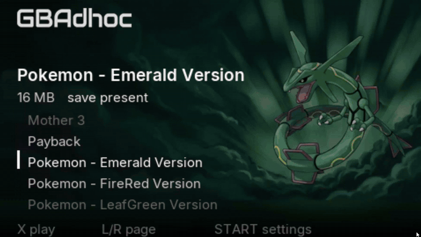
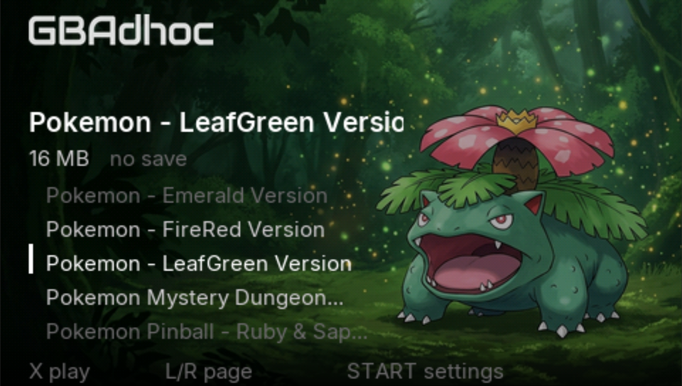
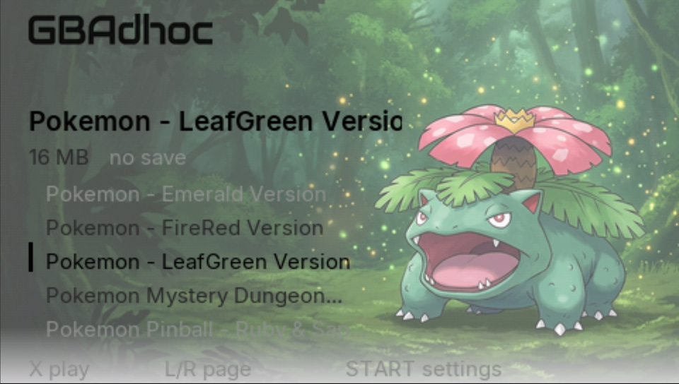
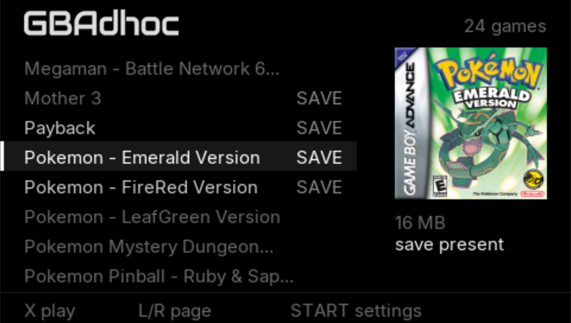
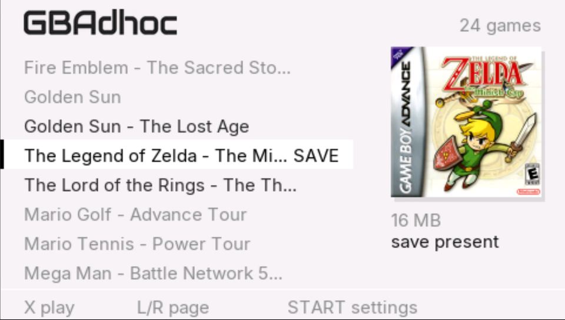
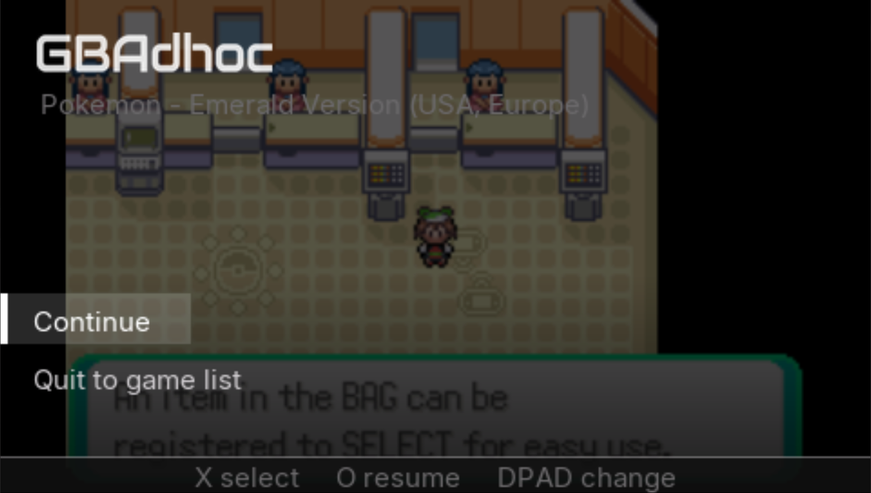
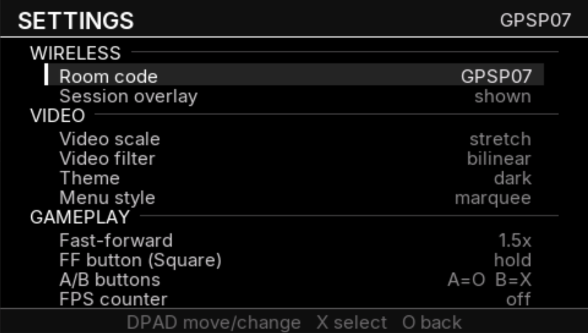
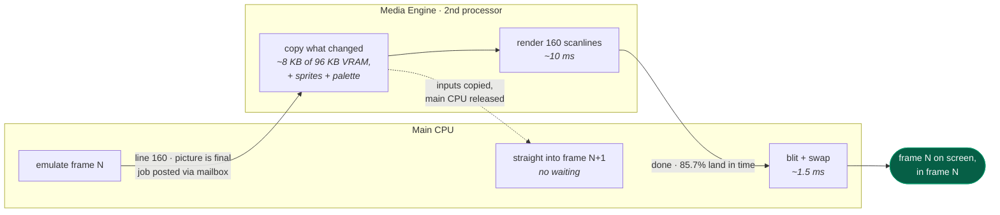

<p align="center">
  <br>
  <sub><b>GBAdhoc 2.0</b></sub>
</p>

**A GBA emulator for the PSP that runs the renderer on the console's second CPU and
carries GBA Wireless Adapter multiplayer over the PSP's own ad-hoc WiFi.**

The first (and only) GBA Emulator with Wireless Adapter Support! 
Trade your friends, Partake in Link battles, recieve Mystery Gifts and more!
It also just plays GBA games, and it is fast: Fully compatible with the PSP-1000,
The secret sauce is a NEW and IMPROVED dual-core Media Engine Frame Renderer. 
Now 1.45ms Faster! (woohoo)

### [**⬇ Download GBAdhoc 2.0**](https://github.com/ShoshinFauteux/GBAdhoc/releases/latest)

Unzip to the **root of your memory stick** — it lands in `PSP/GAME/GBAdhoc`. Put your
`.gba` files in `roms/` and launch it from the XMB. No BIOS needed. Subfolders under
`roms/` are fine, two levels deep; the browser shows one alphabetical list regardless.



## What you get

| | |
|---|---|
| **Wireless multiplayer** | Full AGB-015 Wireless Adapter emulation carried over PSP ad-hoc. Trades, link battles, Union Room, Mystery Gift. **No Internet connection required** |
| **Wake from sleep** | Slide it shut, flick the switch, and come back whenever. Your game is exactly where you left it, under a translucent *Continue / Quit to game list* prompt. On by default. |
| **Two processors, both working** | The PSP's second CPU draws every frame while the first emulates the next one. Full speed on a PSP-1000, and **past 170 fps** with fast-forward uncapped. |
| **Six fast-forward presets** | 1.5x, 3x and uncapped, each in normal or **smooth**. Normal skips frames to go as fast as possible; smooth renders every single one, noticeably slower (roughly 100 fps against 170 uncapped) But far nicer to watch. Hold or toggle, your choice. |
| **A browser worth using** | Two layouts **Marquee** for one game and its art per screen, **Shelf** for more of the library at once, each in light or dark. Four looks from one setting pair. |
| **Save states on the shoulders** | Select + L saves, Select + R loads, one slot per game. Your battery-save SRAM is written out on exit, on HOME and periodically as you play, with a backup kept. |
| **Runs the hard stuff** | Pokémon Unbound and other CFRU hacks at full speed. Emerald, FireRed and LeafGreen all link. |
| **No BIOS needed** | An open-source replacement is bundled. Drop in a real `gba_bios.bin` if you prefer. |
| **All three PSPs** | 1000, 2000/3000 and Go, tested on hardware. |

---

| | |
|---|---|
|  |  |
| **Marquee**, one game per screen, its art behind it | The same, in the light theme |
|  |  |
| **Shelf**, more of the library at once, box art and saves at a glance | Light theme |
|  |  |
| **Wake from sleep**, your game is still there, underneath | Settings |

---

## 2.0.2

**Pokémon Heart & Soul boots.** It went to a white screen for about twelve seconds
and then a black one with pixelated spots. The speed-up that makes Unbound run at
full speed retires only the translated code a write actually touches, and a block
copy only reports its last word — so when Heart & Soul copied a routine into
memory, part of the copy went unnoticed, the game ran a mix of old and new code,
computed a garbage length, and filled the entire address space. Copies now take
the safe path.

**Music no longer costs a third of the frame rate.** The same machinery has 8
*gates* for code that rewrites itself, and Heart & Soul spent all of them at boot
on writes that never came back, so its music engine never got one. Gates now go
one per patched region — extra gates inside one region were saving nothing and
costing a dispatch on every pass — and a gate that goes quiet gets handed back.

On a PSP-1000 with music playing:

| | 2.0.1 | 2.0.2 |
|---|---|---|
| Pokémon Heart & Soul | didn't boot | **locked 60** |
| Pokémon Unbound | — | **59–60** |

With only the boot fix, Heart & Soul ran 37–60 and dropped every time the music
changed.

**Sleep is solid on every model.** Going to sleep released the second processor's
memory while a frame could still be drawing into it. In 2.0 and 2.0.1 a log file
written on every sleep happened to slow things down just enough to hide that, and
taking the log out exposed it — a PSP-3000 stopped waking at all. The emulator now
pauses between frames and lets the Media Engine finish before it lets go. A 3000
and a Go went 20 for 20.

**A PSP-1000 no longer crashes after waking in big games.** It can't hold a 32 MB
game in memory, so it reads the rest from the memory stick as you play, and the
open file doesn't survive sleep. The game ran into garbage a few steps later.
The file is reopened automatically now.

**The clock shows the real date.** Every Pokémon game showed 1 January 2070: on a
real PSP, the call the emulator used for "now" returns the time since the console
was switched on, which reads as 1970, and Pokémon only keeps the last two digits.
The clock now comes from your PSP's own date and time, and a save state made under
the old clock is brought up to today when you load it.

One catch: an in-game save made under the 2070 clock remembers 2070, so the game
sees time run backwards, and daily things like berry growth may stay paused on that
save. Day and night are right for everyone, and new saves work normally.

**Sleep no longer writes to your memory stick.** 2.0 and 2.0.1 added a diagnostic
line to `log/standby.log` every time the PSP slept. That's gone.

Copy the new `EBOOT.PBP` and `gbadhoc_me.prx` over 2.0.x and keep the rest.

## 2.0.1

The game list stopped at 64 ROMs, and it stopped *before* sorting them, so the 64
you got were whichever ones happened to land on the stick first. That reads as
random rather than as a limit, which is the worst way for it to fail — it looks
like the emulator is broken rather than full. Reported within a day of release by
someone with about 130 games, which is a perfectly normal number of games to have
and not one I had tested against.

2.0.1 lists **1024**, walks **subfolders** under `roms/` two levels deep, no longer
drops filenames of 96 characters or more, and if your library is still bigger than
it can show it now says so on screen instead of leaving you to work it out. Nothing
else changed — copy the new `EBOOT.PBP` and `gbadhoc_me.prx` over 2.0 and keep the
rest.

## 2.0

I've been working on this for about a month now, the response I received from my initial release was very positive.
I am a PSP Enjoyer and have been since the age of 9, I suffered through hours of clanker diagnosis to bring this to you.
Hopefully, people are able to enjoy it for years to come. 
**I Respond to issues raised in the repo, if you encounter a bug. Tell me, I will fix it probably maybe**

### Coming from 1.x

Copy the new `EBOOT.PBP` and `gbadhoc_me.prx` over your existing install and keep your
`roms/`, saves and `config.ini`. Three defaults changed and are worth knowing about:

| key | 1.x | 2.0 | why |
|---|---|---|---|
| `net_session_fps` | `29.97` | `59.73` | both consoles now hold full speed during a link |
| `nd_rto_min_us` | 200 ms (fixed) | `50000` | the old floor was 18× the round-trip we actually have |
| `me_mode` | n/a | `1` | the second-core renderer; `0` is the deprecated single-core path |

Sleep/wake (`standby`) is **on** by default in 2.0.

---

## How it runs this fast

The PSP has **two** processors, the main CPU, and a second one Sony put in for video
decoding called the Media Engine. Almost every homebrew emulator uses the first and
lets the second sit idle. GBAdhoc gives it the whole GBA renderer.

The timing is what makes it work. A GBA screen is 160 lines drawn top to bottom, and
**the instant line 160 is done the picture is final**, nothing the game does for the
rest of that frame can change how it looks. But the console still has the whole vblank
period before it has to show anything. That gap is the opportunity: hand the drawing
over at line 160, and both processors run at once for the rest of the frame.



The dotted line is the important one. The Media Engine's first act is to take its own
private copy of everything it needs; the moment that is done it says so, and the main
CPU carries on emulating while the frame is still being painted. Without it the two
would be a relay race instead of two people working.

That is where the speed comes from: the emulator stopped spending roughly **750 µs of
every frame** pushing pixels, and got that time back.

**The parts that are harder than they sound:**

| | |
|---|---|
| **The two CPUs cannot see each other's memory** | No cache coherency between them, each has its own private view, and neither can snoop the other. Every shared word goes through one 64-byte mailbox at an address that bypasses the caches entirely (`0x40000000`). Commands are sequence-numbered, so "has it finished?" is one integer compare and the main CPU never blocks on the answer. |
| **Copying everything cost more than it saved** | Handing over all 96 KB of video RAM per frame was slower than not offloading at all. A 96-byte map tracks which 1 KB pages the game actually wrote, typically ~8 KB, and only those move. **145–173 µs across 14 runs, 0 drops in 161,000 frames.** |
| **Sometimes it doesn't finish** | 85.7% of frames are retired inside their own frame. A miss is not a stutter: the frame simply presents one later, which is exactly what every earlier version did for *every* frame. The misses are CPU spikes, not the engine running short of time.

## Credits, this project stands on other people's work

**Everything that makes wireless multiplayer possible was built by other people. We wrote
a PSP shell and a radio transport around it.**

- **David Guillen Fandos (davidgfnet)**, maintainer and principal author of the modern
  gpSP core. He **reverse-engineered the GBA Wireless Adapter and implemented its
  emulation** (`rfu.c`, `serial_proto.c`), which is the single hardest and most valuable
  piece of this entire stack. His write-up:
  <https://www.davidgf.net/2024/01/13/gba-wireless-adapter/>. Repo:
  <https://github.com/davidgfnet/gpsp>.

- **mcidclan (m-c/d)**, the reason sleep/wake works at all. The PSP cannot resume with
  custom code on the Media Engine, because the kernel's own ME driver owns a system
  event handler that runs during suspend and finds hardware it no longer understands.
  His libraries identified and solved this, and GBAdhoc uses his mechanism (MIT):
  [psp-media-engine-custom-core](https://github.com/mcidclan/psp-media-engine-custom-core)
  and [psp-media-engine-safe-task](https://github.com/mcidclan/psp-media-engine-safe-task).

- **ShoshinFauteux**, project lead.

  I set the direction and ran every hardware test. Sleep/wake was my idea and I pushed
  for it after being told it probably wasn't worth the risk. The wake prompt was my
  design; I turned down two versions before the one that shipped.

  When four rounds of elimination on hardware had ruled out everything we could think of,
  I remembered mcidclan's libraries from an unrelated project. That is where the answer
  was.

  I also guessed people would press HOME at the wake prompt, which turned out to be a
  softlock with no way out.

  The rest was running builds on three consoles and reporting what actually happened,
  including the times it contradicted what the build was meant to prove.

- **Rodrigo Alfonso (afska)** and **Corwin (kuiper.dev)**, the community protocol work on
  the Wireless Adapter that the emulation is built on and cross-checked against:
  [gba-link-connection's `wireless_adapter.md`](https://github.com/afska/gba-link-connection/blob/master/docs/wireless_adapter.md)
  and [blog.kuiper.dev/gba-wireless-adapter](https://blog.kuiper.dev/gba-wireless-adapter).
- **libretro/gpsp**, the upstream repository this is forked from
  (<https://github.com/libretro/gpsp>), including its MIPS32 dynarec (which is why a PSP
  can run this at all), the rewritten video renderer, and the bundled open-source BIOS
  replacement. gpSP itself descends from **Exophase**'s original gpSP and **notaz**'s fork.
- **The libretro project**, the `retro_netpacket_callback` interface (env call 78) that
  lets a frontend carry a core's link traffic over any transport it likes.
- **pret** (`pokeemerald` / `pokefirered` decompilations), used to understand game-side
  RFU behaviour while debugging the input-eating gates.
- **PSPSDK / pspdev**, the toolchain and the `sceNetAdhoc` documentation-by-source.
- **Inter** by Rasmus Andersson (SIL Open Font License), the UI typeface.

Licensed **GPL-2.0**, same as gpSP (see `COPYING`). Upstream copyright headers are intact.
Changes to the core itself are kept minimal and are intended to be offered upstream.

---

## Requirements

- A PSP running custom firmware (developed and tested on **ARK-4**). Works on the
  **PSP-1000, 2000/3000 and Go**, all three are tested.
- A GBA BIOS is **not** required: an open-source replacement is bundled. Drop a real
  `gba_bios.bin` in the app folder if you would rather use one.
- For wireless: **two** PSPs, both with the WLAN switch on, both on the **same fixed
  ad-hoc channel**.

---

## ⚠ Read this before you try wireless

### 1. The physical WLAN switch must be ON

It is in a different place on every model, and the PSP Go has no switch at all, it is
a setting. If it is off you now get a message that says so, rather than a puzzle.

### 2. Both consoles must be on the SAME FIXED ad-hoc channel, not "Automatic"

`Settings → Network Settings → Ad Hoc Channel` on both consoles. Pick **1**, **6** or
**11** and set the same one on both. "Automatic" lets the two consoles choose different
channels, and two radios on different channels cannot hear each other no matter how
correct everything else is.

---

## Install

1. Copy the `GBAdhoc` folder to `ms0:/PSP/GAME/`.
2. Put your `.gba` files in `GBAdhoc/roms/`, loose or in subfolders (two levels).
3. Optional: box art in `GBAdhoc/boxart/`, hero art in `GBAdhoc/hero/`.

---

## Getting the artwork

Two kinds of picture. **Box art** is the little cover in the Shelf layout. **Hero art**
is the full-screen 480×272 backdrop behind the Marquee layout, the Venusaur above.
Neither is required; the browser works fine without them.

### The one rule that matters

**A picture is matched to a game by filename and nothing else.**

```
roms/Pokemon - LeafGreen Version (USA).gba
hero/Pokemon - LeafGreen Version (USA).png     ← found
hero/Pokemon LeafGreen.png                     ← silently ignored
```

There is no database and no fuzzy matching. A mismatched name is not an error and
produces no warning, the game simply shows no art, which looks exactly like a broken
download. **If a card is not showing up, the name is wrong.** Same rule for `boxart/`.

### Three ways to get hero art

**1. Download a pack.** [**GBAdhoc-heroart**](https://github.com/ShoshinFauteux/GBAdhoc-heroart)
has 27 cards ready to go. Unzip, drop the files into `GBAdhoc/hero/`. Names in a pack are already the standard No-Intro ROM names, so if your
ROMs use those it just works. If they don't, `install_heroes.py` in
[tools/heroforge](tools/heroforge) matches the pack against the ROMs you actually
have and renames as it copies, and tells you about anything it could not place, rather
than guessing.

**2. Make your own.** The [art repo](https://github.com/ShoshinFauteux/GBAdhoc-heroart)
carries `PROMPT.md`, the prompt used to generate the existing set, along with why each constraint is there, the composition rules are not
taste, they are where the shell prints its text, and they were worked out by looking at
mockups that failed. Feed it to any image generator, ask for 480×272, save the PNG under
the ROM's exact name. That is the whole process.

**3. Derive it from the box art.** `compose.py` builds a passable backdrop out of a
cover with no AI involved. A lower ceiling than a made-for-purpose card, but it works
for any game and needs nothing but the cover you already have.

### PNG or .565?

Drop in a **PNG** and you are done. The first time you look at that game, the console
decodes it and writes a `.565` beside it, the GPU's own texture format, and every
visit after that is a single read with no decoding at all. **112 ms as a PNG, 14 ms as a
.565.** The conversion is lazy: one game at a time, only for games you actually look at,
and only while the browser is idle, so a big library never stalls at boot.

Packs ship the `.565` files pre-baked, which skips that first-view cost and looks
slightly better as well, baking on a PC lets us dither the 24-bit-to-16-bit step, which
the console's straight truncation cannot do, so skies and gradients come out cleaner.

### Why the art is not in this repository

Hero art is derived from copyrighted box art, the characters and styles belong to
Nintendo, Konami, Capcom and others. Bundling it would put that risk on the emulator
itself, so it lives in a separate archive, the same reason RetroArch keeps
`libretro-thumbnails` as its own project. If a pack ever has to come down, the emulator
is untouched.

The packs are **generated images**, not scans and not official artwork.

---

## Using it

### ROM browser

Two shells, switchable in Settings:

- **Marquee**, one game per screen, its hero art filling the background.
- **Shelf**, a denser list with box art alongside.

D-pad to move, **×** to start, **Start** for Settings. Art loads while you are idle and
never while you are scrolling, so holding a direction stays smooth.

### In-game controls

| PSP | Does |
|---|---|
| D-pad | GBA D-pad |
| **○** | GBA **A** |
| **×** | GBA **B** |
| L / R | GBA L / R |
| Start / Select | GBA Start / Select |
| **△** | Cycle video preset (saved) |
| **□** | Fast-forward (hold by default; mode and multiplier in Settings) |
| **Select + L** | Save state |
| **Select + R** | Load state |
| **Select + Start**, held ~¼ s | In-game menu |

One state slot per game. The shoulder chords require Select held, so L and R behave
normally in play.

### In-game menu

**Resume · Save state · Load state · Wireless · Settings · Exit.** Exit flushes your
save, as does quitting with HOME.

---

## Saves

- **SRAM** is written to `roms/<game>.sav`, flushed on exit, on HOME, and periodically
  during play. A `.sav.bak` is kept.
- **Save states**: one slot per game, `roms/<game>.st0`.
- Sleeping does not touch your save; the game is still in memory exactly as it was.

---

## What to expect from which games

| | |
|---|---|
| **Pokémon Emerald / FireRed / LeafGreen** | Full speed. Union Room trades and battles work between two consoles. |
| **Pokémon Unbound** and other CFRU hacks | Full speed (59.9). Was 29 before translation gates. |
| Most commercial GBA titles | Full speed. |
| Heavy 3D / Mode 7 titles | Varies; fast-forward and frameskip are there if you need them. |

---

## Status and known limitations

**Works, tested on hardware, on all three PSP models.**

- Wireless link battles complete; earlier builds only managed quick trades.
- Sleep/wake with the Media Engine live.
- Single-core rendering is **deprecated** but kept for diagnostics (`me_mode = 0`).

**Rough edges, honestly:**

- The wake prompt appears a beat after the screen lights. The LCD shows video memory the
  instant it powers on, and we blank it at suspend, so you get black then the prompt,
  not a stale frame, but not instant either.
- Link sessions are paced to 59.73 fps on both consoles. Gen-3 games count link timeouts
  in *frames*, so two consoles that disagree about how long a frame is will drop the
  link. Both must run the same rate.
- Hero art is not included in this repository, it is derived from copyrighted box art
  and lives in a separate pack. See `tools/heroforge`.
- FireRed/LeafGreen wireless is less tested than Emerald.

---

## The Test Harness (For Developers)

The reliability of the netcode implementation is validated using
`harness-kit/`, an autonomous, on-device test rig included in this
repository.

Network edge cases cannot be reliably validated within standard emulator
environments. Software like PPSSPP reproduces neither physical PSP WLAN
latency nor multi-device hardware clock drift, which are the primary
variables for ad-hoc desynchronization. To account for this, the test rig
orchestrates unattended execution on actual console hardware.

The harness is designed to support general automated hardware testing and
artifact generation (such as capturing all UI screenshots for this
repository.)

Below is an example of a practical use case (Mine)

```
two PSPs run a scripted trade → exit → expose their memory sticks over USB
→ the PC collects logs/saves/screenshots, restores golden saves, stages the
next build → the consoles relaunch themselves → repeat, all night
```

Every run ends with an oracle check.

### Running it

```
python harness-kit/hw_loop.py --host D: --join E: ^
  --stage <dir> --golden harness-kit/golden-saves ^
  --logs <dir> --verify --forever --keep-going --timeout 86400
```

- **`--stage`** is a folder mirrored onto both cards before each run: the
  EBOOT, `gbadhoc_me.prx`, autopilot `.inputs` scripts, and per-role configs
  (`host-.gpsp-harness.ini` / `join-.gpsp-harness.ini` — prefixes route a
  file to one console). **Editing files here between runs is how you change
  experiments — no restart needed.**
- **`--golden`** holds the baseline saves restored before every run (two
  different parties on purpose, so a completed trade is detectable).
- **`--verify`** turns on the save-decoding oracle. Always pass it.

The consoles run the harness EBOOT (black background — instantly
distinguishable from the playable build) with an autopilot that injects pad
input and asserts on GBA RAM — it navigates the real Union Room, sits in the
real chair, trades the real Pokémon. Fixture scripts for Emerald's Trade
Center are included, comment-annotated with every failure mode that shaped
them.

`harness-kit/HARNESS.md` is the full manual — staging semantics, the config
keys, and the autopilot grammar. `summarize_log.py` turns a 40 KB run log
into 30 lines worth reading.

---

## Building from source

Docker supplies the toolchain, so the build is reproducible on any machine.

```bash
# core + frontend, with the flavour stated explicitly
CORE_FLAGS="SMC_PARTIAL=1 SMC_GATES=1" \
EXTRA_DEFS="-DGPSP_PLAYABLE" \
  ./build.sh
# -> psp/EBOOT.PBP
```

`CORE_FLAGS` reaches the **root** make (anything touching the dynarec: cache sizes,
`SMC_GATES`, `BIG_JIT`). `EXTRA_DEFS` reaches `psp/Makefile` (`GPSP_PLAYABLE`, titles).
They are separate because `make` does not track CFLAGS, and a bare core build will
silently un-flag a core you just flagged by hand, which reads as "the optimisation
didn't help" rather than as a build error.

`build.sh` prints the flavour it built and searches the linked binary for tokens you
name, because a build that quietly did nothing looks exactly like a build that worked.

- **without** `-DGPSP_PLAYABLE` → the harness build: every knob comes from
  `.gpsp-harness.ini`, telemetry on.
- **with** it → the player build: telemetry compiled out entirely (not stubbed, the call
  sites are gone), harness ini inert.

---

## Documentation

- [`docs/ARCHITECTURE.md`](gpsp/docs/ARCHITECTURE.md), how the pieces fit together
- [`docs/ADHOC-NOTES.md`](gpsp/docs/ADHOC-NOTES.md), the RFU protocol as we found it
- [`docs/DECISIONS.md`](gpsp/docs/DECISIONS.md), every design decision and why, including the
  ones that were wrong
- [`docs/TESTING.md`](gpsp/docs/TESTING.md), the harness
- [`docs/RELEASE.md`](gpsp/docs/RELEASE.md), how a release is built and verified

## License

GPL-2.0. See `COPYING`.
