<!-- ============================================================================
     VERSION: the release number is written ONCE, on the "Version" line in the
     hero block just below (3.0.0, confirmed by the owner 2026-09-27).  Every
     other sentence says "this release", and the download button points at
     /releases/latest, so renaming the release is a one-line edit.
     ============================================================================ -->
<p align="center">
  <picture>
    <source srcset="assets/gbadhoc-logo-3-dark@2x.png 2x, assets/gbadhoc-logo-3-dark.png 1x" media="(prefers-color-scheme: dark)">
    <source srcset="assets/gbadhoc-logo-3-light@2x.png 2x, assets/gbadhoc-logo-3-light.png 1x" media="(prefers-color-scheme: light)">
    
  </picture>
</p>

<h3 align="center">Game Boy Advance, Game Boy and Game Boy Color on your PSP,<br>with the Wireless Adapter carried over the PSP's own WiFi.</h3>

<p align="center">
  <sub><b>Version 3.0.0</b> &nbsp;·&nbsp; PSP-1000, 2000/3000 and Go &nbsp;·&nbsp; no BIOS needed &nbsp;·&nbsp; GPL-2.0</sub>
</p>

<p align="center">
  <a href="https://github.com/ShoshinFauteux/GBAdhoc/releases/latest"><b>⬇&nbsp; Download the latest release</b></a>
  &nbsp;&nbsp;·&nbsp;&nbsp; <a href="#install">Install</a>
  &nbsp;&nbsp;·&nbsp;&nbsp; <a href="#whats-new-in-this-release">What's new</a>
  &nbsp;&nbsp;·&nbsp;&nbsp; <a href="#wireless-between-two-consoles">Wireless</a>
  &nbsp;&nbsp;·&nbsp;&nbsp; <a href="#mystery-gift">Mystery Gift</a>
  &nbsp;&nbsp;·&nbsp;&nbsp; <a href="#everything-it-does">Full feature list</a>
</p>

<p align="center">
  <picture>
    <source srcset="gpsp/docs/img/hero-turntable.webp" type="image/webp">
    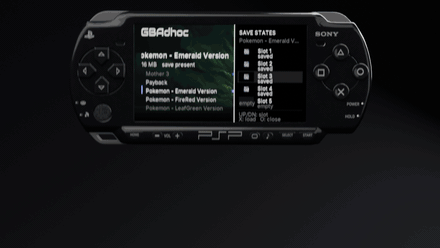
  </picture>
  <br>
  <sub><a href="gpsp/docs/video/hero.mp4">The same loop as an MP4</a></sub>
</p>

<p align="center">
  <picture>
    <source srcset="gpsp/docs/img/link-demo.webp" type="image/webp">
    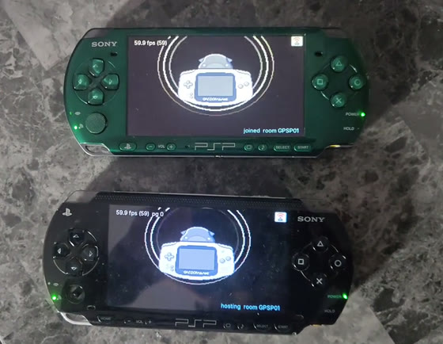
  </picture>
  <br>
  <sub><b>Real hardware, no cables:</b> a PSP-1000 and a PSP-3000 trade over the emulated Wireless Adapter, then fight a link double battle. <a href="gpsp/docs/video/link-demo.mp4">MP4</a></sub>
</p>

Trade with a friend, fight link battles, receive Mystery Gifts, then put the PSP to sleep
and pick the game up tomorrow exactly where it was. It runs the hard ROM hacks at full
speed on a PSP-1000, because the renderer lives on the console's second processor.
And since this release, the `.gb` and `.gbc` games in your library get the same browser,
the same save states and the same shoulder chords as the `.gba` ones.

<br>

<table>
<tr>
<td width="33%" valign="top">
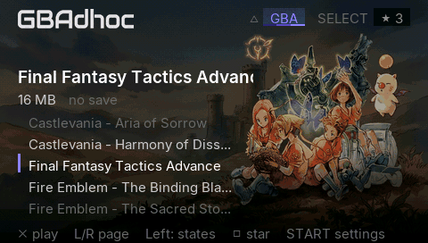
<b>Three consoles, one button</b><br>
<sub>△ cycles GBA → GB → GBC. The new console's palette sweeps the screen while the library rescans underneath it, and each console keeps its own list, its own colour and its own favourites.</sub>
</td>
<td width="33%" valign="top">
<picture><source srcset="gpsp/docs/img/wireless-dark.png" media="(prefers-color-scheme: dark)">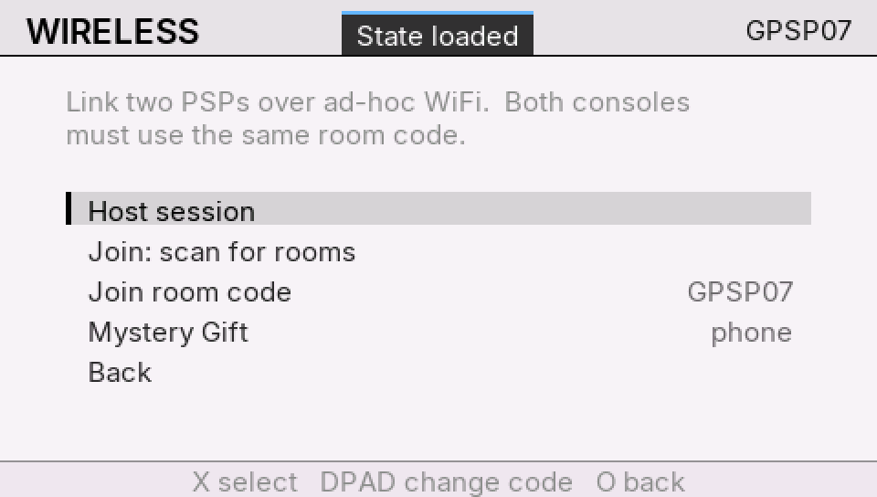</picture>
<b>Real wireless multiplayer</b><br>
<sub>The GBA Wireless Adapter, emulated, with its radio traffic carried over PSP ad-hoc. Union Room trades, link battles and Mystery Gift, no Internet and no cable.</sub>
</td>
<td width="33%" valign="top">
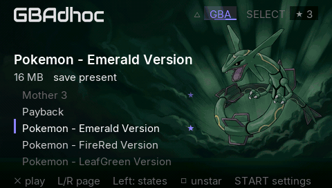
<b>Five save states, with pictures</b><br>
<sub>Every game gets five slots and a shelf in the browser that shows a thumbnail of each, so you launch straight into the moment you saved. GB and GBC too.</sub>
</td>
</tr>
<tr>
<td valign="top">

<b>A browser worth using</b><br>
<sub>Marquee shows one game and its hero art per screen; Shelf shows more of the library at once with box art. Each in dark or light. Art streams in while you are idle and never while you scroll.</sub>
</td>
<td valign="top">
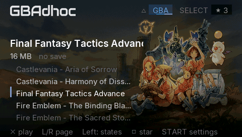
<b>Favourites</b><br>
<sub>□ stars the highlighted game with a small pop; SELECT shows only your stars. It is one plain-text file, <code>roms/favourites.txt</code>, so you can edit it on a PC.</sub>
</td>
<td valign="top">
<picture><source srcset="gpsp/docs/img/game-gba-dark.png" media="(prefers-color-scheme: dark)">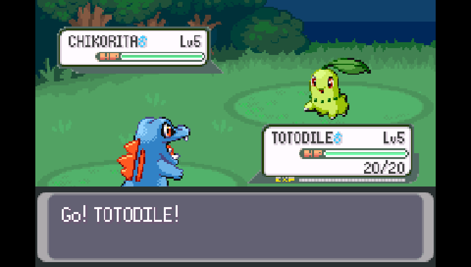</picture>
<b>Two processors, both working</b><br>
<sub>The Media Engine draws every frame while the main CPU emulates the next one. Full speed on a PSP-1000; past 170 fps with fast-forward uncapped; wake from sleep with the game still there.</sub>
</td>
</tr>
</table>

---

## What's new in this release

Everything below is new since 2.1.0. Each item carries a <kbd>NEW</kbd> mark so you can
tell it from the features that were already there.

### <kbd>NEW</kbd> Game Boy and Game Boy Color

`.gb` and `.gbc` files in `roms/` are first-class citizens. They run on **TGB Dual**, the
core from MasterBoy, which is fast enough for full speed on every PSP model with the
sound on. They get the same everything as GBA: the browser with box art and hero art, the
five save-state slots and the state shelf with thumbnails, the fast-forward presets,
sleep/wake, screenshots, and the in-game menu.

- <kbd>NEW</kbd> **GB palette** setting: *Auto* (Super Game Boy colours where the game has
  them, grey otherwise), *Grey*, *DMG green* or *Pocket*. Changes apply to a running game.
- <kbd>NEW</kbd> **Real-time clock** for the games that have one (Gold, Silver, Crystal,
  Harvest Moon): it runs from the PSP's own clock, so the day/night cycle is right.
- Battery saves are compatible with SameBoy, VBA-M and BGB, so a `.sav` from a PC
  emulator drops straight in as `roms/<game>.gbc.sav`.

### <kbd>NEW</kbd> The browser learned three things

- <kbd>NEW</kbd> **The console switch is a moment.** △ cycles GBA → GB → GBC. The rows fan
  out, the new console's palette sweeps in as vertical bands with its name on it (the
  DMG's four greens, the GBC's five shell colours, the GBA's three indigos), and the new
  list slides in beneath them, ~0.6 s in all. The rescan of `roms/` happens while the
  screen is covered, so a big library never stalls a visible frame. Press △ again
  mid-flare to skip straight to the next console.
- <kbd>NEW</kbd> **Per-console skins.** Each console keeps one colour of its own, spent
  in exactly three places: the badge at the top right, the 3 px selection edge and the
  favourite star. Everything else stays monochrome so the box art remains the only
  saturated thing on screen.
- <kbd>NEW</kbd> **Favourites.** □ stars or unstars the highlighted game (a small pop with
  sparks says which way it went; the footer hint reads `□ star` or `□ unstar` to match).
  SELECT swaps the list for your stars and back; because the list only ever shows the
  active console's ROMs, the favourites view is per console for free. It all lives in
  `roms/favourites.txt`, one relative path per line.
- <kbd>NEW</kbd> **Honest hints, real glyphs.** The footer names PSP buttons with the
  PSP's own symbols (△ ○ ✕ □, baked into the UI font) and only advertises what works in
  the state you are in: an empty console says `○ exit`, an empty favourites view says
  `SELECT all games`.

<p align="center">
  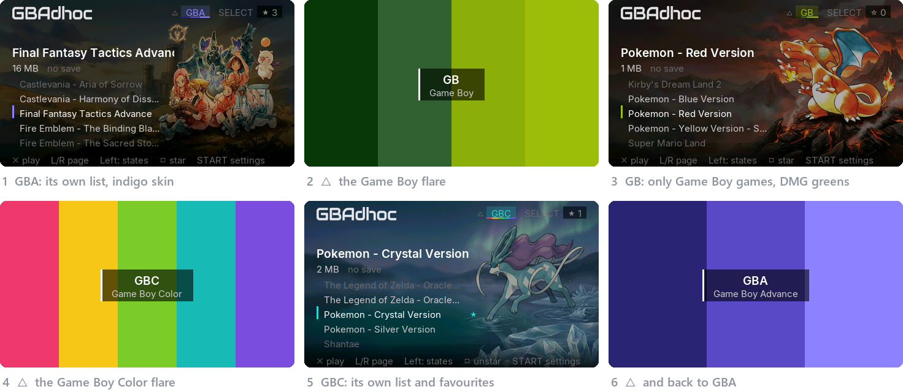
</p>

### <kbd>NEW</kbd> Five save-state slots, and a shelf for them

<picture>
  <source srcset="gpsp/docs/img/state-shelf-dark.png" media="(prefers-color-scheme: dark)">
  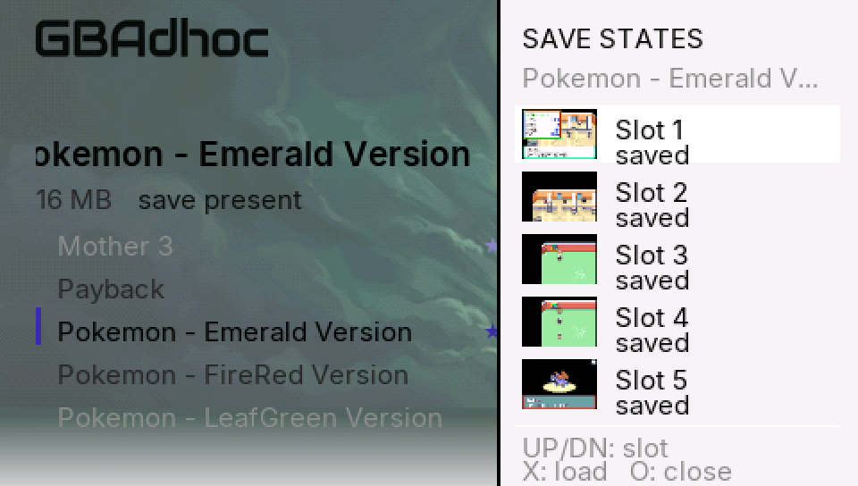
</picture>

One slot per game became **five**, each with a thumbnail of the moment you saved. In the
browser, **LEFT** on a game slides open its shelf; pick a slot and the game launches
straight into it. The in-game menu's *Save state* and *Load state* open the same five
slots. The shoulder chords are unchanged: **Select + L** saves and **Select + R** loads
slot 1, so a quick save is still two buttons. The shelf's slide is eased and its disk
reads happen after it lands, so it never stutters on a slow Memory Stick.

<br clear="right">

### <kbd>NEW</kbd> Stability

- <kbd>NEW</kbd> **Dynarec fixes.** Two real holes in the self-modifying-code tracking
  (a block ending at a gate left the gate word untagged; the low half of a split Thumb
  `BL` emitted nothing), a guest loop closed only by indirect branches can no longer
  spin the main thread forever, and DMA that lands on translated code flushes it.
- <kbd>NEW</kbd> **The Media Engine sprite ghost is fixed at normal speed.** The second
  core now takes its snapshot of video memory at line 160, before the game's VBlank
  writes, which is what made a battler flash in the wrong place for a frame on some
  attacks.
- <kbd>NEW</kbd> **PSP-1000 ROM loading.** A 1000 could fail every GBA ROM with a frame
  buffer allocation error depending on the size of the EBOOT; the loader now guarantees
  1 MiB of headroom after the ROM.

### <kbd>NEW</kbd> Wireless that stays quick

- <kbd>NEW</kbd> **Link shedding.** The emulated adapter's receive queues no longer let
  latency build up over a long link session. On clean air, the lag between choosing a
  move and seeing it stays at the game's own floor across 20-turn battles; without it,
  it climbed turn by turn.
- <kbd>NEW</kbd> **Link hold.** A burst of lost radio no longer drops the link; the
  session rides it out and the game carries on.
- FireRed and LeafGreen link battles have now been through the same extensive testing
  as Emerald, on PPSSPP and on two real consoles.

### <kbd>NEW</kbd> Under the hood

- <kbd>NEW</kbd> **Startup-sized JIT caches.** The translation caches are sized at boot
  from the memory the console actually has, so a PSP-2000/3000/Go uses its extra RAM and
  a PSP-1000 stays inside its own.
- <kbd>NEW</kbd> **Full ROM residency on the 64 MB consoles.** On a PSP-2000/3000/Go a
  32 MB ROM is held entirely in memory, so there is no Memory Stick paging at all.
  On by default there; `rom_resident = 0` in `config.ini` turns it off. A PSP-1000
  keeps the paged cache.
- <kbd>NEW</kbd> **Fast-forward save fix.** An in-game save made during Unlimited
  fast-forward could sit unwritten until fast-forward ended; it is written on time now.

### <kbd>NEW</kbd> Smaller things

- The audio worker and resampler were hardened against the power-callback race that
  could halve the pace after a wake.
- △ in game persists one setting instead of rewriting `config.ini`.
- CodeBreaker cheat codes with multiple lines are walked correctly.


<details>
<summary><b>Release history</b>: 2.1.0 and earlier</summary>

### 2.1.0

Faster where it was slowest, and a hard freeze found and fixed.

**The sound mixer was costing a third of the frame.** Pokémon games build their sound
mixer at runtime and then rewrite its instructions as they play; every one of those
writes forces the emulator to throw away compiled code and recompile it, about twelve
times a frame in a busy battle. The emulator already knew how to handle this cheaply, but
it only recognised one game's mixer by sight; Heart & Soul's sits a few bytes further
along and took the expensive path every time. It now recognises the whole family. On
Heart & Soul's heaviest battle that is 37% less work per frame, and 57 fps became a solid
59.8. Unbound and everything already at full speed were unaffected.

**The freeze.** A compiled block could contain a direct jump to an address the translator
had failed to resolve, and nothing on the way there called the safety net, so the console
locked up hard. Those exits now go to a permanent known-good block. The emulator's memory
of which addresses rewrite themselves is also wiped when a ROM loads. Backed by 36
unattended runs across a PSP-1000 and a PSP-3000 and 1440 save-state reloads with
fast-forward toggling throughout, zero lockups.

### 2.0.x

Mystery Gift from an Android phone, the three fast-forward presets, the Marquee and Shelf
browsers with box art and hero art, wake from sleep with the Media Engine live, the
translation gates that took Pokémon Unbound from 29 to 59.9 fps, and the wall clock for
the GBA RTC. The full notes for each are on the
[releases page](https://github.com/ShoshinFauteux/GBAdhoc/releases).

</details>

---

## Wireless between two consoles

The AGB-015 Wireless Adapter is emulated in full (that work is
[davidgfnet's](#credits-this-project-stands-on-other-peoples-work)); GBAdhoc carries its
radio traffic over the PSP's ad-hoc WiFi with a reliable transport of its own. Two
consoles, both with the WLAN switch on, both on the same fixed ad-hoc channel, and the
games see each other exactly as they would through the adapter.


**What works:** Union Room trades, link battles (singles and doubles), the Trade Center,
and Mystery Gift, between any of Emerald, FireRed and LeafGreen. Link sessions are paced
to 59.73 fps on both consoles, because Gen-3 games count link timeouts in *frames* and
two consoles that disagree about how long a frame is drop the link. One thing that is
the game and not the link: at each battle menu the games themselves pause for about a
second while both consoles sync, exactly as they do through the real adapter.

### ⚠ Read this before you try wireless

**1. The physical WLAN switch must be ON.** It is in a different place on every model,
and the PSP Go has no switch at all, it is a setting. If it is off you get a message that
says so.

**2. Both consoles must be on the SAME FIXED ad-hoc channel, not "Automatic".**
GBAdhoc uses the channel the XMB sets under `Settings → Network Settings → Ad Hoc Mode`.
Pick **1**, **6** or **11** and set the same one on both consoles, and pick one that
is *away from your router*: two PSPs next to a busy router on the same channel will
struggle to hear each other. "Automatic" lets the two consoles choose different
channels, and two radios on different channels cannot hear each other no matter how
correct everything else is.

**3. Start the session from the in-game menu.** **Select + Start** (held ~¼ s) →
*Wireless* → *Host* on one console, *Join* on the other, then use the game's own wireless
counter as you would with the real adapter. Save states are locked while a session is
live; the adapter's state is not in them and a mid-session load would desync both games.

---

## Mystery Gift

Gen-3 Mystery Gift works, from an Android phone. The phone stands in for Nintendo's
distribution station, and the game receives a real Wonder Card through its own Mystery
Gift menu; nothing is written into your save by the emulator.

**Get the app:** [**Mystery Gift Station**](https://github.com/ShoshinFauteux/MysteryGiftStation)

1. Open Mystery Gift Station on the phone and pick a gift. The app starts its own
   Wi-Fi Direct access point named **`Mystery Gift`**.
2. On the PSP, in-game, press **SELECT + DOWN**. GBAdhoc joins that access point and
   starts listening; it creates the connection profile itself, so there is nothing to set
   up in the PSP's network settings.
3. In the game, go to **Mystery Gift** on the title screen and receive the card as you
   normally would.

**SELECT + DOWN** again stops it. Mystery Gift and wireless trading cannot run at the same
time; the emulator will tell you to stop one before starting the other. Full protocol
notes, the gift list and troubleshooting live in the app's repository.

---

## Screenshots

Every screen, in the theme you are reading this in. Switch GitHub to the other theme to
see the other set.

<table>
<tr>
<td width="50%"><picture><source srcset="gpsp/docs/img/marquee-gba-dark.png" media="(prefers-color-scheme: dark)">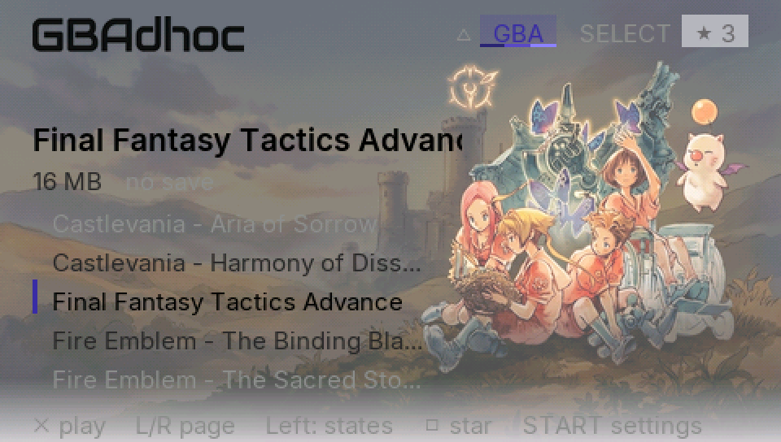</picture><br><sub><b>Marquee</b>, GBA. One game per screen, its hero art behind it.</sub></td>
<td width="50%"><picture><source srcset="gpsp/docs/img/shelf-gba-dark.png" media="(prefers-color-scheme: dark)">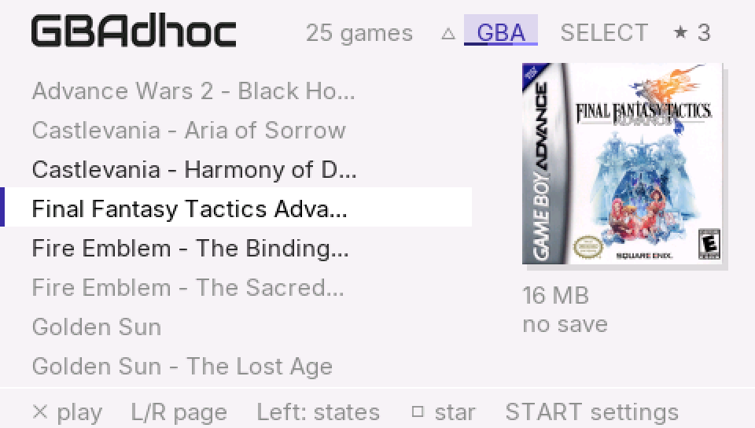</picture><br><sub><b>Shelf</b>, GBA. More of the library at once, box art and saves at a glance.</sub></td>
</tr>
<tr>
<td><picture><source srcset="gpsp/docs/img/marquee-gb-dark.png" media="(prefers-color-scheme: dark)">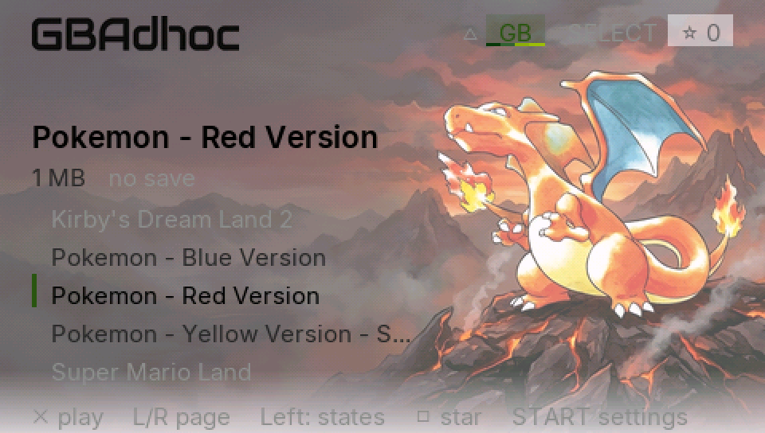</picture><br><sub><b>Game Boy skin.</b> The DMG greens on the badge, the edge and the star.</sub></td>
<td><picture><source srcset="gpsp/docs/img/marquee-gbc-dark.png" media="(prefers-color-scheme: dark)">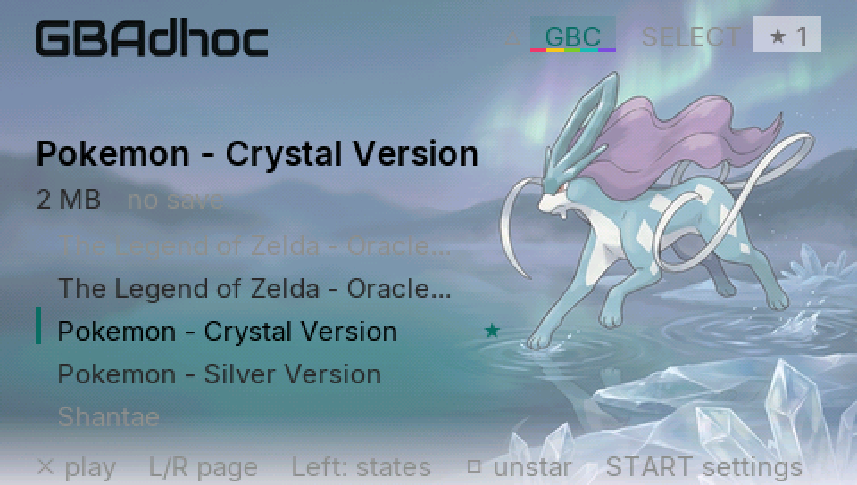</picture><br><sub><b>Game Boy Color skin.</b> The five shell colours.</sub></td>
</tr>
<tr>
<td><picture><source srcset="gpsp/docs/img/favourites-dark.png" media="(prefers-color-scheme: dark)">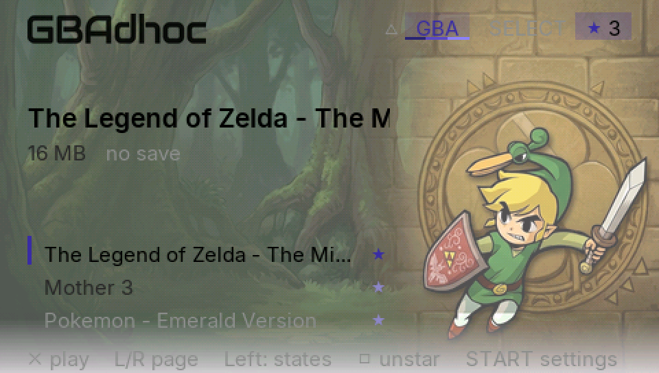</picture><br><sub><b>Favourites.</b> SELECT shows only your stars for the console you are on.</sub></td>
<td><picture><source srcset="gpsp/docs/img/state-shelf-gbc-dark.png" media="(prefers-color-scheme: dark)">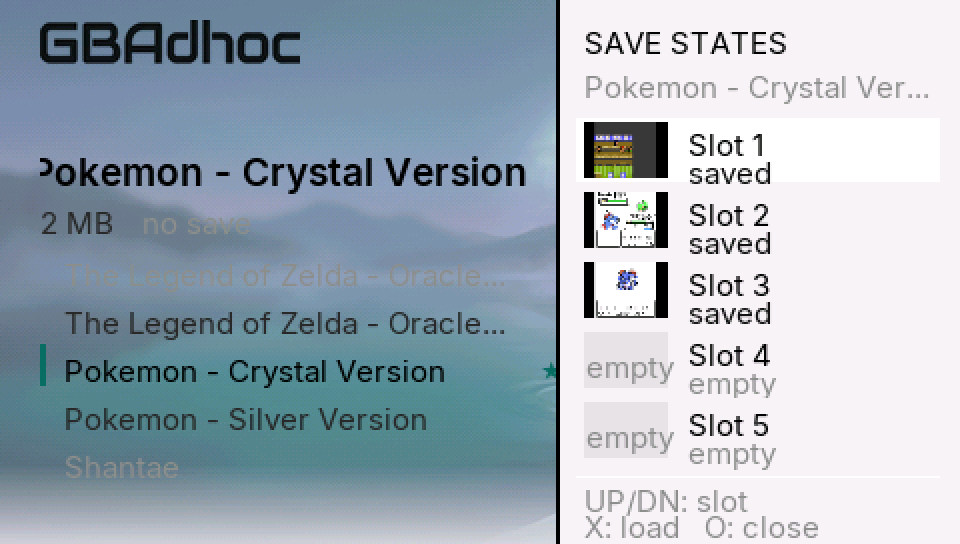</picture><br><sub><b>The state shelf on a GBC game.</b> Same five slots, same thumbnails.</sub></td>
</tr>
<tr>
<td><picture><source srcset="gpsp/docs/img/menu-dark.png" media="(prefers-color-scheme: dark)">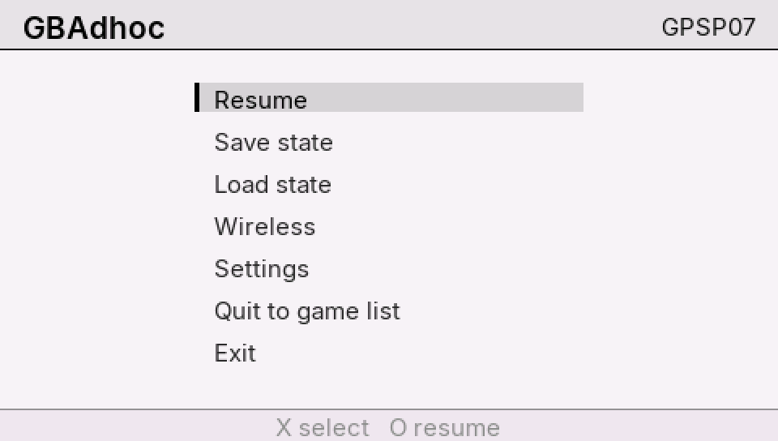</picture><br><sub><b>In-game menu</b> (Select + Start): resume, save and load a slot, wireless, settings, exit.</sub></td>
<td><picture><source srcset="gpsp/docs/img/settings-dark.png" media="(prefers-color-scheme: dark)">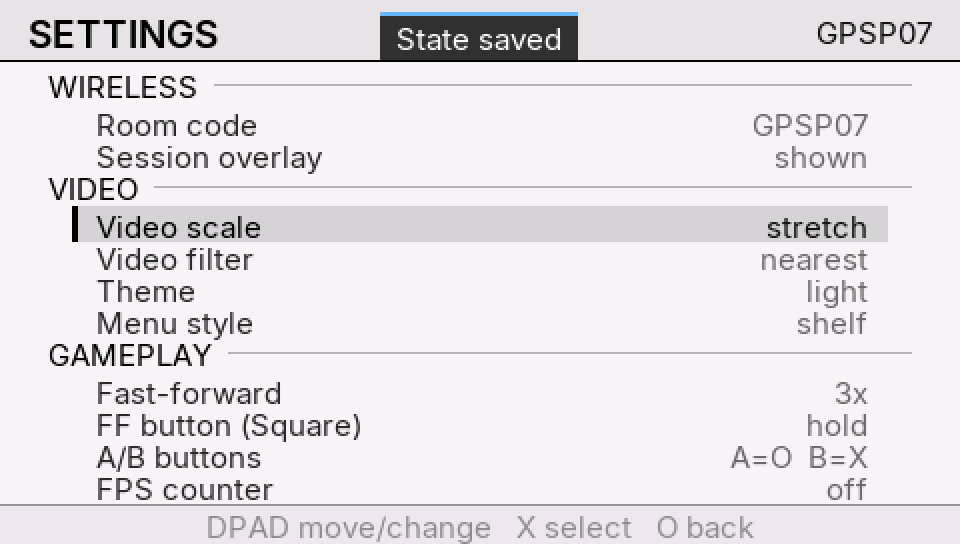</picture><br><sub><b>Settings.</b> Wireless, video, gameplay; the GB palette row is at the bottom.</sub></td>
</tr>
<tr>
<td><picture><source srcset="gpsp/docs/img/game-gb-dark.png" media="(prefers-color-scheme: dark)">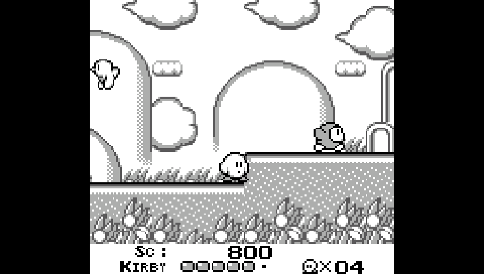</picture><br><sub><b>A Game Boy game</b>, DMG palette, at full speed.</sub></td>
<td><picture><source srcset="gpsp/docs/img/game-gbc-dark.png" media="(prefers-color-scheme: dark)">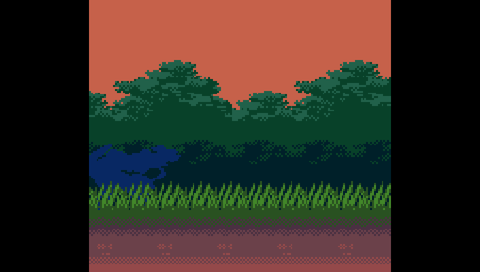</picture><br><sub><b>A Game Boy Color game.</b></sub></td>
</tr>
</table>

---

## Everything it does

<details open>
<summary><b>The full feature list</b></summary>

**Consoles**
- Game Boy Advance on the gpSP core with its MIPS dynarec and the translation gates that
  make CFRU hacks (Pokémon Unbound, Heart & Soul) run at full speed.
- <kbd>NEW</kbd> Game Boy and Game Boy Color on TGB Dual, full speed with sound, with
  Super Game Boy palettes, a GB palette setting and a cartridge real-time clock.
- No BIOS needed: an open-source replacement is bundled. Drop a real `gba_bios.bin` in
  the app folder if you prefer.

**Performance**
- The renderer runs on the PSP's Media Engine, so both processors work on every frame.
- Three fast-forward presets: **3x** (a steady triple speed), **Unlimited** (skips frames,
  past 170 fps) and **Unlimited Smooth** (draws every frame, about 100 fps). Hold or
  toggle, your choice.
- Only the video memory the game actually wrote is handed to the second core, tracked
  per page; about 85% of frames finish inside their own frame.

**The browser**
- Two shells, **Marquee** and **Shelf**, each in **dark** or **light**.
- <kbd>NEW</kbd> One list per console, △ to switch with the flare, per-console skins.
- <kbd>NEW</kbd> Favourites with □ and SELECT, stored in `roms/favourites.txt`.
- <kbd>NEW</kbd> PSP button glyphs in the hints, and hints that only name what works.
- Box art and hero art matched by filename; `.565` textures baked on first view, one game
  at a time while idle, so a big library never stalls at boot.
- Subfolders under `roms/`, two levels deep; the browser shows one alphabetical list.

**Saving**
- <kbd>NEW</kbd> Five save-state slots per game with thumbnails, the state shelf in the
  browser (LEFT), and the slot pickers in the in-game menu.
- Select + L / Select + R for a quick save and load of slot 1.
- Battery saves flushed on exit, on HOME and periodically as you play, with a `.sav.bak`
  kept. Sleeping never touches the save.

**Wireless**
- AGB-015 Wireless Adapter emulation over PSP ad-hoc: Union Room, Trade Center, link
  battles, Mystery Gift. Host, join by scan or join by room code.
- Mystery Gift from an Android phone (Mystery Gift Station).
- Save auto-backup before every session; save states locked while linked.

**The console**
- Wake from sleep: slide it shut, flick the switch, come back whenever, under a
  translucent *Continue / Quit to game list* prompt.
- All three PSP models, tested on hardware. 333 MHz.
- L + R + SELECT takes a screenshot to `log/` in any build.

</details>

<details>
<summary><b>In-game controls</b></summary>

| PSP | Does |
|---|---|
| D-pad | D-pad |
| **○** | **A** (swap with **×** under *Settings → A/B buttons*) |
| **×** | **B** |
| L / R | GBA L / R |
| Start / Select | Start / Select |
| **△** | Cycle video preset (saved) |
| **□** | Fast-forward (hold by default; preset and hold/toggle in Settings) |
| **Select + L** | Save state, slot 1 |
| **Select + R** | Load state, slot 1 |
| **Select + Start**, held ~¼ s | In-game menu |
| **Select + Down** | Mystery Gift listener on/off |
| **L + R + Select** | Screenshot |

The shoulder chords require Select held, so L and R behave normally in play. The
in-game menu is **Resume · Save state · Load state · Wireless · Settings · Exit**; Exit
flushes your save, as does quitting with HOME.

</details>

<details>
<summary><b>Settings</b></summary>

| Section | Setting | |
|---|---|---|
| Wireless | Room code | `GPSP00`–`GPSP99`, for joining by code |
| | Session overlay | show or hide the session chip during play |
| Video | Video scale | 1x, fit or stretch |
| | Video filter | nearest or bilinear |
| | Theme | dark or light |
| | Menu style | Marquee or Shelf |
| Gameplay | Fast-forward | 3x, Unlimited, Unlimited Smooth |
| | FF button (Square) | hold or toggle |
| | A/B buttons | ○/× or ×/○ |
| | FPS counter | on or off |
| | <kbd>NEW</kbd> GB palette | Auto, Grey, DMG green, Pocket |

</details>

<details>
<summary><b>Where things are saved</b></summary>

- **Battery saves**: `roms/<game>.sav` for GBA, `roms/<game>.gb.sav` and
  `roms/<game>.gbc.sav` for Game Boy (the extension stays in the name, so a GB and a GBA
  game with the same title never share a save). A `.sav.bak` is kept.
- **Save states**: `roms/<game>.st0` … `.st4`, and `.gb.st0` / `.gbc.st0` … likewise,
  each with a `.thumb` beside it.
- **Favourites**: `roms/favourites.txt`.
- **Screenshots**: `log/`.
- **Settings**: `config.ini` in the app folder.

</details>

---

## Install

1. Download the [latest release](https://github.com/ShoshinFauteux/GBAdhoc/releases/latest)
   and unzip it to the **root of your Memory Stick**. It lands in `PSP/GAME/GBAdhoc`.
2. Put your `.gba`, `.gb` and `.gbc` files in `GBAdhoc/roms/`, loose or in subfolders
   (two levels).
3. Optional: box art in `GBAdhoc/boxart/`, hero art in `GBAdhoc/hero/` (see
   [Artwork](#artwork)).
4. Launch it from the XMB. No BIOS needed.

**Requirements:** a PSP running custom firmware (developed and tested on **ARK-4**);
PSP-1000, 2000/3000 and Go are all tested. For wireless: two PSPs, both with the WLAN
switch on, both on the same fixed ad-hoc channel.

**Upgrading from any earlier version:** copy the new `EBOOT.PBP` and `gbadhoc_me.prx`
over your existing install, then **delete your old `config.ini`**. Several defaults
changed, and a stale file keeps the old ones. Your `roms/`, battery saves and save
states are untouched; the single state slot you had becomes slot 1.

### Artwork

Two optional kinds of picture: **box art**, the small cover in the Shelf layout, and
**hero art**, the full-screen 480x272 backdrop behind Marquee. The browser works fine
without either. **A picture is matched to a game by filename and nothing else:**

```
roms/Pokemon - LeafGreen Version (USA).gba
hero/Pokemon - LeafGreen Version (USA).png     <- found
hero/Pokemon LeafGreen.png                     <- silently ignored
```

No database, no fuzzy matching, and a mismatch prints no warning; the game just shows
no art. **If a card is not showing up, the name is wrong.** Same rule for `boxart/`, and
the same for `.gb` and `.gbc` games.

Ready-made packs (GBA, and now GB/GBC), a tool that renames a pack to match the ROMs
you actually have, and a script that derives a backdrop from box art are in the art
repository: [**GBAdhoc-heroart**](https://github.com/ShoshinFauteux/GBAdhoc-heroart).
The packs are generated images, not scans and not official artwork, and they are kept
out of this repository because hero art derives from copyrighted box art.

---

## What to expect from which games

<p align="center">
  <picture>
    <source srcset="gpsp/docs/img/psp1000-unbound.webp" type="image/webp">
    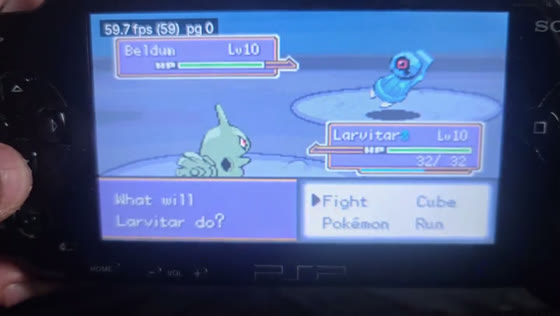
  </picture>
  <br>
  <sub><b>The slowest PSP, the heaviest game:</b> Pokémon Unbound's rival battle on a PSP-1000, FPS counter on. The middle of the fight is sped up 3× for the clip (labelled); the counter shows the real rate throughout. <a href="gpsp/docs/video/psp1000-unbound.mp4">MP4</a></sub>
</p>

| | |
|---|---|
| **Pokémon Emerald / FireRed / LeafGreen** | Full speed. Union Room trades and link battles work between two consoles. |
| **Pokémon Unbound** and other CFRU hacks | Full speed (59.9). Run it on the game's **medium music preset** for the best results. |
| **Pokémon Heart & Soul** | Full speed (59.8) including its heaviest battles. Set its sound to **mono** for the best performance. Tested hard; if you hit something odd, please raise it. |
| Most commercial GBA titles | Full speed. |
| Heavy 3D / Mode 7 GBA titles | Varies; fast-forward and frameskip are there if you need them. |
| **Game Boy / Game Boy Color** | Full speed with sound on every model. Shantae is playable but shows glitches on this core. |

---

## Status and known limitations

**Works, tested on hardware, on all three PSP models:** wireless link battles and
trades, sleep/wake with the Media Engine live, GB/GBC at full speed.

**Rough edges, honestly:**

- The wake prompt appears a beat after the screen lights: the LCD shows video memory the
  instant it powers on, and we blank it at suspend, so you get black then the prompt.
- Link sessions are paced to 59.73 fps on both consoles; both must run the same rate.
- Hero art is not included in this repository; see
  [GBAdhoc-heroart](https://github.com/ShoshinFauteux/GBAdhoc-heroart).
- The Game Boy link cable over ad-hoc (`.gb`/`.gbc` two-player) is in the code and works
  on the desktop twin, but it has not yet been tested between two real consoles, so it
  is not claimed above.
- Single-core rendering is **deprecated** but kept for diagnostics (`me_mode = 0`).
- If a game ever faults, it is reset with a short message (*Emulation fault, game was
  reset*) and your battery save stays in memory. If the PSP itself ever faults, the
  screen shows a diagnostic page; a photo of it is the most useful thing a bug report can
  carry.

---

## The second processor

The PSP has two CPUs. The second one, Sony's Media Engine, sits idle in almost every
homebrew emulator; GBAdhoc gives it the entire GBA renderer.

A GBA screen is 160 lines drawn top to bottom, and the instant line 160 is done the
picture is final; nothing the game does for the rest of the frame can change it. But the
console still has the whole vblank period before it has to show anything. So the drawing
is handed over at line 160 and both processors work at once for the remainder. The Media
Engine's first act is to take a private copy of what it needs, which releases the main
CPU to start the next frame instead of waiting, and it copies only the video memory the
game actually wrote, typically 8 KB of 96 KB, tracked by a per-page map. The emulator
gets roughly 750 microseconds of every frame back.

---

## Building from source

Docker supplies the toolchain, so the build is reproducible on any machine.

```bash
# one profile name, one artifact, one manifest
gpsp/tools/build.sh release      # what a player installs
gpsp/tools/build.sh harness      # the hardware test rig
gpsp/tools/build.sh diagnostic   # release plus instruments
# -> gpsp/psp/EBOOT.PBP
```

The three profiles share the same dynarec configuration deliberately: a diagnostic build
must be the *same emulator* as the release, or it answers a different question. What
differs is the frontend: **release** has telemetry compiled out entirely; **harness**
adds telemetry and the autopilot so a job file can drive a console unattended (titled
*GBAdhoc HARNESS* on the XMB so it is never mistaken for a playable build);
**diagnostic** is release plus instruments that write to the Memory Stick. The script
reads the linked binary and fails if a profile's expected strings are missing or a
forbidden one is present. The reproducible release procedure and current flag set are in
[`gpsp/docs/RELEASE.md`](gpsp/docs/RELEASE.md).

## Documentation

- [`docs/ARCHITECTURE.md`](gpsp/docs/ARCHITECTURE.md), how the pieces fit together
- [`docs/ADHOC-NOTES.md`](gpsp/docs/ADHOC-NOTES.md), the RFU protocol as we found it
- [`docs/DECISIONS.md`](gpsp/docs/DECISIONS.md), every design decision and why, including
  the ones that were wrong
- [`docs/TESTING.md`](gpsp/docs/TESTING.md), the harness
- [`docs/RELEASE.md`](gpsp/docs/RELEASE.md), how a release is built and verified
- [`gbcore/tgbdual/LOCAL-PATCHES.md`](gpsp/gbcore/tgbdual/LOCAL-PATCHES.md), every change
  to the Game Boy core

## Credits, this project stands on other people's work

**Everything that makes wireless multiplayer possible was built by other people. We wrote
a PSP shell and a radio transport around it.**

- **David Guillen Fandos (davidgfnet)**, maintainer and principal author of the modern
  gpSP core. He **reverse-engineered the GBA Wireless Adapter and implemented its
  emulation** (`rfu.c`, `serial_proto.c`), which is the single hardest and most valuable
  piece of this entire stack. His write-up:
  <https://www.davidgf.net/2024/01/13/gba-wireless-adapter/>. Repo:
  <https://github.com/davidgfnet/gpsp>.
- **Hii**, author of **TGB Dual**, the Game Boy / Game Boy Color emulator that runs the
  `.gb` and `.gbc` games, and **Brunni**, whose **MasterBoy** ported it to the PSP (with
  earlier PSP work by LCK, ruka and RIN) and made it fast enough for full speed. GBAdhoc
  vendors MasterBoy's core only, with its changes listed in
  `gbcore/tgbdual/LOCAL-PATCHES.md`. Its Super Game Boy support descends from **GEST**
  (TM) and **VisualBoyAdvance** (Forgotten). All GPL v2 or later.
- **mcidclan (m-c/d)**, the reason sleep/wake works at all. The PSP cannot resume with
  custom code on the Media Engine, because the kernel's own ME driver owns a system
  event handler that runs during suspend and finds hardware it no longer understands.
  His libraries identified and solved this, and GBAdhoc uses his mechanism (MIT):
  [psp-media-engine-custom-core](https://github.com/mcidclan/psp-media-engine-custom-core)
  and [psp-media-engine-safe-task](https://github.com/mcidclan/psp-media-engine-safe-task).
- **ShoshinFauteux**, project lead. Set the direction, ran every hardware test on three
  consoles, pushed for sleep/wake after being told it probably was not worth the risk,
  designed the wake prompt, and reported what actually happened, including the times it
  contradicted what a build was meant to prove.
- **Rodrigo Alfonso (afska)** and **Corwin (kuiper.dev)**, the community protocol work on
  the Wireless Adapter that the emulation is built on and cross-checked against:
  [gba-link-connection's `wireless_adapter.md`](https://github.com/afska/gba-link-connection/blob/master/docs/wireless_adapter.md)
  and [blog.kuiper.dev/gba-wireless-adapter](https://blog.kuiper.dev/gba-wireless-adapter).
- **libretro/gpsp**, the upstream repository this is forked from
  (<https://github.com/libretro/gpsp>), including its MIPS32 dynarec (which is why a PSP
  can run this at all), the rewritten video renderer, and the bundled open-source BIOS
  replacement. gpSP itself descends from **Exophase**'s original gpSP and **notaz**'s fork.
- **The libretro project**, the `retro_netpacket_callback` interface (env call 78) that
  lets a frontend carry a core's link traffic over any transport it likes.
- **pret** (`pokeemerald` / `pokefirered` decompilations), used to understand game-side
  RFU behaviour while debugging the input-eating gates.
- **PSPSDK / pspdev**, the toolchain and the `sceNetAdhoc` documentation-by-source.
- **Inter** by Rasmus Andersson (SIL Open Font License), the UI typeface.
- **The PSP in the renders** on this page is
  [*Sony PSP*](https://sketchfab.com/3d-models/sony-psp-dca89d10ec304d0cab76837750df7761)
  by [Ilya Ostrovsky](https://sketchfab.com/strov), licensed
  [CC BY 4.0](https://creativecommons.org/licenses/by/4.0/); modified: re-lit, screen
  replaced with GBAdhoc footage. The renders are ours; the game content on the screens
  is the games'.

Licensed **GPL-2.0**, same as gpSP (see `COPYING`). Upstream copyright headers are intact.
Changes to the core itself are kept minimal and are intended to be offered upstream.

## License

GPL-2.0. See `COPYING`.
