# Control remapping (Settings > Controls)

Branch `claude/control-remap`, from `claude/candidate-3.1` (d7df3bb). 2026-10-01.

Players can rebind every GBA/GB button and every emulator shortcut, or leave
any of them blank. Two things stay fixed: START+SELECT (the menu) and HOME.
The one exception is the menu button itself, which is a two-way toggle,
START+SELECT or HOME (section 10, `claude/home-toggle`).
With no `bind_*` keys in CONFIG.INI, which is every config written before this
feature, the emulator behaves exactly as 3.0. "Exactly" is measured below, not
assumed.

| Where | What |
|---|---|
| `psp/ctl_map.c`, `psp/ctl_map.h` | The model: action table, defaults, trigger shapes, conflict rule, validation, CONFIG.INI. Pure C, no SDK, host-tested. |
| `psp/main_psp.c` | `plat_input_bitmask()` becomes one table lookup. Every shortcut site reads one `ctl_shortcuts()` result per frame. |
| `psp/mgift_shortcut.h` | The Mystery Gift chord takes the binding as a parameter. |
| `psp/config_psp.c/.h` | `g_pcfg.controls`, loaded (with the `btn_swap` migration, §4) by `pcfg_load()`, saved by `pcfg_save()`, repaired by `pcfg_validate()`. |
| `psp/ui_psp.c` | The Controls page (`SCR_CONTROLS`), the Settings entry row, and the demo scripts. |
| `tools/tests/test_ctl_map.c` | The host unit test, registered in the `fe_ini_bounds` suite. The runner caps the suite count at 30. |

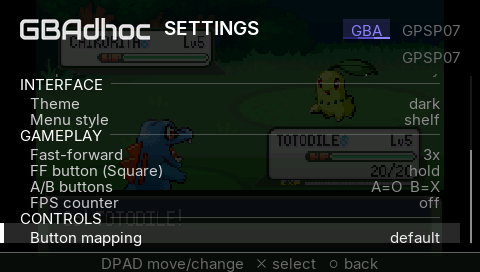
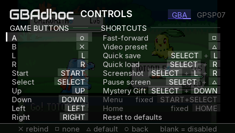

---

## 1. Inventory: every binding the frontend has

This inventory comes from a full sweep of `sceCtrlPeekBufferPositive` callers
(`main_psp.c`, `ui_psp.c` x3, `usb_handoff.c`) and every `PSP_CTRL_*` test.

### 1a. Game buttons (remappable, one PSP button each, or none)

These reach the GBA core, the GB/GBC core (TGB Dual) and the GB link lockstep.
All three read the same `input_bitmask` callback.

| Action | CONFIG.INI key | Default |
|---|---|---|
| A | `bind_a` | CIRCLE |
| B | `bind_b` | CROSS |
| L | `bind_l` | L |
| R | `bind_r` | R |
| Start | `bind_start` | START |
| Select | `bind_select` | SELECT |
| Up / Down / Left / Right | `bind_up` `bind_down` `bind_left` `bind_right` | the d-pad |

The d-pad remaps as cleanly as the face buttons do, because each direction is
one bit in the same table. The analog stick has never been mapped, and it still
is not.

### 1b. Shortcuts (remappable, one button or a chord of up to 4, or none)

All of these act only in game. Triangle and Square have never been GBA buttons.

| Action | Key | Default | Trigger shape (3.0 behaviour, kept) | Context gates (unchanged) |
|---|---|---|---|---|
| Fast-forward | `bind_ff` | SQUARE | Hold mode reads the chord's level. Toggle mode toggles on its press. | Locked to 1x with a toast during a wireless session. |
| Video preset (scale/filter cycle) | `bind_video` | TRIANGLE | Fires on the press. Exempt from the longer-chord rule (§3). | Menu closed. |
| Quick save, slot 1 | `bind_quicksave` | SELECT+L | Modifier chord: SELECT held, fires on L. Longer-chord rule. | Menu closed, no autopilot script, state path set. Refused in wireless. |
| Quick load, slot 1 | `bind_quickload` | SELECT+R | As quick save. Never fires on the same frame as a save. | As quick save. |
| Screenshot | `bind_screenshot` | L+R+SELECT | Chord complete plus any of its buttons newly pressed, START not held (ADR-0069). | Works with the menu open, as 3.0 did. Silent while Controls is capturing. |
| Pause screen (the wake overlay) | `bind_pause` | SELECT+TRIANGLE | Modifier chord. | Menu closed, no script. |
| Mystery Gift listener | `bind_mystery_gift` | SELECT+DOWN | Exclusive: the chord and nothing else held. Its buttons are withheld from the game until released. | GBA only, menu closed, no script, no pause screen. |
| Crash self-test | `bind_catch_test` | L+R+UP+TRIANGLE | Level, while held. | Only compiled into `GPSP_CATCH_SELFTEST` bisect builds. Elsewhere the row is hidden, the key is never read or written, and it conflicts with nothing. |

**Modifier chord** means: SELECT and START inside a chord are modifiers that
must already be down, and pressing any other button of the chord fires it.
SELECT+L fires on L with SELECT held. It does not fire on SELECT with L held.
That is 3.0's quick-save behaviour. A chord made only of modifiers fires on any
press.

### 1c. Fixed (not remappable)

| Input | Does | Why fixed |
|---|---|---|
| START+SELECT held ~1/4 s (15 frames) | Opens the in-game menu. With Menu = HOME (section 10) it does not; HOME does, in game. | This is the only way into the Controls page. If it could be rebound or blanked, one bad mapping would leave no way back. The HOME toggle has exactly two values and falls back to START+SELECT whenever HOME cannot work. |
| START+SELECT held ~1.5 s (90 frames) | Ends the run cleanly (ADR-0057 abort: SRAM flushed, log closed). It is active in release builds too, and in BOTH menu modes. | The same gesture. It is the "stop, whatever you are doing" key. |
| HOME | The system's exit dialog (exit callback, then a clean shutdown). With Menu = HOME, in game only, it opens the in-game menu instead (section 10). | It belongs to the firmware, not to the app. It is never a binding: it can only be chosen as the menu button. |
| START+SELECT in the USB handoff screen | Leaves the parked handoff loop. | Same gesture, harness flow. |

**No shortcut may contain both START and SELECT.** The page refuses such a
chord at once, while it is still held. It does not wait for release, because
holding that pair for 1.5 s is the abort gesture.

### 1d. Menu keys (fixed, for lockout safety)

These are not game bindings, and no game binding reaches them. Every menu reads
the raw pad.

- **In-game menu, Settings, Controls, save-state slots, Wireless:** d-pad moves,
  X selects, O goes back. On the Controls page, Square means "none" and
  Triangle means "this row's default". On the save-state slots, Square
  deletes the highlighted state, after an X on the plate (section 11).
- **Wake/pause overlay:** d-pad, X selects, O resumes.
- **ROM browser:** d-pad moves, L/R page, X plays, O exits, Square stars,
  SELECT shows favourites, Triangle switches console, START opens settings,
  LEFT opens the state shelf, L+R+SELECT takes a gallery screenshot (one-shot).
  In the open shelf: UP/DOWN pick a slot, X loads, O (or RIGHT) closes,
  Square deletes after an X (section 11). HOME is always the system's here.

These stay fixed because they are how you navigate to the screen that undoes a
mapping.

---

## 2. The Controls page

| | |
|---|---|
| 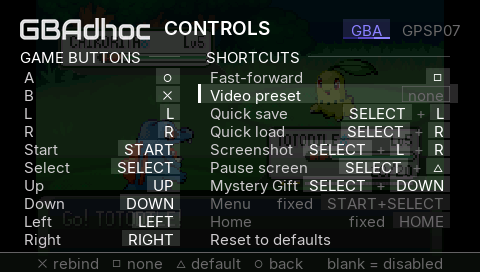 | 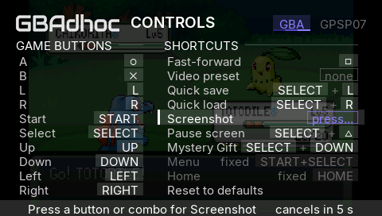 |
| 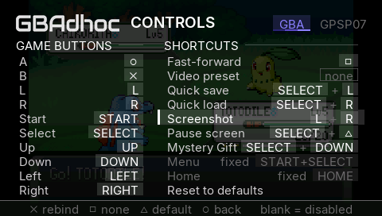 |  |
| 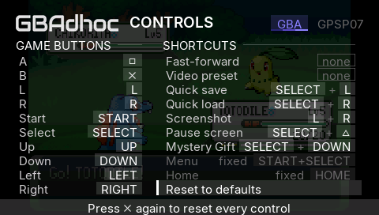 | 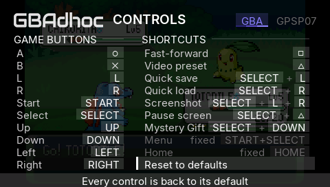 |

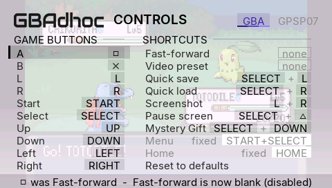

- **Reach it** from the in-game menu (Settings > Button mapping) or from the
  ROM browser (START > Button mapping). Both are the same code; in game it
  draws over the paused frame, from the browser over the browser's own page. O returns to Settings and saves if anything changed.
- **X opens capture.** Press the new button, or hold a chord, and let go. The
  page records every button held between the first press and the moment all are
  released, so the order you press a chord's buttons in does not matter. Game
  buttons take exactly one button.
- **Capture cancels by itself** after 5 s with nothing pressed, and the plate
  shows a countdown. A press is the only other way out, because every button,
  O included, is a legal answer. If you capture O by accident, Triangle on that
  row restores the default.
- **Square sets the row to none. Triangle restores the row's default.**
- **"Reset to defaults"** needs a second X. It restores the factory table,
  including A=O/B=X.
- **Every conflict is described in words** on the plate that replaces the
  footer, for example `[] was Fast-forward  -  Fast-forward is now blank
  (disabled)`. That plate is the visible half of the conflict rule; a plain
  rebind needs no words, because its chip shows it. The plate clears on the
  next d-pad press.
- The Settings rows that already existed now follow the table.
  **FF button (Square)** renames itself when fast-forward moves, for example
  `FF button (L+R)`.
- **The "A/B buttons" row is gone** (`claude/ui-tweaks`). Button mapping
  does the same and more. A 3.0 player who had A and B swapped keeps the
  swap, as an explicit binding (§4, "`btn_swap`").
- **Menu buttons do not follow the game mapping.** In every menu, the browser,
  the Controls page and the wake overlay, ✕ confirms and ○ goes back, whatever
  A and B are bound to. They never followed `btn_swap` either (only the game
  did), so nothing changes for anyone. The reason: a menu has to be operable
  by a player whose mapping is broken, and the Controls page itself uses ✕ to
  rebind and ○ to leave. Making ○ confirm for a swapped player would make the
  page that repairs a mapping depend on that mapping.

**Re-skin (done: docs/UI-OVERLAY.md).** All the rules live in `ctl_map.c`. The
page only walks a row list, captures a press and draws. Since the overlay
redesign it draws in two labelled columns, GAME BUTTONS and SHORTCUTS, each
binding a row of chips (bound, locked, blank `none`, and the pulsing `press...`
capture outline); the fixed HOME row is a locked chip the cursor skips, and
the Menu row (once locked too) is now the START+SELECT / HOME toggle of
section 10. UP/DOWN walk the rows in the same order as the old single list
(down the game buttons, then down the shortcuts); LEFT/RIGHT cross between the
columns.

---

## 3. Conflict rule and the longer-chord rule

**Conflict means an identical input.** The same single button, or the same set
of chord buttons in any order. **The new binding steals it, the old holder
becomes none, and the note line says so.** Nothing else moves.
`ctl_assign()` is the only writer. A host fuzz of 200,000 random edits checks
that the table never holds a duplicate or an illegal binding.

**Overlap is not a conflict.** A chord may contain buttons that are also game
buttons or shorter shortcuts. 3.0 already did this: SELECT+L saves, and SELECT
and L still reach the game. At runtime the **longer-chord rule** settles
overlaps. A shortcut carrying `CTL_F_YIELD` stands down for the frame if a
longer shortcut that strictly contains its whole chord is fully held. With the
defaults, this rule is exactly 3.0's "the other shoulder must be up" test for
quick save and load, which kept them off the L+R+SELECT screenshot. It now also
applies to any chords the player creates. Example: FF on L+R stands down while
L+R+SELECT is held.

**Video preset is exempt, on purpose.** In 3.0, SELECT+TRIANGLE opens the pause
screen and also cycles the video preset. The cycle check runs later in the same
loop iteration. The defaults must reproduce 3.0, so they still do. Turning the
flag on is a one-word change in the table (`bind_video ... CTL_F_YIELD`). The
mutation test below shows the exhaustive test catching exactly that change, so
it cannot slip in unnoticed. **This is a decision for the owner.**

**Load-time duplicates** come from a hand-edited CONFIG.INI. They are settled by
the same rule: an explicit (non-default) value beats a default one. Between two
explicit values, the earlier action in the table wins. The loser becomes none,
which is what the menu would have done. Each case is logged
(`config_bind_conflict`).

---

## 4. CONFIG.INI

```ini
bind_a = TRIANGLE
bind_video = NONE
bind_ff = L+R
bind_quicksave = SELECT+L
```

- **Values:** button names joined by `+`: `SELECT START L R UP DOWN LEFT RIGHT
  TRIANGLE CIRCLE CROSS SQUARE`. `LTRIGGER` and `RTRIGGER` are also accepted.
  Names are case-insensitive, may appear in any order, and may have spaces
  around `+`. `NONE` unbinds. Values are written in a fixed order, modifiers
  first.
- **Validation (`ctl_load_ini`).** A missing key falls back to the default. So
  does an empty value (`bind_a =`), an unknown name, a repeated name, a value
  `fe_ini_get` truncated, a second button on a game action, START+SELECT
  together, or more than 4 buttons. Each rejected value logs
  `config_bind_invalid key=... reason=...`. The word `NONE` is the only way to
  get "unbound". A typo can never produce it.
- **The ini key trap** (silent defaults from misspelled keys) is covered twice.
  A misspelled `bind_*` key falls back to the default, which is the safe answer.
  Telemetry builds also report the key as `cfg_unknown` in the existing config
  audit (`rig_cfg_audit_report`). Every key is read inside `pcfg_load`, before
  the audit runs.
- **Persistence.** A binding is written only when it differs from its default,
  or when its key is already in the file. Once set, that flag (`keep`) stays set.
  - A player who never remaps gets a byte-identical CONFIG.INI with no new keys
    and no extra write cycles. `pcfg_save` already rewrites the file about 37
    times, and Triangle in game calls it.
  - "Reset" still overwrites a custom value that is on the card.
  - After a reset, a garbage value is rewritten as the value actually in force.
- **`btn_swap` (3.0's "A/B buttons") is migrated, then inert.** There is no
  row and no `g_pcfg` field any more. `ctl_load_ini()` reads the key once:
  - If it is nonzero and `bind_a` or `bind_b` is missing from the file, the
    config was written by 3.0 or an earlier 3.1 candidate for a player who
    swapped A and B. It is loaded exactly the way those builds loaded it: the
    swapped pair (A=✕, B=○) is what a missing or invalid A/B key falls back
    to, and what the repair's tie-break counts as "default". A and B are then
    marked `keep`, so the next save writes both as explicit keys
    (`bind_a = CROSS`, `bind_b = CIRCLE`), and the Controls page shows them.
    Telemetry builds log `config_migrate key=btn_swap -> bind_a=CROSS
    bind_b=CIRCLE`.
  - If both keys are present, `btn_swap` is ignored outright, whatever it
    says.
  - Settings shows "Button mapping: custom" for a migrated player, because
    the table is no longer the factory one. "Reset to defaults" gives A=○.
- **`btn_swap` is still WRITTEN, as a mirror.** `pcfg_save()` writes
  `btn_swap = 1` when A is on ✕ and B on ○ (`ctl_legacy_swap()`), else 0.
  This build never acts on that value: a 1 means A and B differ from their
  defaults, so both bind keys are written beside it, and with both keys
  present the key is ignored. It is written for two reasons:
  - a player who never remaps keeps a CONFIG.INI byte-identical to 3.0's
    (`btn_swap = 0`, no `bind_` keys);
  - **downgrade:** 3.0 ignores `bind_*` and reads `btn_swap`, so a swapped
    player who goes back to 3.0 still has the swap.

---

## 5. GB/GBC, the GB link and wireless

- The GBA core, the GB/GBC core and `fe_gblink`'s lockstep all take their
  buttons from `fe_host`'s `input_bitmask` callback (`fe_host.c`:
  `input_state`, `gblink_frame`, the `gb_core` path). That callback is
  `plat_input_bitmask()`, so **one table serves all three**, with nothing
  console-specific.
- **What crosses the network is unchanged.** The GB link sends the resulting
  button mask through `gb_buttons_from_retro`. GBA wireless sends RFU game
  data, never buttons. A remap is local to the console that made it.
- Autopilot scripts inject GBA buttons after the table (`fe_host_input_inject`),
  so every existing script is unaffected by any mapping.

## 6. Performance

- **Game buttons:** ten `pad & bind[i]` tests per call. 3.0's if-chain did the
  same ten tests.
- **Shortcuts:** one `ctl_shortcuts()` per frame. That is eight chord tests,
  plus a scan of 8 shortcuts for each action carrying the yield flag. About 300
  simple instructions, roughly 1 us at 333 MHz. It replaces about a dozen inline
  tests.
- **No allocation, no I/O, no per-frame logging.** CONFIG.INI is touched only
  at load and at the existing save points.

---

## 7. Validation evidence

### Host (`python tools/run_host_tests.py`)

The new test is `tools/tests/test_ctl_map.c`, built twice inside the
`fe_ini_bounds` suite. One build is the harness flavour with ASan and UBSan. The
other is the release flavour with `GPSP_CATCH_SELFTEST`. It links the
production `ctl_map.c`, `config_psp.c` and `fe_util.c`.

- **Defaults = 3.0, exhaustively.** The test covers all 16,777,216 (previous
  pad, current pad) pairs over the 12 bindable buttons, with the unbindable
  system bits (HOME, HOLD, WLAN, NOTE) mixed in. For each pair, `ctl_game_mask`
  is checked against 3.0's `plat_input_bitmask` (both `btn_swap` values), and
  `ctl_shortcuts` against 3.0's inline tests, restated verbatim. The test checks
  every shortcut except Mystery Gift. Mystery Gift is checked by 2,000,000
  random steps of the stateful chord against the 3.0 function in
  `tools/test_mgift_profiles.c`.
- **The table:** unique keys, legal and distinct defaults, and no default that
  uses the menu chord.
- **Parsing:** parse/format round-trips every legal binding. Twenty-one malformed
  values are refused and leave the output untouched.
- **Rules:** the legality rules, the conflict rule (including self-assign and
  refusals that leave the map unchanged), and the 200k-edit fuzz.
- **Repair:** `ctl_repair` precedence.
- **CONFIG.INI:** missing keys, empty values, garbage, truncated values, illegal
  values, `NONE`, and a hand-edited duplicate. The keep rule is checked,
  including that an unremapped save leaves the file byte-identical. 3,000 random
  tables are loaded from random seeded files and survive save+load exactly.
- **Through `pcfg_load`/`pcfg_save`** on a 3.0 CONFIG.INI with `btn_swap = 1`:
  A and B come out swapped, and the save writes `bind_a = CROSS`,
  `bind_b = CIRCLE` and the `btn_swap = 1` mirror. A fresh config writes
  `btn_swap = 0` and no `bind_` key. After a reset the mirror is 0 and the
  keys say CIRCLE/CROSS.
- **The `btn_swap` migration** (`claude/ui-tweaks`): the exhaustive 3.0
  comparison's swapped table is now the one a `btn_swap = 1` file LOADS to.
  A partial pair (A remapped, B on the swapped base), the repair tie-break
  (FF's explicit ✕ beats A's swapped-default ✕), an invalid `bind_a`, and
  `btn_swap = 2` all resolve as the candidates resolved them. With both keys
  present `btn_swap` changes nothing in either direction, and no
  `config_migrate` is logged. The 3,000-table round trip seeds half its files
  with `btn_swap = 1`. Mutation-checked: disabling the migration, not marking
  B keep, repairing against the factory table, ignoring the both-keys rule
  (either way), and a mirror that is always 0 each fail the test.
  `tools/test_ff_config.c` (the `run_ff_tests.py` config suite) loads a 3.0
  card with `btn_swap = 1` among the other legacy keys.
- **The remapped behaviours:** Triangle unbound fires nothing and still leaves
  SELECT+Triangle working. A stolen Triangle. FF on L+R over two game buttons.
  START as a modifier. A fully unbound table that can never fire.
- **Mutation-checked.** Each of these edits makes the test fail:
  - dropping the screenshot's START guard;
  - dropping quick save's yield flag;
  - making the modifier shape plain;
  - giving Video preset the yield flag;
  - changing the pause default;
  - swapping A's libretro id.

Result: **30/30 suites pass.** `rig_pc` failed once with a cwd
`FileNotFoundError` inside `tools/rig/test_summarize_battle.py`. It passed on
the immediate rerun, and it passed on the untouched base. It is a Python rig
script this change does not touch. The full run on the final commit is in §9.

### PPSSPP: the defaults are identical to before, and a remap works

Method: the new harness key `pad_script` (its own commit, `02954f6`) drives
the **real `g_pad`**: the table and every shortcut, which autopilot scripts
cannot reach.

- **Build A** = base + `pad_script` only.
- **Build B** = this branch. Both are harness profile.
- **Workload:** FireRed, chosen because it has no RTC. 4,800 frames: the intro,
  Oak's speech, the gender menu and the naming screen. Every shortcut the rig
  survives is pressed (Triangle twice, SELECT+L, Square hold, L+R+SELECT,
  SELECT+R), plus B and the d-pad.
- **Oracles:** the guest-state oracle `shash` (CPU registers, IWRAM, EWRAM,
  I/O, palette, OAM, VRAM and the audio hash, per frame) and the core-output
  `vhash`.

| Comparison | shash (4,732 frames) | vhash | Shortcut events |
|---|---|---|---|
| A vs A (is the rig deterministic?) | identical | identical | identical |
| **A vs B, defaults: does B reproduce 3.0?** | **identical** | **identical** | **identical, same frames:** `video_mode` x2, `state_save`, `ff_user` on/off, `frame_dump`, `state_load` |
| B defaults vs B with the face buttons **permuted** (`bind_a=TRIANGLE bind_b=SQUARE bind_ff=CROSS bind_video=CIRCLE`) and the pad script permuted to match | **identical** | identical | the same 9 events on the same frames |
| B defaults vs B with **`bind_video = NONE`** (same pad script, Triangle pressed twice) | **identical** | identical | **0 `video_mode` events** (defaults: 2). Triangle no longer resizes. |
| GB (Pokemon Red, 3,000 frames), A vs B | n/a | **identical** (2,946) | |
| GB, B defaults vs B permuted | n/a | **identical** | the mapping applies to TGB Dual |

Notes from the runs:

- **Savestate files.** The A and B savestate files differ in exactly two bytes.
  Both are in the core's `rtc-base-time` field, the boot wall clock, which even
  FireRed's state records. A-vs-A matched only because those two runs started
  in the same second. The comparator masks the state CRC for that reason.
- **Emerald and shash.** On the Emerald video-regression workload (autopilot
  input, `.sav`), `vhash` is identical across five runs, A and B alike (1,091
  frames). Emerald's `shash` is not reproducible run to run even on the
  untouched base: IWRAM diverges from frame 4. So `shash` can only gate a
  game without an RTC under PPSSPP. (That is a finding about the oracle, not
  this feature.) The tracked `goldens/video_emerald.hashes` is also stale
  against this base: A misses it at frame 11. The gate is A == B.
- **Existing smoke ladders.** `run_ui_smoke.sh`'s Phase A (`ui_demo`) and
  Phase B (`simff`) ladders still pass on B. The Settings rows the demo walks
  are untouched, and the config it saves gains no `bind_` key.

### Builds

| Build | Profile | EBOOT.PBP md5 |
|---|---|---|
| A (base + pad_script) | harness | `05151fd6b2d89317fdedd4e4c1a13983` |
| B (this branch, pre-commit tree) | harness | `34275c39506355c1d9df36be98203e79` |
| B | release | `343148c049da618206575360bc3da09e` |

Both profiles pass `tools/build.sh`'s no-new-warnings gate and its binary audit.
The release build contains `.playable-no-harness`, and the harness keys and
`pad_script` are absent from it.

Screenshots: `ui_controls_demo = 1` (in game) and `= 2` with `browser = 1`
(the ROM-browser path), under PPSSPP with the software GPU.

---

## 8. Owner's hand test (PSP-1000, PSP-3000, PSP Go)

Install the **release** EBOOT from this branch on each console. Do steps 1 to 6
on all three. Steps 7 to 9 need one console, except 9b, which needs two.

1. **An old config is unchanged.** Keep your current CONFIG.INI. Boot a GBA game.
   - Circle = A and Cross = B (or the reverse if you had swapped them).
   - Triangle cycles the video preset. Square fast-forwards.
   - SELECT+L saves and SELECT+R loads, with "State saved" and "State loaded".
   - L+R+SELECT writes a screenshot.
   - SELECT+Triangle opens the pause screen.
   - SELECT+Down starts Mystery Gift (GBA).

   Then open the menu and leave it. CONFIG.INI on the card should contain
   **no** `bind_` lines.
2. **Reach the page both ways.**
   - In game: START+SELECT, then Settings, then the last row,
     **Button mapping**.
   - From the ROM browser: START, then **Button mapping**.

   O backs out of each, one level at a time.
3. **Unbind Triangle** (your case). Select **Video preset**, press Square, and
   it reads "none". Back out to the game. Triangle no longer resizes.
   SELECT+Triangle still opens the pause screen.
4. **Steal.** Select **A**, press X, then press Square and let go. The note says
   A took Square from Fast-forward. In game, Square is now A, Circle does
   nothing, and nothing fast-forwards.
5. **Chord.** Select **Fast-forward**, press X, then hold L and R together and
   let go. In game, holding L+R fast-forwards, and L and R alone still work as
   game buttons. L+R+SELECT still takes a screenshot and does not fast-forward
   while held.
6. **Safety.**
   - On any row, press X, then hold START+SELECT. The note says it is reserved,
     immediately.
   - Press X and touch nothing: after 5 s it cancels with "nothing pressed".
   - With A unbound, START+SELECT still opens the menu, and every menu still
     works with the d-pad, X and O.
7. **Persistence.** Power off and on. The custom bindings survive, and CONFIG.INI
   now holds `bind_*` lines. **Reset all to defaults** needs two X presses.
   Afterwards everything is back to step 1, including A=O.
8. **GB/GBC.** Boot a GB game with a remap active (for example A on Triangle).
   The game obeys it.
9. **Link and wireless.**
   - 9a. With A remapped on one console only, do a GB link trade (any two
     consoles). Both sides play normally.
   - 9b. Do one GBA wireless trade. Remapping changes only that console's
     buttons.
10. **Optional (3000/Go): Heart & Soul with residency on, one save-state load.**
    This build moves code layout, and the resident I-cache crash
    (`docs/RESIDENT-ICACHE-FIX.md`) has been layout-sensitive before.

---

## 9. Final-commit results (54afe6c)

- `python tools/run_host_tests.py`: **30 passed, 0 failed, 0 skipped**,
  `rig_pc` included.
- `tools/build.sh release` at 54afe6c:
  - Built clean through the warning gate and the binary audit.
  - EBOOT.PBP md5 `685f9f040c5f6882cfe5aab1da18a39d`, sha256
    `b1b0b77bfc430743a86e708fcd99bb217031fa6771e12160ef264b63ba0e98b1`.
  - Staged at `builds/remap-out/release-54afe6c/` with `gbadhoc_me.prx`. That
    is the EBOOT for §8.
  - `pad_script` is absent from it. The `ui_controls_demo` key string is
    present but inert, like every harness key in a release (ADR-0067).

---

## 10. Menu = HOME (Settings > Controls > Menu)

Branch `claude/home-toggle`, from `claude/candidate-3.1-all` (97a9dad).
2026-10-02, for the 3.1.0 beta.

The Controls page's "Menu" row used to be a locked chip. It is now a toggle
with two values, and nothing else can ever be chosen:

| Menu | In game | ROM browser, loading, wake overlay, any screen before the game |
|---|---|---|
| **START+SELECT** (default) | Held ~1/4 s opens the menu, held ~1.5 s ends the run, HOME is the system's exit dialog. This is 3.0/3.1 byte for byte (measured, §12). | HOME is the system's. |
| **HOME** | HOME (the PS button on a PSP Go) opens the menu; on the menu's top page it closes it again, like Resume. A START+SELECT **tap** reaches the game as START and SELECT. Holding START+SELECT ~1.5 s still ends the run. | HOME is the system's, exactly as in the other mode. The browser's settings stay on START. |

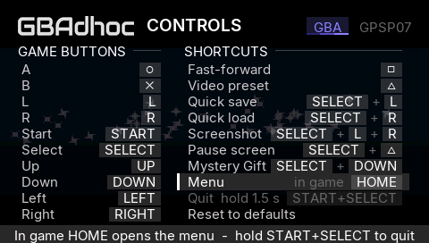
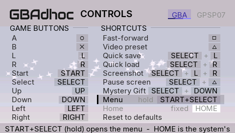

- **X** flips the row, **Triangle** puts it back to START+SELECT. The plate
  says what the new value means. With the menu on HOME, the fixed row under
  it reads **Quit - hold 1.5 s - START+SELECT**, because the system's exit
  dialog is no longer on HOME in game.
- **CONFIG.INI `menu_button = start_select | home`.** Written only when it is
  not the default, or when the key is already on the card (the same `keep`
  rule as `bind_*`, §4). A player who never touches it keeps a byte-identical
  CONFIG.INI, and 3.0 simply ignores the key. A value we do not know (`ps`,
  an empty value, a truncated one) falls back to START+SELECT and is
  reported as `config_bind_invalid`. "Reset to defaults" also returns the
  menu to START+SELECT, and the Settings row reads "custom" while it is on
  HOME.
- **Mid-game changes take effect at once.** Flipping it in the in-game
  Controls page loads the HOME module on the spot.

### The mechanism, and why this one

**The problem.** A user-mode `sceCtrlPeekBufferPositive` never shows HOME:
the firmware strips HOME, NOTE, SCREEN and the volume keys from every
user-mode read. And the "Quit the game?" popup is drawn by the system the
moment HOME goes down. Only kernel code can see the button, and only a
kernel-side switch can stop the popup.

**The module.** `psp/home/gbadhoc_home.prx`, a 4 KB kernel module (attr
0x1006, like the ME module), shipped beside the EBOOT and loaded with
`kuKernelLoadModule` the first time a game runs with the menu on HOME. It
holds one kernel thread at priority 0x10 that wakes every 16 ms and:

1. reads the pad with `sceCtrlPeekBufferPositive` from kernel mode (k1 = 0),
   which returns the raw HOME bit;
2. switches the popup with `sceImposeSetHomePopup(0)` / `(1)`;
3. counts each HOME press it sees while the popup is OFF into the shared
   block (`home_seq`), for the EBOOT to act on.

The contract is one struct, `psp/home/home_link.h`, in the EBOOT's `.bss`,
handed over in `sceKernelStartModule`'s argument (the ADR-0080 pattern: no
exports, no function pointers, no import-order trap).

**Why `sceImposeSetHomePopup`.** It is the flag sceImpose itself consults
before it draws the popup, and it is what working 6.xx homebrew uses for
exactly this:

- TempGBA4PSP (a GBA emulator) calls `sceImposeSetHomePopup(enable ^ 1)`
  and reads HOME through its own kernel helper PRX (`ku_bridge.prx`) with
  `sceCtrl_driver` - the same split as here;
- TempAR's menu and PSPdisp switch the popup off and on around their own
  HOME handling.

The alternatives are worse:

- `sceCtrlSetButtonIntercept` masks a button only from USER readers. The
  popup is driven from a kernel ctrl callback, so it would still fire.
- Hooking impose's ctrl callback means patching firmware code per version.

**6.60 / 6.61 (PRO, ARK-4).** Kernel NIDs were randomised in 6.xx; the CFW's
NID resolver maps the pre-6.xx NIDs this module imports. PRO's
`SystemControl/nid_660_data.c` (ARK-4 inherits PRO's tables) carries all of
them:

| Import | Old NID | 6.60 NID |
|---|---|---|
| `sceCtrl_driver` sceCtrlPeekBufferPositive | 0x3A622550 | 0x2BA616AF |
| `sceImpose_driver` sceImposeSetHomePopup | 0x5595A71A | 0xC08C41EF |
| `sceImpose_driver` sceImposeGetHomePopup | 0x0F341BE4 | 0xE9A42056 |

The ME module already depends on the same resolver for `sceSysreg_driver`
and `SysEventForKernel`, on every console it runs on. The uOFW 6.60 export
table confirms the driver NIDs really did move (`sceCtrl_driver`
PeekBufferPositive is 0x2BA616AF there).

**If anything does not resolve, HOME mode falls back instead of breaking.**
PPSSPP is the live proof. It loads the module and starts the thread, but it
has no `sceImpose_driver`, so the call returns 0x8002013A (library not
linked). The module sets `fail` and stops asking. The EBOOT sees it, keeps
the menu on START+SELECT, and says so once:

- the event: `home_service state=refused`, then `fallback=start_select`;
- the toast: "HOME menu unavailable: START+SELECT opens it".

A missing `gbadhoc_home.prx` takes the same path, with
`home_service state=unavailable reason=load`.

### Safety: HOME can never be left disabled

| Situation | What gives HOME back |
|---|---|
| Browser, loading screen, browser Settings, anything before the main loop | The module is not loaded yet. |
| Wake overlay, sleep | `home_host_disarm()` in the power callback (before its 60 ms wait; the module reacts within one 16 ms poll) and before `ui_wake_menu()`. The loop only re-arms after Continue. |
| A frozen or blocked main loop | **Heartbeat fallback.** The loop bumps `beat` every iteration. If it stops for 2 s while armed, the module turns the popup back on by itself, so HOME is the exit dialog again, as in default mode. The thread runs at 0x10, above the emulation thread (0x20-0x2B), so a loop that SPINS cannot starve it. When the loop comes back, it must beat steadily for 1 s before HOME is taken over again, so a limping loop does not flap the popup. A press that starts while the popup is on stays the system's. |
| Exit, game list, relaunch, abort | `home_host_stop()` is the first step of teardown: `module_stop` re-enables the popup unconditionally, after the thread has ended. |
| A crash, or any exit path we do not control | Every way out of a game is a LoadExec, which reboots the kernel and re-initialises sceImpose with the popup on. No state survives the process. |
| Stale presses | A press counted while the loop was blocked is dropped if the loop sees it more than 250 ms later. Presses while disarmed are discarded. |

The ME module (`gbadhoc_me.prx`) is untouched: no `psp/me` file changed, and
the rebuilt module is byte-identical to the base build's (md5
`18158678dd49f2d5ac17fa4a8b2a4b50` for the harness profile, both trees; the
release profile's ME_CATCH module is built from the same unchanged sources). The HOME module has its own lifetime, so
GB/GBC and `me_boot = 0` get HOME too, and the standby ladder's ME unload
cannot take HOME with it.

**Packaging.** `tools/build.sh` builds `psp/home/gbadhoc_home.prx` as a
sub-make (`psp/Makefile`), records `homePrxSha256` in the manifest and
stages it with `--out`. `tools/make_release.sh` ships it beside the EBOOT and
refuses a stale one. Like the ME module, the `.prx` is tracked so that a
toolchain-less clone can package a release; its `.elf` is ignored.

**Harness keys (GPSP_PERF_RIG builds only; release refuses them).**

- `home_sim = 1`: HOME mode without the module (PPSSPP). A HOME bit from
  `pad_script` (`<frame> 2 0x10000`) counts as a press.
- `home_stall_frame = N`, `home_stall_ms = M` (default 8000): at emulated
  frame N the main loop SPINS for M ms without beating. This is the
  heartbeat-fallback test.

The release audit forbids the string `home_stall_frame`.

---

## 11. Save-state delete

Delete a state from the browser's state shelf (LEFT on a ROM) or from the
in-game Save state / Load state pages. **Square** asks, on the cursor's slot
only, and only if that slot holds a state. The question is a plate in the
Overlay style:

- in game, it replaces the footer: "Delete Slot 2?  X delete  O keep";
- in the shelf, it replaces the panel's two hint lines.

While the question is up, nothing else acts: X deletes, O or any other key
keeps it. An X meant for "delete" can never load or overwrite instead.

| | |
|---|---|
| 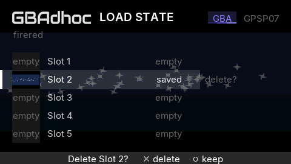 | 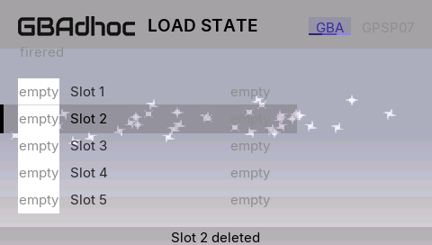 |
| 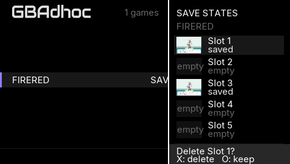 | 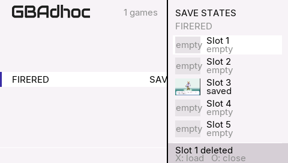 |

- **Square was free on both screens.** The browser's Square (star) and
  Triangle (console switch) are already gated off while the shelf is open,
  and the in-game slot pages used only the d-pad, X and O. The footer shows
  "Square delete" only on a slot that has something to delete.
- **Exactly two files go:** `<stem>.stN` and `<stem>.stN.thumb`. They are
  named by `psp_state_delete_paths()` (`psp/state_slots.h`) from the SLOT-1
  path alone. It refuses anything that does not already end in `.st0` after
  a non-empty name, and only swaps the final digit. A ROM path, a `.sav`, a
  directory or a slot outside 1-5 cannot come out of it. The preview is
  removed only after the state is gone.
- **"Gone" is checked, not assumed.** Success means the state no longer
  `getstat`s. PPSSPP returns 0 from `sceIoRemove` whether or not it removed
  anything (its case-folding retry misses the FAT short names the PSP
  reports, such as `FIRERED.st0`). Without the check, an emulator run would
  report "deleted" over a state still on the stick. On a real FAT stick,
  names are case-insensitive.
- **Afterwards:**
  - in game, the slot list and the previews are rescanned, and the plate
    reports "Slot N deleted";
  - in the shelf, the slot list is re-read, the deleted preview is dropped
    at once, and the panel reports it;
  - **an empty shelf closes**: deleting the last state slides the panel
    away.

---

## 12. Validation (claude/home-toggle)

### Host

`python tools/run_host_tests.py`: **30 passed, 0 failed, 0 skipped**. The
suite count is unchanged, because the new tests ride in `fe_ini_bounds`.

- `tools/tests/test_ctl_map.c` gains `test_menu_button`, built in both
  flavours:
  - parse and name, including blanks and `START+SELECT`;
  - an old config gains no key on save, byte for byte;
  - HOME round-trips;
  - flipping back rewrites the key (keep);
  - hand-edited garbage, empty and over-long values fall back and are
    reported;
  - independence from the bindings;
  - Reset;
  - corruption repaired by `ctl_repair`;
  - the round trip through `pcfg_load`/`pcfg_save`.
- `tools/tests/test_state_delete.c` (ASan + UBSan):
  - agreement with the save/load naming, for every console's slot-1 name and
    every slot;
  - 14 refused inputs plus bad slots and small buffers, all leaving both
    outputs empty;
  - a 200,000-string fuzz that only ever yields `.stN` / `.stN.thumb`;
  - a real directory where a delete removes exactly the two files and leaves
    the ROM, the `.sav`, the other slots and another game's states.
- **Mutation-checked.** Each of these makes a test fail:
  - always writing the key;
  - ignoring it on load;
  - Reset not resetting the menu;
  - not marking the key kept;
  - dropping the `.st0` check;
  - widening the slot range.

### PPSSPP

Harness builds of the base (97a9dad) and of this branch. Software GPU, Xvfb
:132, a private namespace per run.

| Run | Result |
|---|---|
| FireRed, the §7 pad workload (4,800 frames, every default shortcut), base vs branch, default config | **shash (4,732 frames), vhash (4,733), shortcut events and the frame dump: identical** |
| Pokemon Red (GB), 3,000 frames, base vs branch | **vhash (2,947) and events identical** |
| START+SELECT held 200 frames from f=1000, base vs branch | Identical shash, vhash and events: the menu opens at 15 frames, and `user_abort` follows at 90 |
| Default mode with a HOME bit injected and `home_sim = 1` | Nothing changes: `home_sim` only acts when the menu is on HOME. The chord opens the menu and the hold aborts. |
| `menu_button = home`, `home_sim = 1`, START+SELECT tap at f=600 and held from f=1200 | No menu. The game receives START+SELECT (`input mask=0x00c` at f=600 and f=1200), and the hold aborts (`user_abort`) |
| `menu_button = home`, `home_sim = 1`, HOME at f=1000 | `home_press`, `menu_open via=home`, `ui_open`; START+SELECT held in the menu still aborts |
| `menu_button = home`, no sim (the module cannot work in PPSSPP) | Module loads, `state=refused imp_rc=0x8002013A`, the fallback toast; START+SELECT opens the menu and the hold aborts |
| Toggle demo (`ui_controls_demo = 3`), dark, then light on the card the first run wrote | Run 1 writes `menu_button = home`. Run 2 starts on HOME and flips back, and the card then says `menu_button = start_select` |
| In-game delete demo (`ui_controls_demo = 4`), dark and light | Saves slot 2. Square asks; O keeps it; Square + X deletes `firered.st1` and its `.thumb`; Square on an empty slot asks nothing. Only `firered.gba` and `firered.sav` remain. |
| Browser shelf (`ui_browser_script`), dark and light | Two states (slots 1 and 3). Square asks, O keeps, X deletes slot 1 (slot 3 kept), then slot 3 and the empty shelf closes. Only `FIRERED.GBA` and `FIRERED.sav` remain. |
| The same shelf with lower-case host names (PPSSPP's remove no-op) | Reports "Slot 1 not deleted", and the state stays listed: the honest failure path |

Every row above was re-run on the final harness build (6b7a4e3) with the same
results.

### Builds (from 6b7a4e3, clean tree)

| Build | EBOOT.PBP md5 | gbadhoc_me.prx md5 | gbadhoc_home.prx md5 |
|---|---|---|---|
| **release**, title "GBAdhoc 3.1.0 beta" (`builds/home-out/release`) | `413610202e10adbc7c3ac02b79861cc7` | `19ae57b6d21f5d1c3545bf07ff516a4c` (ME_CATCH; identical to the base 97a9dad release build's) | `d3434f4fd02260583c2e97ce7fe757e6` |
| harness, for checklist step 5 (`builds/home-out/harness`) | `a9beb54a3906f7d63acd5a0a7c0b6684` | `18158678dd49f2d5ac17fa4a8b2a4b50` (identical to base) | `d3434f4fd02260583c2e97ce7fe757e6` |

The release build passes the warning gate and the binary audit, including
the new `home_stall_frame` absence check. The home module is reproducible:
every build produced the same bytes as the tracked
`psp/home/gbadhoc_home.prx`.

PPSSPP cannot exercise the kernel half: no sceImpose_driver, and no HOME in
any pad read. That is the hardware checklist below.

### Hardware checklist (owner)

Install the **release** EBOOT, `gbadhoc_me.prx` and `gbadhoc_home.prx` from
`builds/home-out/release` (all three, side by side). For step 5, also
install the harness build from `builds/home-out/harness` as its own app
folder.

1. **Default mode untouched (all three consoles).** Without changing
   anything:
   - START+SELECT held opens the menu, and held longer ends the run;
   - HOME in game shows the system dialog;
   - CONFIG.INI gains no `menu_button` line.
2. **HOME opens the menu in game.** Go to Controls > Menu, press X (it reads
   HOME), and back out.
   - In game, HOME opens the menu with no system dialog.
   - HOME again on the menu's top page returns to the game.
   - A START+SELECT tap reaches the game: try it on a title screen or the
     START menu of a GBA game.
3. **HOME in the browser is the system's (both modes).** On the ROM list,
   HOME shows the exit dialog; answer No. Also check the state shelf, the
   browser Settings (START), the loading screen and the wake overlay: the
   system dialog everywhere.
4. **Hold START+SELECT tears down in both modes.** In HOME mode, hold
   START+SELECT ~1.5 s in game: the app exits cleanly. Repeat in default
   mode.
5. **Heartbeat fallback (harness build).** Set `.gpsp-harness.ini`:
   `rom = <game>`, `home_stall_frame = 1800`, `home_stall_ms = 10000`. Set
   CONFIG.INI `menu_button = home`.
   - About 30 s in, the game freezes for 10 s.
   - From ~2 s into the freeze, HOME must show the system dialog. Choose No.
   - About 1 s after the game moves again, HOME opens our menu again.
   - `log/frontend.log` has `home_stall end fallbacks=1`.
6. **Sleep/wake in HOME mode.** Sleep in game and wake. On the wake overlay,
   HOME is the system's. After Continue, HOME opens our menu.
7. **A wireless session in HOME mode.** One GBA trade, or a GB link. HOME
   opens the menu during the session, and the session survives the menu
   exactly as it does with START+SELECT.
8. **PSP Go PS button.** Steps 2 and 3 on the Go, with the PS button.
9. **Mid-game toggle.** Flip the menu to HOME from the in-game Controls page.
   HOME works as soon as the menu closes. Flip it back: HOME is the system's
   again at once.
10. **Delete.** Make two states.
    - In game, delete one from Load state: the question, O keeps it, X
      deletes it.
    - In the browser shelf, delete the other: the shelf closes when empty.
    - On the stick only `.stN` and `.stN.thumb` went; the `.sav` is intact.
11. **Unknown (watch for it).** HOME pressed during a stall shows the dialog.
    If the loop recovers while the dialog is still open, the module switches
    the popup flag off under it after 1 s. That should leave the open dialog
    alone, since the flag is only consulted when HOME goes down, but this is
    only confirmable on hardware.
