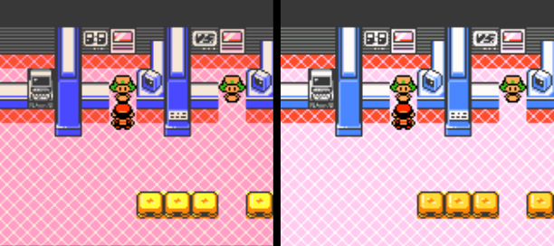
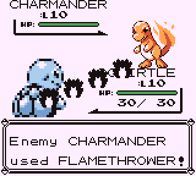
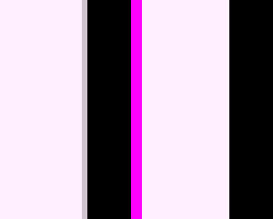

# GB/GBC colour reports from the 3.0.0 thread

2026-10-01, branch `claude/gb-palette` (from `claude/candidate-3.1-all`,
`e97d5b3`). Reporter: Queasy_Reference254 (docs/FEATURE-REQUESTS.md). The
three reports are about different things: one was a real defect, one is how
the game itself colours itself on a Super Game Boy, and one could not be
reproduced. None of the changes touches emulation; they change only how
pixels are displayed.

| Report | Verdict | Change |
|---|---|---|
| Pokémon Crystal looks too dark | **Defect.** CGB colours were shown raw | GBC LCD colour model, on by default |
| Pokémon Red: Flamethrower is the wrong colour | **Not a defect.** The game draws its move animations in the darkest SGB colour | none |
| Pokémon Blue/Yellow: blur on the left edge | **Not reproduced.** A 1-px fringe at the *right* and bottom edges was found | edge texels repeat the picture's edge |

## 1. Crystal too dark: Game Boy Color LCD model

**Root cause.** `gbc_recreate_colors` (`gbcore/tgbdual/lcd.c`) turned each
CGB palette entry into a display colour with `CONVERT_COLOR15`, a plain
5-to-8-bit expansion (`c << 3 | c >> 2`). That treats the GBC screen as a
linear sRGB display. It is not: the GBC's LCD lifts the mid-tones (channel
16/31 shows at about 63 % brightness, not 52 %), and its green sub-pixel
picks up some of the blue. Games were coloured on that screen, so raw
values look dark and over-saturated on a PSP. GBA games are not affected:
they keep `gpsp_color_correction` (off).

**Fix.** CGB entries now go through SameBoy's measured CGB model, its
default mode "Modern – Balanced" (SameBoy `Core/display.c`,
`GB_convert_rgb15`; MIT/Expat). Per entry: `R = curve[r]`, `B = curve[b]`,
and `G = curve[g]` mixed with `curve[b]` at gamma 1.6 (3:1). The tables (32
bytes plus 1 KiB) are generated once by `tools/gen_cgb_lcd_table.py` into
`gbcore/tgbdual/_cgb_lcd_table.h`, and are defined a single time in
`tgb_shared.c`, outside the per-instance link. The core therefore does no
floating point, and a link session's second Game Boy does not carry a copy.

* **Scope.** Only CGB colours change. DMG palettes (`gb_palette`: Auto,
  Grey, DMG green, Pocket) and Super Game Boy colours are the same as before.
* **Switch.** `gbcore_set_color_correction(int)` sets it for the whole
  program (both instances), takes effect from the next line and survives
  `gbcore_power_on`. In CONFIG.INI it is `gbc_color_correction` (1, the
  default) or 0 for the 3.0.0 raw colours. It has no UI row yet; one would
  fit as a GBC-only row in DISPLAY, beside "GB palette".
* **Cost.** Nothing per pixel. A palette entry is converted only when the
  game rewrites it, with three table reads, exactly as before.

**Evidence.**

* Pokémon Crystal, inside the Pokémon Center from the GB-link fixture state.
  The PSP framebuffer (PPSSPP soft GPU, Fit plus linear filtering, the game
  area only) has a mean luma of **155.2 before and 173.7 after**. The host
  core frame goes from 154.7 to 173.0.
  
* `gbcore/tests/cgb_lcd.c` (in `tools/run_gb_tests.py`) uses a generated CGB
  cartridge with a known palette. It checks that the model is on by default,
  that off gives the raw expansion, that switching takes effect on the next
  frame without the game rewriting CRAM, and that a DMG picture does not
  depend on the setting.
* **Everything else is bit-identical to 3.0.0.** `bitident` turns the model
  off through a weak hook, because the 3.0.0 tree lacks the function.
  Pictures, sound, save states and battery images then match 3.0.0 for
  22,412 frame records: the generated ROM plus 10 real ROMs at 2000 frames
  each (Red, Blue, Yellow, Crystal, Silver, Link's Awakening DX, both Oracles,
  Shantae and Super Mario Land).
* **Frame budget (PPSSPP, Crystal intro, three 600-frame windows).**
  `core_prof` mean core time was 3586 / 3586 / 3688 µs before and 3593 /
  3592 / 3694 µs after, a difference within noise. The table lookups replace
  lookups that were already there, so nothing changes on the PSP-1000 either.

## 2. Red's Flamethrower: the Super Game Boy palette, as programmed

With the default `gb_palette` = Auto, a `.gb` file runs on Super Game Boy
hardware when the cartridge supports it, so Red uses SGB colours. On an SGB,
pokered's `SetAnimationPalette` (`engine/battle/animations.asm`) gives move
animations `OBP0 = $F0` instead of `$E4`. With that palette, colours 2 and 3
both become shade 3. The SGB knows nothing about sprites: it colours each
8x8 screen cell with that cell's attribute palette, and shade 3 is entry 3
of every Pokémon palette, `RGB 03,02,02` (`data/sgb/sgb_palettes.asm`). The
flames are therefore black and white, over every Pokémon, on real hardware.

Reproduced with the GB-link battle fixture: `tools/gblink/linkplay`, the
golden Red saves, both parties' first move poked to Flamethrower (`D173 =
$35`), and frames dumped every 3 frames. The flame pixels are exactly
`(24,16,16)`, which is `RGB 03,02,02` expanded:

No hardware shows orange flames for Red. A DMG draws them in grey (shades
1 to 3). A Game Boy Color colours a DMG Red from its boot ROM table (title
checksum $14: OBJ0 is a **green** palette), so they are green there. Players
who want the DMG look can choose Grey, DMG green or Pocket. Nothing is
changed, because a Red-only palette would be the kind of per-game patch
these fixes avoid.

**For the owner, related but out of scope.** The GBC tab lists only `.gbc`
files and the GB tab runs DMG/SGB hardware. A CGB-enhanced cartridge
distributed as `.gb` therefore never runs in colour. Pokémon Yellow is one:
on a GBC it has full CGB colours, including red Flamethrower flames. Letting
the GBC tab also list `.gb` files whose header has CGB flag `$80` would be
the general fix. It is a browser change, not a palette one.

## 3. Left-edge blur in Blue/Yellow: not reproduced; right/bottom fringe fixed

Each hypothesis in the brief was checked:

* **Core picture (SCX fine scroll, WX < 7, sprites at x < 8, SGB
  attribute cells).** These were examined in Blue and Yellow dumps:
  intros, title screens, the Nidorino/Pikachu intros, a new game walked
  around Red's room, and a full link battle (4,900 frames). In none of them
  did column 0 hold a colour absent from the rest of the picture. The BG and
  window renderers start fine-scrolled tiles in the guard band, as the
  hardware discards them. The SGB pass recolours only columns 0 to 159.
* **PSP blit.** At the left edge the GE samples texel −1, and `GU_CLAMP` (set
  in `vid_init`, never changed) returns texel 0. In PPSSPP the first column
  is exact at 1x, Fit and Stretch, with nearest and with linear filtering.
* **Right and bottom edges: a real fringe.** The staging texture's margin was
  documented as "zeroed so bilinear edge taps read black", which holds only
  for a 240-wide GBA frame. A 160x144 GB frame leaves columns 160 to 255 and
  rows 144 to 160 holding whatever was staged there before, and the last
  column was blended with them. Blue's title screen, last column (white is
  `(255,239,255)`): **Fit `(206,195,206)`, Stretch `(173,166,173)`**.
  

**Fix (`psp/video_psp.c`, `stage_convert_rgb565`).** The texel column right
of the picture and the row below it now repeat the picture's edge, so a
bilinear tap past the right or bottom edge reads the edge pixel, and
`GU_CLAMP` does the same on the left and top. After the fix the last column
is `(255,239,255)` at Fit and at Stretch. This applies to every CPU-path blit
(GB, GBC, and GBA when the Media Engine is off). The ME path stages its own
buffers and is unchanged. Cost: one extra store per row and one extra row
copy, reading from the cached source. In PPSSPP `blit_prof stage` went from
90 to 96 µs; `gu` and `wait` are unchanged.
`tools/test_video_geometry.c` checks the edge texels for a GB and a GBA frame
over a deliberately stale staging buffer, built both with and without
`USE_PSP_RGB565_FORMAT`.

**Still open.** If the reporter's blur is really on the left, it is not in
anything that can be reproduced here. A screenshot or a save state would
settle it, ideally with the scale and filter they use.

## Hardware checks (not run; the main session owns the consoles)

1. **PSP-1000, Crystal, harness build.** Compare `EVT core_prof` and
   `blit_prof` against the base EBOOT over five 600-frame windows. Expected:
   core unchanged, stage up by a few µs at most.
2. **Picture.** Crystal at Fit and 2x. Blue at Fit and Stretch with linear
   filtering: no dark right-edge column.
3. **`gbc_color_correction = 0`** gives back the 3.0.0 look.
