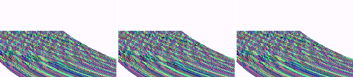
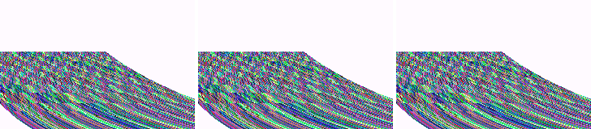

# Sonic Advance 2 title screen and "bilinear delays audio"

Status 2026-10-01, branch `claude/sa2-title` (off `claude/candidate-3.1-all`).
Report: Hecyo800, GBAdhoc 3.0.0 (docs/FEATURE-REQUESTS.md): "Sonic Advance 2's
title screen shows a white background instead of the ocean; also bilinear
filter delays audio."

**No Sonic Advance 2 ROM exists on this PC** (every `.gba` on C: and in WSL
was identified by its header; none is SA2, and no archive contains one). So
nothing here ran the game itself. The title screen was worked out from the
SAT-R/sa2 decompilation and reproduced with a synthetic ROM that does what
the game's code does.

## 1. White title background: ME renderer contract (fixed on the candidate)

### What the title screen does (SAT-R/sa2 decomp)

`src/game/sa2/title_screen.c` `WavesBackgroundAnim` and `src/core.c` (VBlank):

* Mode 1. The sea is **BG2, a 256x256 affine layer**, wrap off, shown through
  WIN1 (`WINOUT &= 0x13`).
* **All of its geometry is per line.** `gHBlankCopyTarget = REG_ADDR_BG2PA`,
  `gHBlankCopySize = sizeof(BgAffineReg)` (16 bytes: PA, PB, PC, PD, X, Y). In
  VBlank, DMA3 copies table entry 0 to BG2PA..BG2Y_H, then DMA0 is armed
  16-bit / HBlank / repeat / dest-reload, 8 halfwords, from entry 1.
* **PC = PD = 0** (and PB = 0), so nothing moves the reference point from one
  line to the next except the per-line reload of BG2X/BG2Y.
* Lines above the horizon get `PA..PD = 0, X = 0, Y = (line + 512 - top) << 8`:
  BG2 points off the map there, so it is transparent.
* A palette gradient (`BgPaletteEffectGradient`, BG palette bank 14) is written
  by the BIOS `CpuFastSet` from the HBlank IRQ, and `ResetWavesPalette`
  restores the base bank in VBlank.

### Why 3.0.0's Media Engine renderer drew no sea

3.0.0's ME contract (docs/ME-MIDFRAME.md) recorded the affine reference point
**only at line 0** and stepped it by PB/PD itself. It replayed all 160 lines
against one graphics-memory snapshot taken at vcount 160. For this screen:

* Line 0 is above the horizon, so its seed points off the map. PB = PD = 0,
  so every line after it uses the same off-map point. **BG2 is transparent on
  all 160 lines, and the backdrop and the layers behind BG2 show through where
  the sea should be.** This is the Mario Golf aim-view class ("mostly black"
  there), with an empty layer instead of a garbled one.
* The gradient is written mid-frame, so the single snapshot also lost it.

The CPU renderer is correct for this pattern. `main.c` renders line N, then
`affine_advance` steps by PB/PD (zero here), then runs the HBlank DMA, whose
BG2X/BG2Y writes reload `affine_reference_x/y` in `write_io_register16`. Line
N+1 uses the reloaded point. So **ME off (and PPSSPP, which has no ME) should
show the sea, and ME on in 3.0.0 should not.** ME is on by default in playable
builds (`PCFG_ME_MODE_DEF 1`), which is how a user hits it.

### Fix: already on the candidate (`claude/me-midframe`)

`ME_AFFINE_LINES` (per-line affine reference capture) and `ME_MIDFRAME_LOG`
(per-line palette/OAM/VRAM undo/redo log) are both default 1 on
`candidate-3.1-all`. Neither exists in `v3.0.0` / `claude/release-3.0.0`. I
checked the two paths SA2 depends on:

* 16-bit HBlank DMA into BG2X_L/H and BG2Y_L/H goes through
  `write_io_register16`, which reloads the reference, and the capture records
  `affine_line[vcount]` at the start of each line, after the reload.
* `CpuFastSet` runs as translated BIOS code, and its STM reaches the
  aligned-store stub. `tmemst[3][5]` is `emit_palette_hdl`, which sets
  `reg[PAL_UPDATED]`, so the mid-frame log sees the gradient. There is no HLE
  `CpuFastSet` that could bypass the stub.

No new renderer change was needed. This branch adds the regression case.

### Evidence: `sa2_waves` synthetic ROM

`tools/e2e/me_midframe/gen_roms.py` gains `sa2_waves`, which follows the decomp
mechanism step by step: the VBlank DMA3 entry-0 copy, the 16-bit HBlank DMA0
repeat/dest-reload of 8 halfwords to BG2PA, PB=PC=PD=0, off-map rows above a
horizon at line 64, wrap off, WIN1, and a bank-14 gradient through
`swi 0x0C` (CpuFastSet) in the HBlank IRQ, restored in VBlank. The backdrop is
set to white so the failure is visible. SA2's real backdrop colour was not
checked.

`tools/e2e/run_me_midframe.sh` (desktop twin, `ME_TIMING_SIM`, 210 frames
after a 30-frame settle; "vis" is the production vcount-160 post, "m1" is
capture mode 1):

| arm | `ctl_mode0` | `ctl_affine` | `aff_dma` | `pal_irq` | **`sa2_waves`** |
|---|---:|---:|---:|---:|---:|
| 3.0.0 contract (`-DME_AFFINE_LINES=0 -DME_MIDFRAME_LOG=0`) | 0 | 0 | 210 | 210 | **210** |
| affine lines only (`-DME_MIDFRAME_LOG=0`) | 0 | 0 | 0 | 210 | **210** |
| candidate (both default 1) | 0 | 0 | 0 | 0 | **0** |

The m1 column is identical to vis in every arm. The oracle can fail: the
controls read 0 everywhere, and the unfixed arms fail every frame. The CPU
image is byte-identical across all three arms (same md5). Both halves of the
fix are needed for SA2: per-line affine brings the sea back, and the log
brings back its gradient.

Frame 120 of each arm, CPU renderer | ME model (vis) | ME model at frame end:

* 3.0.0 contract, sea missing (white backdrop):
  
* affine lines only, sea back, gradient still wrong (210/210 frames differ):
  
* candidate, identical to the CPU renderer:
  

### Needs hardware / the game

* SA2 itself on a PSP with the candidate EBOOT, ME on, title screen; then the
  same with `me_mode = 0` as the A/B. Expected: sea in both. If 3.0.0 is to
  hand, ME on vs off there should reproduce the report.
* FF caveat (unchanged, ME-MIDFRAME.md): the FF presets post at frame end and
  drop the mid-frame log. The sea geometry survives because affine lines are
  captured per line in every mode, but the gradient will be the post-VBlank
  palette while fast-forwarding.

## 2. "Bilinear filter delays audio": it is the audio ring, not the filter

### What the filter does

`vid_set_mode` sets `g_filter`, and `game_filter()` returns `GU_LINEAR` or
`GU_NEAREST` for one `sceGuTexFilter` call in `vid_draw_frame` /
`vid_draw_prestaged`. Nothing else reads it: there are no pacing, audio or
emulation paths that depend on it. Its only cost is GE sampling time inside
`blit_prof wait`. Existing hardware logs (`builds/**/frontend.log`) show
`wait` window means of 32-42 us for fit+nearest and 54-126 us for
stretch+bilinear. That comparison is confounded by stretch drawing 18% more
pixels, but either way it is under 1% of a 16.7 ms frame. PPSSPP's GE is
instant (DISPLAY-FEATURES.md), so it cannot price the filter.

### What actually delays audio

The main loop is vblank-locked at 59.94 Hz, and each frame produces
1/59.7275 s of sound at the core's 32768 Hz. The consumer drains at the nominal
rate. So the 32768-frame ring gains about 0.36% (about 116-124 frames/s) until
the "audio-master nudge" holds it at `RING_HIGH_WATER`, which was
`RING_FRAMES * 3 / 4` = **24576 frames = 0.75 s**. From then on, sound plays
0.75 s behind the picture.

* The in-game menu pauses the core while the audio thread keeps draining, so
  **opening the menu empties the ring and the lag starts again from zero**.
* That matches the other 3.0.0 report exactly: "audio drifts out of sync after
  minutes; opening the menu resets it" (Notnbutgravity, HairSalty5626, which
  also names Sonic Adv. 2).
* A player who changes the filter (menu, or Triangle) and then plays on sees
  the lag build up "after turning bilinear on". The filter is coincidental.

Hardware evidence. `builds/wireless-rig/logs/growl-ch11/auto002-A-host.log`
(real PSP, `audio_rate in=32768`) has `frame_hist` windows of 600 frames
showing `nudge=0` for windows 1-19, then `nudge=1` at window 20 and 2-3 in
every window for the rest of the run. That is the ring reaching 0.75 s at
~200 s and staying there. The PPSSPP run below hits its first nudge at the
same window, 20. 3,528 + 624 hardware windows across `builds/` sit at nudge 2-3.

### Change (this branch)

`AUDIO_RING_TARGET` (default **4096 frames = 125 ms**) replaces the 3/4-ring
high water. The steady-state lag drops from 0.75 s to 0.125 s, and the nudge
rate is unchanged (it is set by the 59.94/59.7275 surplus, not by the level).
The first ~35 s of every session have always run below 4096 frames, because
the ring starts empty, so this does not reduce the cushion that play starts
on. It only stops the cushion growing.

* `audio_status_frame` now reports occupancy against the target, not the
  whole ring. With the ring held at 12.5%, the old formula would report a
  permanent underrun to the core's `auto` frameskip, which only the non-default
  `net_frameskip = 2` engages. Underrun is now below 25% of the target
  (31 ms).
* Harness `audio_ring_target = N` (1024..32767) overrides it per arm.
* New telemetry `EVT audio_ring n=600 lvl min max target nudge starved
  in_rate`, every 600 paced frames. Until now there was no ring-level
  observable outside link sessions, which is how a 0.75 s lag went unseen.
  `starved` counts output frames filled with silence. It compiles out with
  the rest of `fe_evt` in release builds.

### PPSSPP A/B (Emerald title screen, harness EBOOT, Xvfb :114)

Arms: target 24576 (old) / 4096 (new) x filter nearest / bilinear, scale fit,
600-frame windows, values `lvl/min/max` in ring frames:

| window (600 frames, ~10 s) | old target 24576 (3.0.0) | new target 4096 | audio lag at lvl (old / new) |
|---:|---|---|---|
| 1 | 2511/292/2723, nudge 0, starved 164864 | 2511/292/2723, nudge 0, starved 164864 | 76 ms / 76 ms |
| 2 | 3755/1998/3932, nudge 0, starved 0 | 3755/1998/3932, nudge 0, starved 0 | 114 ms / 114 ms |
| 3 | 5000/3227/5052, nudge 0, starved 0 | 3478/2856/4130, nudge 2, starved 0 | 152 ms / 106 ms |
| 4 | 6245/4362/6245, nudge 0, starved 0 | 3962/2830/4112, nudge 2, starved 0 | 190 ms / 120 ms |
| 5 | 7489/5555/7489, nudge 0, starved 0 | 2924/2849/4152, nudge 3, starved 0 | 228 ms / 89 ms |
| 10 | 12951/11318/13179, nudge 0, starved 0 | 3821/2858/4131, nudge 2, starved 0 | 395 ms / 116 ms |
| 15 | 18414/17205/19050, nudge 0, starved 0 | 3196/2852/4125, nudge 2, starved 0 | 561 ms / 97 ms |
| 19 | 23392/21935/23816, nudge 0, starved 0 | 3610/2828/4128, nudge 3, starved 0 | 713 ms / 110 ms |
| 20 | 23876/23127/24579, nudge 1, starved 0 | 3333/2837/4120, nudge 2, starved 0 | 728 ms / 101 ms |
| 21 | 24360/23304/24604, nudge 2, starved 0 | 3056/2831/4110, nudge 2, starved 0 | 743 ms / 93 ms |
| 22 | 24082/23334/24607, nudge 2, starved 0 | 3539/2844/4131, nudge 2, starved 0 | 734 ms / 108 ms |
| 23 | 23805/23305/24608, nudge 3, starved 0 | (run ended) | 726 ms / - |

Bilinear arms (stopped early to free the host once they had matched): old 5 windows and new 4 windows, byte-identical to the nearest arms window for window.

* **Filter: no effect.** Nearest and bilinear produced byte-identical
  `audio_ring` lines in every window both ran, for both targets. (As expected
  in PPSSPP, since its GE is instant. On hardware the cost is the 20-90 us
  above.)
* **Old target:** the level climbs ~1245 frames per window from an empty
  start and plateaus at the 0.75 s high water, after which the nudge fires
  2-3 times a window, as on hardware.
* **New target:** the level settles at ~4096 (125 ms) from the third window
  on, with the same 2 nudges a window and `starved=0` after boot. The
  ~165k starved frames in window 1 are the boot, before the game produces
  sound, and appear identically in every arm.

### Needs hardware

* PSP-1000 and 3000 (the 1000 is where the drift was reported): play for
  more than 5 minutes and confirm the lag stays small. Check that `EVT
  audio_ring` holds lvl near 4096 with `starved=0` through ordinary play,
  state saves (the >100 ms frames) and FF exit.
* Optional A/B on the same unit: `audio_ring_target = 24576` reproduces 3.0.0.
* If a 100+ ms stall starves the ring audibly, raise the target (8192 =
  250 ms is still a third of the old lag). This must be measured, not assumed.

## 3. Also on this branch

`psp/ui_psp.c` did not compile on `candidate-3.1-all`. The control-remap merge
left `bframe == 90` (an undeclared identifier) in `ui_browser`'s Controls demo
hook, where `g_bframe` was meant. It is fixed here as a one-token change.
