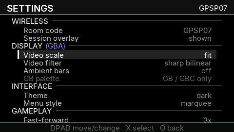
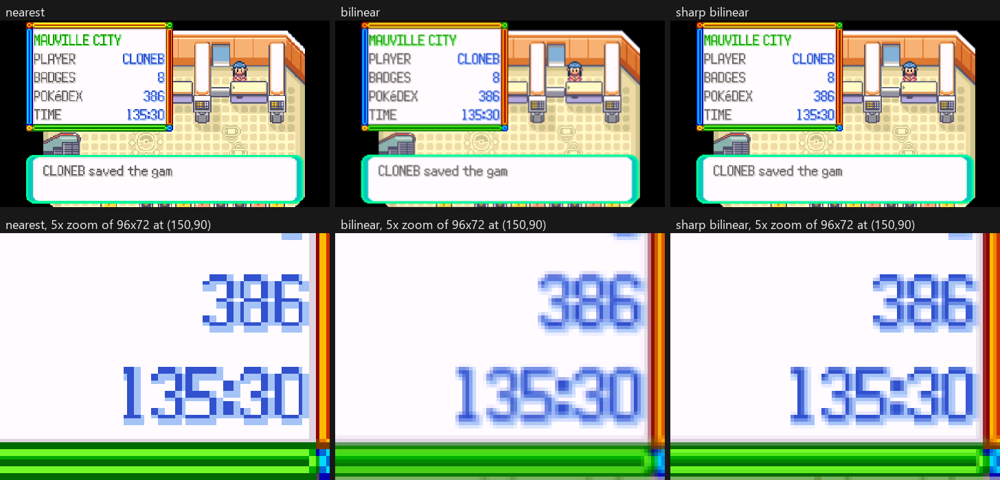
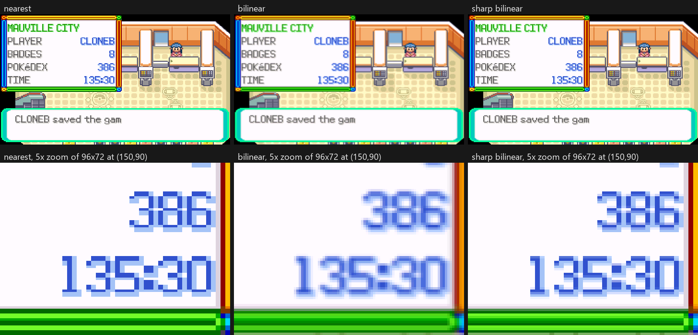
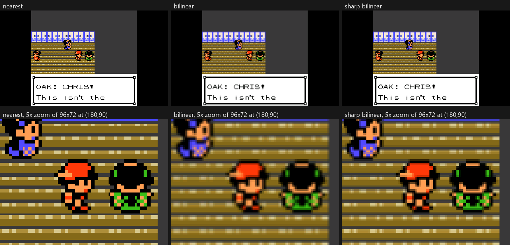
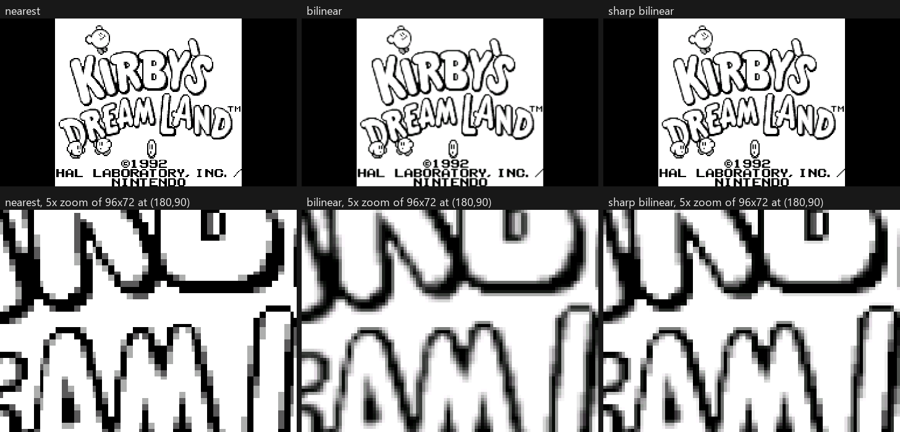
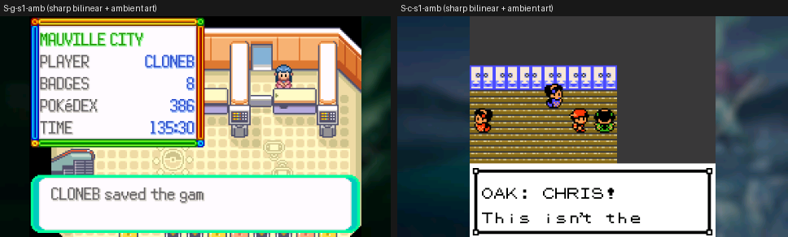
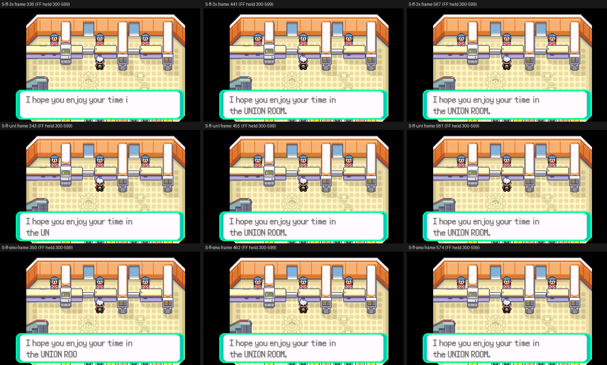

# Sharp bilinear filter

2026-10-01, branch `claude/sharp-bilinear`, from `claude/candidate-3.1-all`
(`d1aca36`). This is feature request #6 from the 3.0.0 Reddit thread: crisp
pixels without shimmer at non-integer scales.

Settings > Display > **Video filter** now has three values: `nearest`,
`bilinear` and **`sharp bilinear`**. The value is stored per console
(GBA / GB / GBC), like the other display settings. It is **off by default**,
and every existing config keeps its look.

Validated in PPSSPP and the host suites. The hardware checks at the end
have **not** been run.



## The problem

At Fit, a GBA picture is drawn at 1.7x (240x160 to 408x272):

* **Nearest** draws each source pixel 1 or 2 screen pixels wide, in an
  uneven pattern. When the picture scrolls, the pattern moves with it, so
  edges crawl ("shimmer").
* **Bilinear** removes the shimmer but blurs every pixel.

**Sharp bilinear** keeps square, crisp pixels and blends only the one
output pixel that straddles each source-pixel edge.

## Approach: two fixed-function GE passes

The GE has no shaders, so the effect is built from two textured-sprite
passes inside the blit's own display list (`sharp_draw` in
`psp/video_psp.c`).

1. **Prescale.** Draw the staged frame with `GU_NEAREST` at an integer
   factor into a render target in VRAM (`sceGuDrawBufferList`). The factor
   is `k = ceil(final scale)` on each axis, so the target is never smaller
   than the final picture. The last source column and row are drawn once
   more, one texel past the picture. Bilinear taps at the far edge then
   read the edge colour, whatever sampling offset the GE uses, and never
   stale VRAM.
2. **Resample.** Switch back to the display buffer and draw the target with
   `GU_LINEAR` at the final size, in 64-texel strips that share exact
   boundaries. Inside a k x k block every tap reads the same colour, so
   only the pixels on source-pixel edges are blended.

Choosing `ceil` rather than `floor` is deliberate. At 1.7x, `floor` gives
k = 1, which is plain bilinear. With `ceil`, the blend band is `scale / k`
output pixels wide (0.85 at GBA Fit), close to the one-pixel band that the
analytic sharp-bilinear shader produces.

| picture | source | final | prescale k (x, y) | target |
|---|---|---|---|---|
| GBA 1x | 240x160 | 240x160 | integer: drawn nearest | none |
| GBA Fit | 240x160 | 408x272 | 2, 2 | 480x320 |
| GBA Stretch | 240x160 | 480x272 | 2, 2 | 480x320 |
| GBA 2x | 240x160 | 480x272 (cropped) | integer: drawn nearest | none |
| GB/GBC 1x | 160x144 | 160x144 | integer: drawn nearest | none |
| GB/GBC Fit | 160x144 | 302x272 | 2, 2 | 320x288 |
| GB/GBC Stretch | 160x144 | 480x272 | 3, 2 | 480x288 |
| GB/GBC 2x | 160x144 | 320x272 (cropped) | integer: drawn nearest | none |

* **Integer scales are nearest, exactly.** When both axes scale by an
  integer, the two passes would change nothing, so the picture goes
  through the normal one-pass draw with `GU_NEAREST`. It is
  pixel-identical to "nearest" (proven below). 2x was already nearest
  whatever the filter setting said.
* **The clear is replaced by bars.** The full-screen clear (130,560 pixels)
  becomes black sprites over the bars only: 19,584 pixels at GBA Fit, none
  at Stretch. With ambient bars on, the ambient bars are drawn instead, as
  they already were. The picture covers everything else, so this removes
  part of the prescale's extra fill.
* **State is restored after the passes:** the draw buffer (to `g_draw_off`,
  correct for both the double- and triple-buffered builds), the scissor,
  the GE drawing region (commands 21 and 22, opened to the target for
  pass 1) and the depth mask.
  * Pass 1 masks depth writes. Depth test is off, which already means no
    depth writes, but the depth buffer has 272 rows at stride 512 and the
    staging texture sits directly after it, so a stray depth write on
    target row 272 or later would land in the texture being read.
  * `sceGuTexSync()` and `sceGuTexFlush()` separate the two passes: the
    texture cache may still hold last frame's target.
* **The off path is unchanged.** The picture draw that `vid_draw_frame` and
  `vid_draw_prestaged` used to inline moved into `game_draw()` command for
  command, and both functions call it whenever sharp is not in use.
* **Fallback:** if the render target does not fit in VRAM, or a geometry
  needs more than 512x336, sharp draws plain bilinear. Neither happens
  with any current mode.

### Where the passes run

Both blit paths go through `sharp_draw`. The only difference between them
is where the texture comes from:

* the CPU path (`vid_draw_frame`): the VRAM staging buffer;
* the Media Engine renderer and ME staging (`vid_draw_prestaged`, which
  also serves every fast-forward preset): the uncached stage the ME wrote.

Screenshots are unaffected:

* The L+R+SELECT screenshot (`dump_frame_bmp`) and the vhash oracle read
  the core frame or the ME stage, which come before the filter.
* `vid_dump_ge` reads the display buffer, which holds the final picture.

The wake overlay and the in-game menu backdrop (`vid_image_screen`) keep
their existing filter. That frame sits under a 170-alpha scrim.

## VRAM

```
[display x3: 0 .. 835,584][depth .. 1,114,112][staging 82 KiB .. 1,196,544]
[ambient 32 KiB .. 1,229,312][pad][SHARP 512 x 336 x 2 = 336 KiB: 1,236,992 .. 1,581,056]
```

* **Placement:** above the ambient texture, aligned to 8 KiB. The target
  ends at 1,581,056 of the 2,097,152 bytes of eDRAM that every model has,
  which leaves 504 KiB free.
* **Taken lazily:** VRAM is claimed on the first sharp frame and never
  freed (nothing else allocates VRAM). The claim is logged as
  `EVT sharp_target rc=0 vram_off=1236992 bytes=344064`.
* **No heap or BSS cost:** this matters on the PSP-1000, where the core
  takes every heap byte at ROM load (see DISPLAY-FEATURES.md §3).
* **Locked by a test:** `tools/test_video_geometry.c` asserts the offsets.

## Config and UI

* **`filter`, `filter_gba`, `filter_gb`, `filter_gbc`:** 0 = nearest,
  1 = bilinear, **2 = sharp bilinear**. Any other non-zero value is still
  bilinear, as before (`pcfg_filter_clamp`). The legacy `filter` key mirrors
  the GBA profile, so it can hold 2.
* **Older builds:** an older build maps any non-zero filter to 1, so it
  reads 2 as bilinear. That is the closest look it has, and nothing breaks.
* **Settings row:** cycles nearest > bilinear > sharp bilinear (left/right
  go both ways). Under 2x it still reads "sharp (2x)" and is greyed out.
* **TRIANGLE preset cycle:** the two smoothed presets use the smoothing the
  player last chose. After sharp is selected, they are "fit sharp" and
  "stretch sharp". A player who never picks sharp gets exactly the old
  cycle.
  * After cycling to a nearest preset, the choice lives in memory only
    (`g_smooth`). A reboot after saving a nearest preset brings the
    smoothed presets back to bilinear.

## Cost

### Pixels the GE fills per presented frame

| picture | today (either filter) | sharp | change |
|---|---|---|---|
| GBA Fit | clear 130,560 + picture 110,976 | bars 19,584 + prescale 154,401 + picture 110,976 | flat −110,976, textured +154,401 |
| GBA Stretch | clear 130,560 + picture 130,560 | prescale 154,401 + picture 130,560 | flat −130,560, textured +154,401 |
| GB/GBC Fit | clear 130,560 + picture 82,144 | bars 48,416 + prescale 92,769 + picture 82,144 | flat −82,144, textured +92,769 |
| GB/GBC Stretch | clear 130,560 + picture 130,560 | prescale 139,010 + picture 130,560 | flat −130,560, textured +139,010 |
| 1x, 2x | unchanged | unchanged (nearest) | 0 |

The prescale counts include the duplicated edge column and row.

### Estimate for the GE time

This is calibrated against hardware, not measured on it.

* **Calibration:** the only hardware GE number on record is ADR-0034. In
  that measurement, the PSP-1000 VRAM-mode blit took `gu = 728 µs` with the
  sync inline: about 50 µs of list building and about 680 µs of GE time
  for a 1x frame (a 130,560-pixel clear plus a 38,400-pixel nearest
  picture). That is about 4.0 ns per pixel averaged.
* **Bounds on the split:** if textured fill costs 4.0 to 6.0 ns per pixel,
  the clear costs 3.4 to 4.0 ns per pixel.
* **Central estimate:**

  | picture | extra GE time |
  |---|---|
  | GBA Fit | +0.2 to +0.55 ms |
  | GBA Stretch | +0.1 to +0.5 ms |
  | GB/GBC Fit | +0.05 to +0.3 ms |
  | GB/GBC Stretch | +0.03 to +0.4 ms |

* **Pessimistic estimate (about +0.9 ms at GBA Fit):** textured fill at
  6 ns per pixel, and the resample from the larger 512-wide texture 50 %
  slower than today's picture.
* **Caveat:** the calibration assumes the ADR-0034 run was at the
  harness's 1x. **Treat all of these as estimates until the hardware A/B
  below is run.**

### How much of that the CPU sees

* **CPU list building: +19 µs per frame**, measured in PPSSPP
  (`blit_prof gu` 12 → 31 µs at GBA Fit, 11 → 27 µs at GBC Stretch).
  PPSSPP's CPU timing is emulated, so the hardware figure may differ, but
  it is small.
* **GE time:** the playable builds force `gu_defer = 1`, so the GE
  rasterises while the CPU runs.
  * **ME renderer (the default):** the blit list is issued at the loop top
    and runs during `retro_run`. A GE job under 1.5 ms inside a 10 to
    16 ms emulation step should be fully hidden, and the CPU waits only if
    the GE is still busy at `vid_swap`. The hardware PSP-1000 logs at
    Stretch + bilinear show a 120 µs residual `wait` today.
  * **ME `me_sameframe`** (harness-only, default off): the present happens
    just before the swap, so the GE time is visible.
  * **CPU renderer (ME off):** the list is issued after `retro_run` and
    overlaps the vblank wait. The extra GE time costs a frame only when a
    frame has less than about 1 to 1.5 ms of slack.
* **What PPSSPP cannot show:** PPSSPP's GE is effectively instant
  (`wait = 4 µs` in every arm), so **PPSSPP cannot show GE cost at all**.
* **Emulation is unchanged:** `core_prof` moved by +19 µs, which is the
  list build. The video oracle is bit-identical with sharp on (below).
* **Expectation for the PSP-1000:** full speed holds wherever it holds
  today, because the extra work lands on the otherwise idle GE. This is an
  expectation, not a measurement.

### Fast-forward

Fast-forward costs the same per presented frame, and only presented frames
pay it. The ME-staged FF presets present through `vid_draw_prestaged`, and
uncapped CPU FF presents 1 frame in 32. None of the presets skips sharp.
If the hardware A/B shows FF throughput dropping, the obvious change is to
use bilinear while FF is held. That has not been done, because nothing has
measured a need for it.

## Evidence (PPSSPP, software GE renderer, private Xvfb pinned to :118)

* **Builds** (harness profile, clean rebuilds from commits):
  * base `d1aca36`: EBOOT md5 `a1d109191d8b9010554a5d50766dd993`;
  * this `5cfef8d`: EBOOT md5 `2007c01d3c6b2a51b26d6790f9e55d23`.
* **Rig:** `tools/display-rig/sharp.sh` (52 runs, all clean exits) and
  `sharp_compare.py`.
* **GE dumps:** byte comparison of `ge_NNNNNN.bmp` drawbuffer dumps every
  20 frames from frame 60. Earlier frames precede the state load and
  depend on the wall-clock RTC.

### 1. Nothing changes with sharp off: 13 of 13 arms identical

| arm (base vs this build) | frames identical |
|---|---|
| GBA Emerald 1x nearest, 1x bilinear | 9/9, 9/9 |
| GBA Fit nearest, Fit bilinear | 9/9, 9/9 |
| GBA Stretch nearest, Stretch bilinear | 9/9, 9/9 |
| GBA 2x (bilinear set, so drawn nearest) | 9/9 |
| GBA Fit bilinear + ambient art; 1x nearest + ambient art | 9/9, 9/9 |
| GBC Crystal 1x nearest, Fit bilinear, Stretch nearest | 9/9, 9/9, 9/9 |
| GB Kirby 2x | 12/12 |
| **control:** base vs base again (GBA Fit bilinear) | 9/9 |

The dumps are not trivially equal:

* each Emerald and Crystal run holds 5 distinct pictures in its 11 dumps,
  and the Kirby run holds 11 in its 12;
* nearest, bilinear and ambient dumps of the same frame all differ.

### 2. Sharp at integer scales is nearest, exactly

| sharp arm | equals | frames |
|---|---|---|
| GBA 1x | GBA 1x nearest | 9/9 identical |
| GBA 2x | GBA 2x | 9/9 identical |
| GBA 1x + ambient art | GBA 1x nearest + ambient | 9/9 identical |
| GBC 1x | GBC 1x nearest | 9/9 identical |
| GBC 2x | GBC 2x nearest | 9/9 identical |

### 3. Sharp at non-integer scales is a different picture

This is the positive control: it shows the comparison can see a
difference. Each pair below differs on every frame:

* GBA Fit sharp vs bilinear: 9/9 frames differ;
* GBA Fit sharp vs nearest: 9/9;
* GBA Stretch sharp vs bilinear: 9/9;
* GBC Fit sharp vs bilinear: 9/9;
* GBC Fit sharp vs nearest: 9/9;
* GB Kirby Fit sharp vs bilinear: 12/12.

Numeric checks on the frame-200 dumps:

* **Bars:** black exactly.
* **Picture edges:** the first column and first row match nearest exactly.
  The last column and last row differ from nearest only as much as the
  interior does (mean |Δ| 0.9 and 6.6, interior 5.4), so there is no dark
  or garbage edge.

The prescale and resample also work in the other configurations covered:

* GBC Fit and Stretch;
* GB Fit;
* GBA and GBC with ambient art;
* all three FF presets (3x, Unlimited, Unlimited Smooth): 71 to 100 dumps
  per run, taken every 7 frames through the 300-frame FF hold. All 226
  dumps from frame 60 on pass a scripted check: the bars are pure black,
  and the bottom 8 rows of the picture are not black, so there is no
  missing or stale band. Nine of them are in the montage below.

### 4. Screenshots and emulation

* **Screenshot:** the `dump_at` frame (the L+R+SELECT screenshot path) is
  byte-identical between sharp Fit and bilinear Fit.
* **Video oracle:** `tools/e2e/run_video_regress.sh`, build against build.
  It hashes the core's frame, upstream of the blit.

  | run | result |
  |---|---|
  | base `--capture` | 1091 frames, every marker reached |
  | this build, default config | **PASS**, 1091 frames identical |
  | this build, **sharp on at Fit** (`sharp_target rc=0` in its log) | **PASS**, 1091 frames identical |
  | negative control: the base golden with one hash altered (frame 700) | **FAIL**, "differing frame count: 1" |

  The last row shows that the oracle compares this time, and was not a
  no-op.

  The script gained `VREGRESS_EBOOT` (run a staged build),
  `VREGRESS_CONFIG` (a config.ini for the run) and `XDISPLAY` (pin Xvfb).
  Each step ran in a private `unshare` namespace with its own `/tmp` and
  `/dev/shm`.

### 5. Host tests

* `video_buffers` (`tools/test_video_geometry.c`) covers:
  * the prescale factors for every mode, GBA and GB;
  * nearest at 1x and 2x;
  * the filter that each setting draws with;
  * the VRAM offsets;
  * TRIANGLE with sharp chosen;
  * odd filter values.
* `ff` (`tools/test_display_profiles.c`) covers:
  * filter 2 loading per console and through the legacy key;
  * the legacy mirror writing 2;
  * a sharp GB profile surviving a reload;
  * −3 and 5 still loading as bilinear.
* **Full run, `python tools/run_host_tests.py`: 29 of 30 suites pass.**
  * The one failure is `gb`. Its gblink build stops at a link error,
    ``multiple definition of `fe_autopilot_take_mark'``
    (`frontend-common/fe_autopilot.c:585`).
  * The **base `d1aca36` fails `gb` in the same way**, so the failure was
    already there and this branch does not touch it.

### What PPSSPP did not cover

* **The ME path:** `vid_draw_prestaged` on the ME renderer and ME staging.
  PPSSPP does not run the second core, so `me_mode = 1` falls back to the
  CPU path. The code is shared, and only the texture pointer differs.
* **GE timing:** PPSSPP does not model it.
* **Real-hardware GE semantics:**
  * whether the drawing region (commands 21/22) is enforced;
  * TEXSYNC behaviour;
  * write-to-texture ordering between the passes.
  PPSSPP's software renderer models these permissively.

## Captures (PPSSPP software renderer, frame 200)

Each image shows the full screen on top and a 5x nearest zoom of a 96x72
crop below.

GBA Fit (1.7x):


GBA Stretch (2.0 x 1.7):


GBC Fit (1.89x):


GB Fit, Kirby's Dream Land title screen (frame 660):


Sharp with ambient art bars, GBA and GBC Fit:


Sharp during fast-forward, all three presets:


PPSSPP's software bilinear is a model of the GE's. The real panel's
response, and any GE sampling-offset difference, can only be judged on a
console.

## Hardware checks (not run; the main session owns the consoles)

Use the **harness** build of `5cfef8d` on the **PSP-1000** with the ME on (the
playable default). Arms differ only in `CONFIG.INI`. Use Emerald, or the AW2
fixture with the `aw2.txt` tour.

1. **Raw GE cost.** Run with `.gpsp-harness.ini` `gu_defer = 0`, so the
   sync is inline and `wait` is the whole GE time, at Fit and then at
   Stretch:
   * `filter_gba = 1` against `filter_gba = 2`;
   * five 600-frame windows each;
   * read `EVT blit_prof wait=` and `gu=`.

   The difference in `wait` is the sharp GE cost. The estimate is
   +0.2 to +0.55 ms at Fit, and it should not exceed about 1 ms. Repeat
   one GB/GBC arm at Fit.
2. **What players get.** Repeat check 1 with the default `gu_defer`
   (forced to 1). Compare `EVT core_prof`, `wait=` and the fps over five
   windows:
   * Expected: `wait` within noise of bilinear, and core unchanged.
   * Repeat once with `me_mode = 0` (the CPU renderer), where the GE time
     can show if a frame has no slack.
   * Also run one heavy scene (the H&S fixture) to check that sharp does
     not turn a frame that holds 60 into one that misses.
3. **Fast-forward.** Hold FF (Unlimited, then Unlimited Smooth) for 30 s at
   Fit, bilinear against sharp. Compare the emulated frame rate. If sharp
   costs FF throughput, consider using bilinear while FF is held.
4. **Picture, on the 3000 panel and the 1000.** Check the following:
   * GBA Fit and Stretch, GBC and GB Fit and Stretch;
   * no dark, garbage or stale band at the bottom of the picture (that
     would mean the region or scissor was enforced differently, or that
     pass 2 sampled the target before pass 1's writes landed);
   * no flicker of last frame's picture (texture cache);
   * scrolling looks steady (no shimmer);
   * 1x and 2x look identical to nearest;
   * the OSD and toasts still draw on top;
   * a menu open/close and a sleep/wake with sharp on (the wake overlay
     and menu backdrop keep their own filter).
5. **VRAM.** `EVT sharp_target rc=0 vram_off=1236992` on every model. An
   `rc=-1` would mean less eDRAM than assumed, and sharp then shows
   bilinear.

## Files

| file | change |
|---|---|
| `psp/video_psp.h` | `VID_FILTER_SHARP = 2`, `VID_FILTER_MODES` |
| `psp/video_psp.c` | `game_draw()` (the old inline draw, unchanged); `sharp_draw()`, `sharp_factors()`, `picture_filter()`; `g_smooth` and the TRIANGLE cycle; filter name |
| `psp/config_psp.c/.h` | `pcfg_filter_clamp`; validate range 0..2 |
| `psp/ui_psp.c` | the filter row cycles three values |
| `tools/test_video_geometry.c`, `tools/test_display_profiles.c` | the tests above |
| `tools/display-rig/run.sh` | `XDISPLAY`: a private Xvfb pinned to one display number |
| `tools/display-rig/sharp.sh`, `sharp_compare.py` | this campaign |
| `tools/e2e/run_video_regress.sh` | `VREGRESS_EBOOT`, `VREGRESS_CONFIG`, `XDISPLAY` |

## Notes

* **Pre-existing build-product drift:** the tracked `psp/me/gbadhoc_me.prx`
  and `.elf` differ from what a clean build of this tree produces (md5
  `18158678`, identical for the base and this branch). They were restored
  and not committed.
