# The in-game menu: Fable's Direction A, "Overlay"

Branch `claude/ui-overlay`, based on `claude/candidate-3.1-all` (fa89f4e
merged: sleep/wake fixes, GB palette, sharp bilinear).
Design: `builds/menu-mockups/README.md`, section "A — Overlay". The numbers
are `builds/menu-mockups/mockups.py`, `class Overlay`.

Every in-game screen (menu, save/load state, settings, controls, wireless,
plus the scan and Mystery Gift sub-screens) now draws over the paused game
frame. The frame stays at full fidelity behind a scrim, the wordmark sits in
the top-left, the selection bleeds off the left edge, and a ramp out of the
bottom edge carries the footer. START in the ROM browser opens the same
`screen_settings()`, drawn over the highlighted game's blurred art (§11).

Artifacts:

| | path | sha256 |
|---|---|---|
| playable EBOOT, "GBAdhoc 3.1 RC-ALL+UI" (release profile, commit f24f1ff, clean tree) | `builds/ui-overlay-out/release/EBOOT.PBP` | `cd45000b1dce50b9890e0b87d9a1b5bb1435813b4c09623865ac80a59d1da472` |
| its ME module (unchanged from RC-ALL) | `builds/ui-overlay-out/release/gbadhoc_me.prx` | `ee40522346acc9c5f53351e63f49de8ce0069ec75c54d5e40518244bb83e92ef` |
| harness EBOOT used for every check below | `builds/ui-overlay-out/build/harness/EBOOT.PBP` | `ea83f500b8be8b5ac0bea38400284d9a363d3fefc016892d150b76c98bca6907` |

MD5 of the playable EBOOT: `7ee8e698cb46e326cc86ec943207098c`.

---

## 1. What changed, by file

| file | change |
|---|---|
| `psp/ui_psp.c` | The overlay chrome (`ov_backdrop`, `ov_head`, `ov_cluster`, `ov_band`, `ov_plate`, chips, `ov_scrollbar`) and every in-game screen rewritten on it. Controls page: two columns, chips, plates. Menu: 8-frame opening transition. Slots: thumbnails, read once when the screen opens. Browser START settings: drawn over the browser page. Demo dumps are now taken after the frame is drawn. |
| `psp/main_psp.c` | `menu_open()` takes the wake snapshot and hands it to the UI before every `ui_open()`. The snapshot is stored top-left at its own size (GB/GBC 160x144), with edge texels like the staging buffer. The thumbnail buffer is carved from the netdrv arena's tail. New harness keys `ui_backdrop`, `wake_shot`. |
| `psp/video_psp.c` | `vid_image_screen()` (opaque) draws through `sharp_draw()`/`game_draw()`, the live frame's own code. New `vid_image_px()`. **`vid_clip()` scissor bug fixed** (§6). |
| `tools/ui_model/` | The PPSSPP rig (Xvfb :124, private namespace), fixtures, the model of the implemented screens, and `compare.py`. |
| `docs/CONTROL-REMAP.md` | Screenshots and text for the new chrome. |

Rules did not move: everything about what a binding may be still lives in
`ctl_map.c`, and all 30 host suites pass (`python tools/run_host_tests.py`).

---

## 2. How the pixel match was measured

`tools/ui_model/overlay_model.py` draws each screen the C code draws: the
same calls, in the same order, with the real content (ctl_map's table, the
real Settings rows, the state each harness walker leaves the screen in). It
draws through the design's own renderer model (`pspdraw.py`, the real atlases
and theme words), on `gesurface.py`: the same primitives, but blending in
8-bit integers and writing 565 after every draw call, as the GE does.

PPSSPP draws over the same backdrop as the mockups. The harness key
`ui_backdrop = ui_backdrop.565` draws the mockups' 480x272 game frame 1:1
behind the menu in place of the game. `make_fixtures.py` writes that frame
and the mockups' four state thumbnails as `.thumb` files. The walkers
(`ui_demo`, `ui_controls_demo`) drive every screen and GE-dump it.

```
python tools/ui_model/make_fixtures.py ../ui-overlay-out/fx
# in WSL: DEMO=ui_demo THEME=0 OUT=... UIFX=... bash tools/ui_model/run_ppsspp.sh demo-dark <eboot dir> tools/ui_model/setup_design.sh
python tools/ui_model/compare.py <runs> <out>
```

**Exact identity is not achievable over a photograph, and the reason is
PPSSPP's blend rounding, not the drawing.** Over flat colour the design model
already matched PPSSPP exactly (the mockups README baseline). Over the game
frame I fitted the scrim alone, black at eight alpha levels (the eight frames
of the opening transition), against `out = (c*m + k) >> 8` for every m and k.
The multiplier PPSSPP effectively uses is 256-a at seven of the levels and
255-a at a=170, and no single integer or float formula fits all eight. So the
counts below separate two things:

* **differ**: pixels that differ at all.
* **>1 step**: pixels that differ by more than one RGB565 step in a channel.

Any error in a coordinate, colour, alpha, glyph, clip or draw order puts
pixels in the second column, in solid shapes. Blend rounding cannot, except
where three translucent layers stack (§2.2).

### 2.1 Results, every walker dump, both themes

Thumbnail rectangles are excluded: the GE's bilinear minification of a 64x42
preview to 46x30 is a different resampler from PIL's.

| screen | calls | dark: differ / >1 step | light: differ / >1 step | vs design PNG, >1 step (dark / light) |
|---|---|---|---|---|
| menu, opening frame 4/8 | 21 | 3431 / 0 | 13940 / 0 | - |
| menu | 23 | 4930 / 0 | 49244 / 7 | 21 / 5 |
| save state (slot 3) | 34 | 5347 / 0 | 46234 / 24 | 281 / 828 |
| load state (slot 3) | 34 | 5317 / 0 | 46249 / 24 | 275 / 828 |
| settings (Video scale) | 42 | 13051 / 4 | 16341 / 17 | - |
| wireless | 26 | 8338 / 1 | 48318 / 16 | 39 / 0 |
| settings, Button mapping row | 41 | 12156 / 22 | 15910 / 14 | - |
| controls, defaults | 98 | 13141 / 18 | 15965 / 16 | - |
| controls, Video preset = none | 101 | 13105 / 18 | 16045 / 16 | - |
| controls, capture (Screenshot) | 97 | 13759 / 25 | 15478 / 2 | - |
| controls, chord L+R captured | 98 | 13739 / 22 | 16077 / 16 | - |
| controls, steal plate (A takes Square) | 100 | 12798 / 18 | 15672 / 2 | - |
| controls, reset armed | 100 | 12490 / 18 | 15631 / 2 | - |
| controls, reset done | 97 | 12859 / 18 | 15343 / 2 | - |
| controls, capture (Fast-forward) | 100 | 13189 / 18 | 15422 / 2 | different content (§4) |
| controls, conflict plate | 100 | 13194 / 18 | 15505 / 2 | different content (§4) |
| controls, list (cursor B) | 98 | 13142 / 18 | 15975 / 16 | different content (§4) |

Opening transition frames 1-7, >1 step: dark 2, 3, 0, 0, 0, 0, 217; light
57, 31, 2, 0, 0, 1, 3.

"calls" are the model's draw calls with the backdrop counted as one. In C
the backdrop is the live frame's own path: a clear plus 4 strips (plus up to
4 ambient bars; sharp bilinear about 12). Settings draws only the rows inside
the scissor, so it costs 42 calls rather than the design's 51.

### 2.2 Where the >1-step pixels are

All of them fall in three places, and none forms a shape:

* **The first ~10 rows of the ramp (y 152-161)** where it crosses the scrim,
  a band or a chip. The ramp's per-row alpha is interpolated by the GE, and no
  interpolation rule I tried (truncated, rounded, pixel-centre, h vs h-1) is
  exact. The truncated `a_top + (a_bot-a_top)*i/h` fits best, and all are
  within one step.
* **Glyph edges in the faded rows of the opening transition** (frames 1, 2
  and 7). There the text colour is walked toward the background with
  `mix565` and then blended at partial coverage over a partial scrim.
* **The logo's antialiased edge** (`vid_logo` samples GU_LINEAR).

Against the **design PNGs** directly, the menu, wireless and slot screens
agree to within one step everywhere except 5-39 pixels (menu, wireless) and
the ramp/band overlap on the slots screen (275-828 pixels, all in y 152-167
under slot 3's band). The design model blends in float over the unquantised
frame, so it differs from PPSSPP on about 30% of pixels by one step, which is
expected.

### 2.3 Side by side

Each sheet shows the design PNG (where the screen is the design verbatim),
the PPSSPP GE dump, the model, and the diff (yellow: within one step; red:
more than one step).

| | dark | light |
|---|---|---|
| menu | 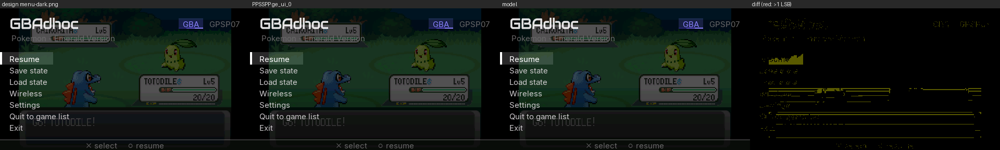 | 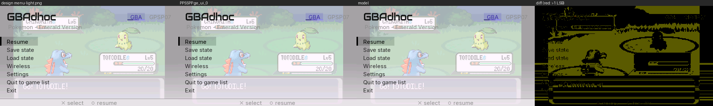 |
| opening, frame 4 of 8 | 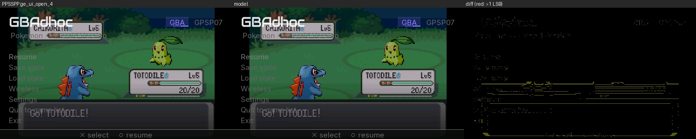 | 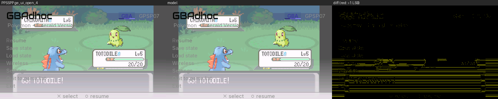 |
| save state | 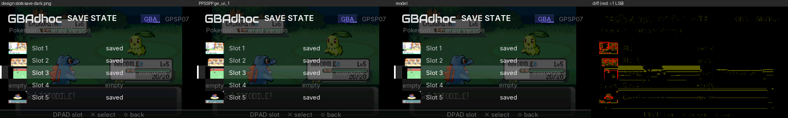 | 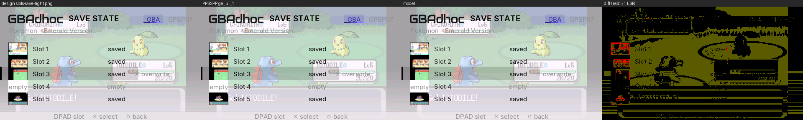 |
| load state | 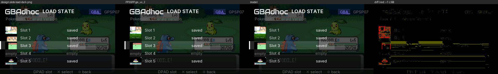 | 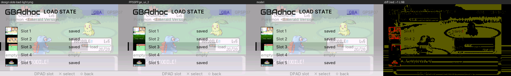 |
| settings | 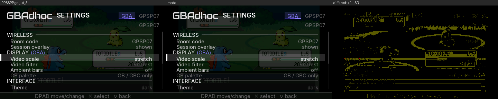 | 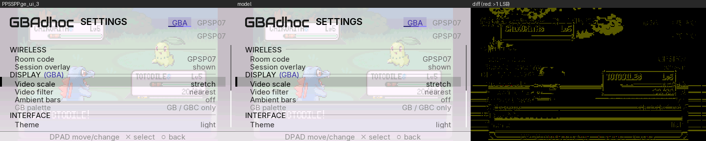 |
| wireless | 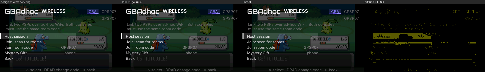 | 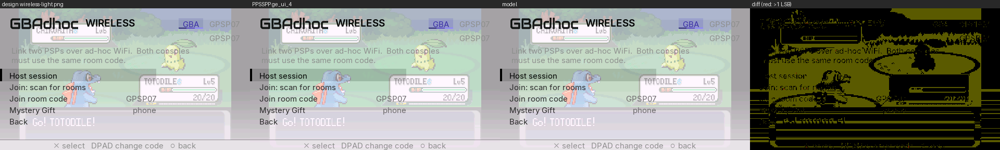 |
| controls | 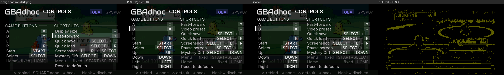 | 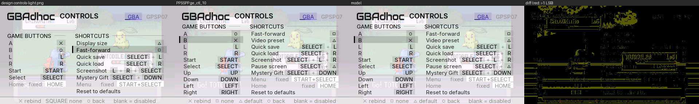 |
| controls, capture |  | 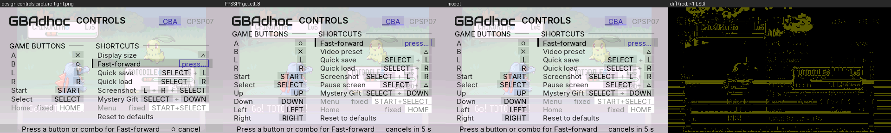 |
| controls, conflict | 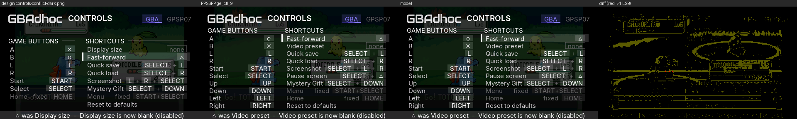 | 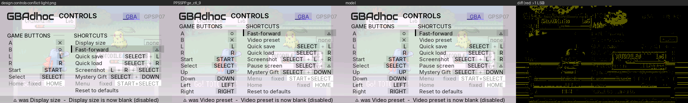 |

More states (PPSSPP dumps):

| | |
|---|---|
|  Settings scrolled to CONTROLS |  a blank (`none`) chip |
| 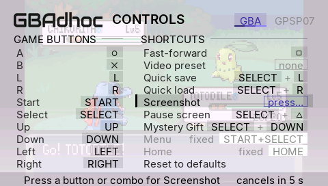 capture on Screenshot | 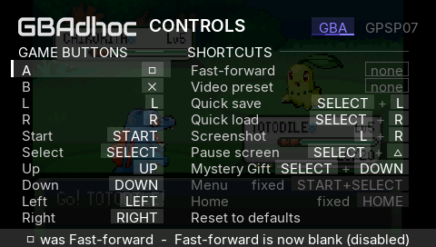 steal plate |
| 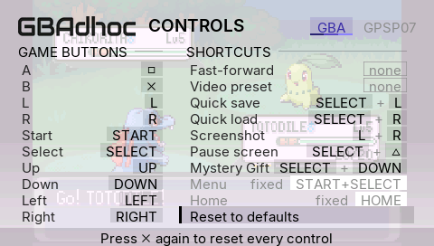 reset armed | 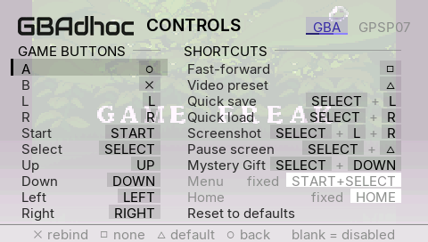 over the real game (light) |
| 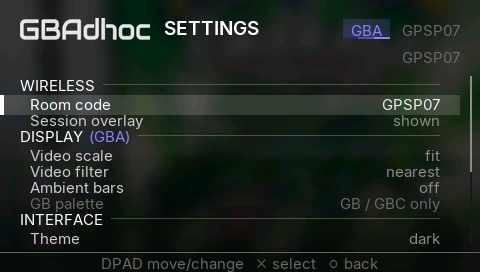 browser START settings, Shelf | 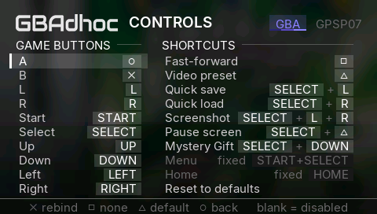 browser Controls, Shelf |
| 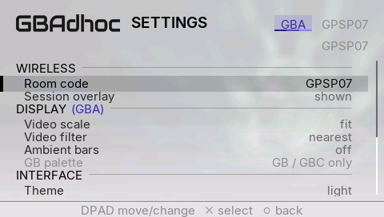 browser settings, Marquee, light | 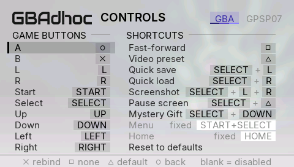 browser Controls, Marquee, light |
| 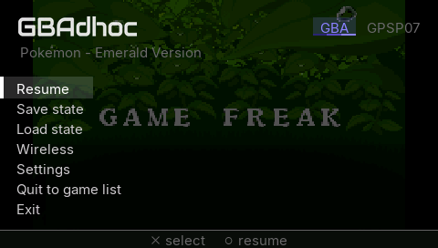 over the real game | 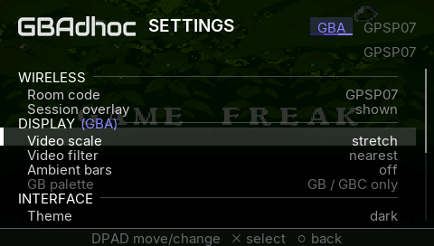 after the walker set Stretch: the backdrop follows |
| 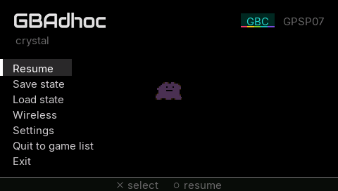 GBC game (160x144 snapshot) | 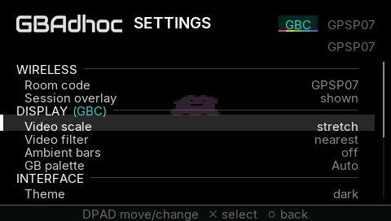 GBC settings, DISPLAY (GBC) |
| 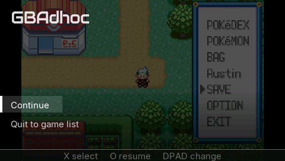 wake overlay, GBA | 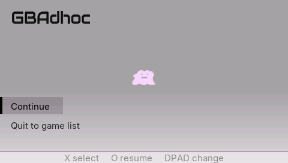 wake overlay, GBC, sharp bilinear |

---

## 3. The backdrop is the live picture, bit for bit

The menu and the wake overlay both draw the snapshot with
`vid_image_screen()`. That now runs the live frame's own code:
`sharp_draw()`, else `game_draw()` with `picture_filter()`, the same 60-texel
strips, REPLACE with blending off, and the same ambient bars. Before, it was
one GU_LINEAR quad, which softened a nearest picture the moment the menu
opened, and a GB frame centred in 240x160 came out smaller than the live one.

Check: harness `wake_shot = N` opens the wake overlay as SELECT+TRIANGLE
would, dumps its third frame, and continues by itself. `gedump_every = 1`
dumps every live frame before it. The live frame, put through the model's
scrim, is compared with the overlay in the scrim-only region (y 60-150).

| run | filter / scale | pixels differing (of 29,700 or 43,200) |
|---|---|---|
| Emerald | nearest, Fit | **0** |
| Emerald | sharp bilinear, Stretch | **0** |
| Crystal (GBC) | sharp bilinear, Fit | **0** |
| Crystal (GBC) | 2x | **0** |

The light-theme GBC run differs on 20 pixels, all within one step. That is
the off-white scrim's blend rounding (§2), not the backdrop.

---

## 4. Deliberate differences from the design, and why

1. **Controls carries the real table, which is longer than the design's.**
   `ctl_map.c` has ten game buttons (the d-pad is remappable) and seven
   shortcuts (it also has Pause screen). The design has six and six. Laid out
   at the design's y0=74 and 19 px pitch, ten rows run off the screen. So the
   column titles sit at y=48 (8 px under the wordmark), rows start at 68, and
   the pitch is computed so the last chip ends by y=246: 18 px for ten rows,
   never more than 19. Home moves under SHORTCUTS with Menu, because GAME
   BUTTONS is full. Labels are ctl_map's ("Video preset", not "Display
   size"), and A defaults to ○ (the design showed the `btn_swap` layout). A
   bisect build's eleventh shortcut row (Crash self-test) gets 16 px.
2. **The capture plate does not say "○ cancel".** O is a legal answer: A is
   on ○ by default, and the rule "a press is the only way out" is
   `CONTROL-REMAP.md`'s. The plate reads *Press a button or combo for
   Fast-forward      cancels in 5 s*, with a live countdown. It is centred on
   the 5-second wording so the digit cannot shift the line. Game buttons read
   *Press a button for A*. While a chord is held, the chip shows it in the
   capture outline and the plate reads *SELECT+L      let go to set*. **The
   owner should decide whether "○ cancel" should become a rule**, which would
   make ○ unbindable alone.
3. **The conflict plate** is the design's sentence with real labels:
   *△ was Video preset  -  Video preset is now blank (disabled)*. The same
   plate also carries refusals (*A unchanged: game buttons take one button*),
   the reset prompt, and the capture timeout. A plain rebind shows no plate,
   because its chip already shows it. The plate clears on the next d-pad press
   and the footer returns.
4. **List footer:** *✕ rebind   □ none   △ default   ○ back      blank =
   disabled*. It uses the □ glyph where the design wrote the word SQUARE, and
   adds △ default, which is a real page action the design left out. The Reset
   row's footer is *✕ reset   ○ back      blank = disabled*.
5. **Navigation:** UP/DOWN walk the rows in the old single-list order (down
   GAME BUTTONS, then down SHORTCUTS), so the harness walker's arithmetic is
   unchanged. LEFT/RIGHT cross to the same row of the other column, or to the
   nearest stop, preferring the row above.
6. **Settings shows the real rows:** DISPLAY (GBA) with its console tag in the
   console colour, Video filter with the third value *sharp bilinear*,
   Ambient bars, GB palette (greyed on a GBA), INTERFACE, FPS counter, and
   *Button mapping* showing default/custom (the design wrote "edit").
7. **Slots:** on an empty slot in Load mode there is no action hint, since ✕
   does nothing there. A state without a preview gets a C_CARD plate reading
   "old", the browser's word.
8. **The opening transition runs on the 8-frame grid** (k/8). The design's
   `transition-*.png` is t=0.45, which is not one of those frames, so frame
   4 (t=0.5) is compared with the model instead.
9. **Screens the design did not draw** use the same language: the linked
   wireless screen (status where the explainer sits), scan, and Mystery Gift.
   During a session the cluster shows LINKED instead of the room code, Save
   and Load state are dimmed, and Wireless reads "linked".
10. **Browser START settings** first drew the browser's live page (Shelf or
    Marquee) under the 200 scrim, as the design says ("zero divergence").
    List rows, box art and the browser's wordmark showed through and looked
    messy. Superseded by §11: the highlighted game's blurred art.
11. **Band geometry (2026-10-02, §10):** every band is now placed by the
    text's cap height, not at the design's `y - 4`. The owner asked for it;
    the design is overruled here.

---

## 5. Emulation is untouched: frame-hash identity against candidate-3.1-all

Harness builds of fa89f4e (base, its own detached worktree) and of this
branch, on the standard fixtures, compare every guest-state field `shash`
writes per emulated frame (registers, PC, IWRAM, EWRAM, I/O, palette, OAM,
VRAM, audio). The only field left out is `c=`, the per-frame cost counter,
which is timing.

| run | frames | result |
|---|---|---|
| AW2 tour (aw2.st0 + aw2_psp_script) | 6061 | **identical** |
| H&S heavy battle (heart_soul_heavy.st0 + battle.txt) | 3200 | identical from the state load (frame 30) on; frames 11-30 of the boot differ, **and differ the same way between two base runs**, so it is run-to-run boot noise |
| Emerald, `ui_demo`: menu opened at frame 300, save state, load state, settings (scale cycled x3), wireless, resume | 1600 | **identical** |
| Emerald, `ui_controls_demo`: every remap, capture, steal, reset, browse | 1800 | **identical** |

The menu runs prove both that the build does not move emulation and that
opening, walking and closing the overlay (with a state saved and loaded
inside it) leaves the guest exactly where the base build leaves it. The
menus draw while the core is paused; the overlay adds no work to a gameplay
frame.

---

## 6. A real bug found on the way: `vid_clip()` never clipped where asked

This SDK's `sceGuScissor(x, y, w, h)` takes a width and height: it sends
`x+w-1`, `y+h-1` (disassembled from `libpspgu.a`). `vid_clip()` passed the
end corner, which only came out right at x = y = 0. So every clip with a top
edge ran on by its own y. The Settings viewport (74..246) cut at 319, which
means not at all; it showed up as row text under the footer. The browser's
two clips were affected the same way: the Shelf list (meant to stop at 246)
and the Marquee title scroller (meant to be 20..264 x 68..98). Both now clip
where their code says. **Owner's eyes on the browser:** the Shelf list no
longer bleeds under its footer rule, and a long Marquee title is cut at
x=264.

---

## 7. Memory (PSP-1000)

No new heap allocation in any player-reachable path.

* The frame snapshot is the existing wake snapshot (128 KiB in the netdrv
  arena's tail), taken at `menu_open()`.
* The five slot thumbnails (5 x 64x64 x 2 = 40 KiB) are carved from the same
  1 MiB block. netdrv uses 515,944 B, the snapshot 131,072, the thumbnails
  40,960, so about 360 KiB is still spare. If the arena reservation ever
  fails, both pointers stay NULL: the menu draws on a flat page and the slots
  show plates.
* The harness-only `ui_backdrop` mallocs 512 KiB at boot, and only when that
  key is set (never in the identity runs).
* BSS: a few hundred bytes (overlay state, the browser-page context).

The PPSSPP runs use the harness profile's 32 MiB layout (`PSP_LARGE_MEMORY=0`,
the 1000's), and thumbnails load there.

---

## 8. Harness walkers

`ui_demo` gained two dumps: save slots and load slots, cursor on slot 3, with
the cursor returned to slot 2 before the save and load, so
`run_ui_smoke.sh`'s ladder (`.st1`, `ge_ui_0.bmp`) is unchanged. It also dumps
every frame of the opening (`ge_ui_open_1..7`). `ui_controls_demo` gained the
design's two states, capture on Fast-forward (`ge_ctl_8`) and the △ conflict
(`ge_ctl_9`), puts both rows back, and crosses columns (`ge_ctl_10`). All
DEMO_DUMPs are now taken after the frame is drawn. With triple buffering the
old pre-draw dump showed the frame from three presents earlier, which
mattered once the capture chip started pulsing; `EVT ge_dump_capture timer=`
records the pulse clock. New harness keys: `ui_backdrop`, `wake_shot`.

---

## 9. What needs the owner's eyes on hardware

1. **The look on a real LCD**, both themes: scrim strength over bright and
   dark scenes, the capture chip's pulse (alpha 255 → 96 → 255 over 48
   frames), and the column titles 8 px under the wordmark on Controls.
2. **ME renderer on** (any real console): the snapshot comes from the ME's
   stage (`me_rend_present_src`), and PPSSPP has no ME. The menu backdrop
   should be the frame on screen when START+SELECT was held.
3. **Sleep/wake** on 1000/3000/Go: the wake overlay now draws its frame
   through the sharp/game path (blending off), not a linear quad.
4. **Thumbnails on a PSP-1000** (arena tail): Save and Load state in game.
5. **Browser**: START settings over the page (§4.10) and the clip fix (§6).
6. **Decisions:** "○ cancel" in capture (§4.2); Home's move to SHORTCUTS and
   the 18 px pitch (§4.1).

---

## 10. Text centred in the selection band (`claude/ui-tweaks`, 2026-10-02)

**This departs from Fable's mockup spec, on purpose: the owner's eye wins.**
The mockup (`mockups.py`, `sel_band(s, y, w, h)`) and §1-§9 above put every
band at `y - 4` from the row's text y, Settings' at `y - 5`. That centres the
16 px LINE BOX, but Inter's ink does not fill it: in the UI atlas
(`psp/font_ui.h`) the capitals are rows y+4..y+14 (11 rows, the 'H' glyph),
the x-height y+7..y+14, the baseline y+15, descenders to y+17. So the letters
sat 1.5 px low in the 24 px bands, and in Settings' 20 px band they rested on
its floor, with descenders hanging 3 px out of it and the band's top covering
the bottom of the row above.

**The rule now:** the band is placed so the text's CAP HEIGHT is centred in
it. With an odd number of spare rows the extra row goes below, toward the
lowercase body and the descenders. One function implements it,
`vid_band_y(text_y, band_h)` (inverse: `vid_text_y_in(box_y, box_h)`), in
`psp/video_psp.c`, reading the metrics from the atlas's 'H'. Every site uses
it: `ov_band()` (menu, wireless, Settings in game and from the browser,
slots), the Controls row band and its chips, the wake overlay, the browser's
Shelf band and Marquee edge, and the browser's save-state drawer cards. Band
sizes are unchanged; only their y moved (and the slot preview, which is
centred in its band). `tools/ui_model/overlay_model.py` follows (`band_y`).

| band | height | old y | new y |
|---|---|---|---|
| menu, wireless | 24 | text y - 4 | text y - 2 |
| Settings | 20 | text y - 5 | text y |
| slots (and the preview, 30 tall) | 32 | y - 8 (preview y - 6) | y - 6 (preview y - 5) |
| Controls row | pitch + 1 = 19 | y - 2 | y |
| Controls chip | 16 | y | y + 2 |
| wake overlay | 28 | y - 6 | y - 4 |
| browser Shelf card | 25 | y - 4 | y - 3 |
| browser Marquee edge bar | 21 | y - 4 | y - 1 |
| browser drawer card (2 lines, 14 apart) | 32 | text at card+4 / +18 | text at card-1 / +13 |

Settings' scroll now keeps the band's lower edge (y+19), not the text box,
inside the viewport, so the last row's band is never cut by the scissor.

### 10.1 Measured from PPSSPP GE dumps, before (4b51235) and after

Harness builds of both, the walkers (`ui_demo` with `wake_shot = 120`,
`ui_controls_demo` = 1 and 2) and a `ui_browser_script` for the browser's
lists, both themes, over a FLAT backdrop (`ui_backdrop` filled with 0x632C) so
every pixel that differs from its row's band fill is glyph ink. The band's
extent is the run of rows of its solid edge bar. "Caps" are the label's
capital rows; margins are band rows above the capitals and below them.
Script: `builds/uitweak-out/measure_bands.py`. Dark and light give identical
geometry (every row below was checked in both themes where a run exists).

| row | before: band / caps / above, below | after: band / caps / above, below |
|---|---|---|
| menu, "Resume" | 84-107 / 92-102 / **8, 5** | 86-109 / 92-102 / **6, 7** |
| wireless, "Host session" | 116-139 / 124-134 / **8, 5** | 118-141 / 124-134 / **6, 7** |
| Settings, "Video scale" | 141-160 / 150-160 / **9, 0** | 146-165 / 150-160 / **4, 5** |
| Settings, "Button mapping" (descenders) | 223-242 / caps end 242, ink 245 / **9, 0, descenders 3 px outside** | 224-243 / 228-238, ink 241 / **4, 5, descenders 2 px inside** |
| browser START settings, same row | identical to the in-game row | identical to the in-game row |
| slots, "Slot 3" | 144-175 / 156-166 / **12, 9** | 146-177 / 156-166 / **10, 11** |
| Controls, "A" | 66-84 / 72-82 / **6, 2** | 68-86 / 72-82 / **4, 4** |
| Controls chip ○ (glyph in chip) | **6, 2** (B's ✕: 5, 2) | **4, 4** (✕: 3, 4) |
| wake overlay, "Continue" | 162-189 / 172-182 / **10, 7** | 164-191 / 172-182 / **8, 9** |
| browser Shelf, selected title | 119-143 / 127-137 / **8, 6** | 120-144 / 127-137 / **7, 7** |
| browser Marquee edge bar | 172-192 / 180-190 / **8, 2** | 175-195 / 180-190 / **5, 5** |
| browser drawer card, "Slot 1"/"saved" | 59-90 / lines 67-77, 81-91 / **8, -1** (second line overran the card) | 59-90 / lines 62-72, 76-86 / **3, 4** |

So the browser's own lists had the same fault, smaller: the Shelf 1 px low,
the Marquee edge 3 px high of its title, and the drawer's second line running
1 px past its card ("empty"'s descenders 4 px). They take the same rule.

The model (`overlay_model.py`, updated) against the new dumps over the same
flat backdrop: every menu, slots, Settings and wireless dump within one 565
step except 0-1 pixel, the Controls dumps 0-17 pixels (the ramp crossing, as
in §2.2). The design PNGs no longer match the band rows, by design.

Not changed, not selection highlights: the footer and the plates that replace
it (text caps 258-268 in a 253-271 fill: 5 above, 3 below), and the header's
console/favourites pills. The screenshots in §2.3 and in CONTROL-REMAP.md show
the old geometry and the old Settings list (with "A/B buttons").

### 10.2 Emulation untouched (harness frame hashes, `c=` excluded)

| run | frames | base 4b51235 vs this branch |
|---|---|---|
| AW2 tour (aw2.st0 + aw2_psp_script) | 6061 | **identical** |
| H&S heavy battle (heart_soul_heavy.st0 + battle.txt) | 3200 | identical from the state load on; IWRAM differs on boot frames 11-30 only (the known boot noise, §5) |
| Emerald `ui_demo` + `wake_shot`, cold boot, repeated | 1600 | the repeat pair **identical in every field on every frame**; the first pair differed in IWRAM only, exactly as base differed from a second base run (cold-boot IWRAM noise that no state load clears) |
| Emerald `ui_controls_demo` (both themes) | 1800 | IWRAM-only differences of the same cold-boot kind; every other field identical |

Host: `python tools/run_host_tests.py` 30/30. The playable EBOOT ("GBAdhoc 3.1
RC-ALL+UI", commit a55f1d1, clean tree) is `builds/uitweak-out/release/`,
EBOOT md5 `e3fcec3b5bf7955d9951b044d9970d8a`; it boots in PPSSPP with a 3.0
config carrying `btn_swap = 1`.

---

## 11. Settings from the browser: the game's blurred art (`claude/browser-settings-bg`, 2026-10-02)

In a game, the scrim sits over the paused frame. From the ROM browser there
is no frame, so §4.10 drew the browser's own page under it. List rows, box
art and the wordmark showed through and looked messy. The owner approved
option 1: use the highlighted game's art, blurred. This is the loading
screen's "L2" background.

**What draws.** `browser_settings()` calls `browse_backdrop_take()` once,
when Settings opens. It bakes the highlighted game's art into the ambient
texture with the same bake a launch uses (120x68 in VRAM, 32 KiB, no heap).
Every frame, `ov_backdrop()` draws it full screen under the Overlay's own
scrim (`OV_SCRIM_DENSE`, 200, `C_BG_BOT`), so Controls is covered too. The
source is whatever the browser already holds:

| shell | source | heap |
|---|---|---|
| either | the hero, when it already holds this game | none |
| Marquee | `hero_get()` decodes into the Marquee's own texture (it would after `IDLE_HERO` frames anyway) | none new |
| Shelf | the cover in the box-art cache, which the shelf is showing | none |

The Shelf never holds a hero, and allocating one would be a new 512 KiB
block, so a Shelf game with `hero/` art shows its cover's bake. That cover
is 128 px wide, nearly 1:1 with the texture. With only the "soft" pass, its
lettering read through the list in the light theme. `vid_ambient_bake_cover()`
adds `AMB_COVER_BLUR_PASSES` (2) box passes of radius 2 (`ambient_look.h`).

With no art, the backdrop is the console's palette ramp
(`LOAD_PAL_RAMP_DARK/LIGHT` of the skin's `pal[0]`), as on the loading
screen, with no scrim and no cart. This covers no art, no ROM highlighted, an
empty console, or `loading_art = 0` (the art kill switch).

**What is put back.** On close, `vid_ambient_drop()` returns the ambient
source to "nothing baked", which is how the browser found it. The browser
runs once per boot, before any launch. A pick bakes its own art. A pick
whose game has no art must not inherit the Settings bake. In PPSSPP, with
Crystal baked last and then AW2 (no art) picked, the log reads
`launch_art_source rom=AW2.GBA ... found=0`, and the loading screen shows the
palette ramp. The hero stays valid: it is either untouched or now holds the
highlighted game, which is what the Marquee shows next. `art_get()` may
evict one cover from the cache's clock, which is ordinary browsing.

**Cost.** One bake per open. In PPSSPP (`EVT browse_backdrop ... us=`) a
hero takes 19 ms, a cover 18 ms, and no art 1 µs. The Marquee's decode,
when the hero was not yet held, adds file I/O. Nothing runs per frame
except one textured quad.

**In-game menus.** The in-game paths through `ov_backdrop()` (game frame,
harness backdrop, flat page) issue the same draws in the same order.
`g_ov_page` / `browser_page_draw()` are gone.

| before (§4.10) | after |
|---|---|
| 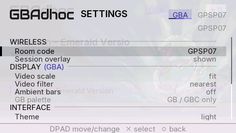 Marquee, light, Emerald |  the hero's bake |
| 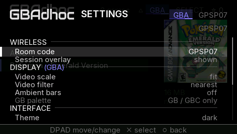 Shelf, dark, Emerald |  the cover's bake |

| fallback and other consoles | |
|---|---|
| 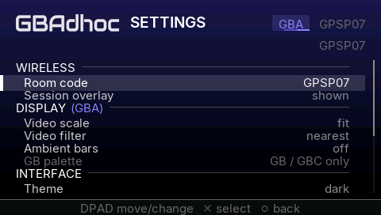 no art (AW2), dark: GBA ramp | 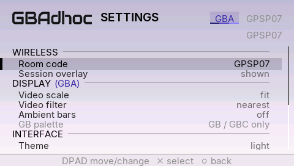 no art, light |
| 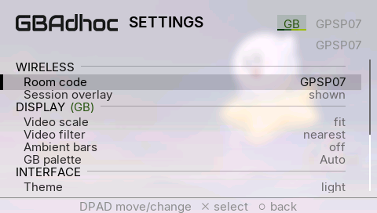 GB (Kirby's Dream Land), hero | 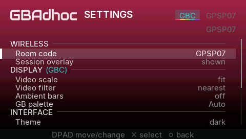 GBC (Crystal), Shelf, no cover: GBC ramp |

The §2.3 browser images are now the new look.

### 11.1 Verification

* PPSSPP GE dumps, harness EBOOTs of base 53bca1d and this branch. A
  `ui_browser_script` opens Settings, Controls, Controls' reset prompt, and
  Settings scrolled to GAMEPLAY on Emerald (art). It then opens Settings and
  Controls on AW2 (no art), Settings and Controls on GB Kirby, and Settings on
  GBC Crystal. Last, it picks AW2. Shelf and Marquee, dark and light:
  `builds/browsebg-out/runs-{base,new}/<shell>-<theme>/`, sheets in
  `builds/browsebg-out/sheets/`.
* In-game identity: `ui_demo` (real game-frame backdrop, dark; harness
  backdrop, light) and `ui_controls_demo` (both themes), base against this
  branch. The GE dumps are **48/48 byte-identical**
  (`builds/browsebg-out/runs-g{base,new}/`).
* Walkers: `ui_controls_demo = 2` (browser) dumps `ge_ctlb_0/1` over the
  ramp, and the `ui_browser_script` above runs to its pick.
* Host: `python tools/run_host_tests.py` 30/30.
* Playable EBOOT, "GBAdhoc 3.1 RC-ALL+UI" (release profile, commit 1d1cfbb,
  clean tree): `builds/browsebg-out/release/EBOOT.PBP`, md5
  `39284c3b67f288cadaad6dee00e06733`, sha256
  `75f3cd92610718482ba08bc1b0d7665a2361d349811d03bcbadaa18d3a766490`. The ME
  module is unchanged (`ee405223...`). It boots in PPSSPP.
* **Owner's eyes on hardware:** the strength of the scrim over the art on a
  real LCD, in both themes.
